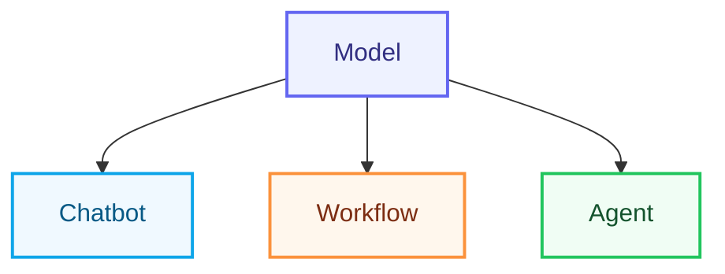
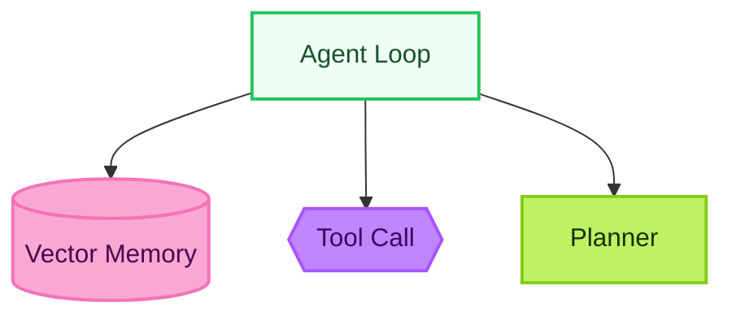

# TedT.org

[](https://github.com/TedTschopp/tedt.org/actions/workflows/site-ci.yml)
[](https://github.com/TedTschopp/tedt.org/actions/workflows/deploy-pages.yml)
[](https://github.com/TedTschopp/tedt.org/actions/workflows/mastodon-backfill.yml)
[](https://github.com/TedTschopp/tedt.org/actions/workflows/mastodon-feed-publish.yml)
[](https://github.com/TedTschopp/tedt.org/actions/workflows/mastodon-dedupe.yml)

Welcome to the repository for my personal homepage, [TedT.org](https://tedt.org). This site is a collection of my projects, writings, and interests, built using Jekyll and various open-source tools.

## Features

This site includes:

- A blog with categorized posts.
- A collection of tools, resources, and experiments.
- Integration with Mastodon and other social platforms.
- Custom scripts for managing and generating content.

## Table of Contents

1. [TedT.org](#tedtorg)
   1. [Features](#features)
   2. [Table of Contents](#table-of-contents)
   3. [Repository Structure](#repository-structure)
   4. [Include Standards](#include-standards)
      1. [Directory Structure](#directory-structure)
      2. [Directory Purposes](#directory-purposes)
      3. [Naming Conventions](#naming-conventions)
      4. [Usage Examples](#usage-examples)
      5. [Adding New Includes](#adding-new-includes)
      6. [Migration from Old Structure](#migration-from-old-structure)
      7. [Quick Reference](#quick-reference)
   5. [Acknowledgments](#acknowledgments)
   6. [Custom Scripts](#custom-scripts)
   7. [How to Contribute](#how-to-contribute)
      1. [Local Development](#local-development)
      2. [Testing](#testing)
   8. [Quality Gates](#quality-gates)
   9. [GitHub Workflows Overview](#github-workflows-overview)
   10. [Front Matter Feature Flags](#front-matter-feature-flags)
       1. [Mermaid Diagrams Usage](#mermaid-diagrams-usage)
   11. [Homepage Hero System \& Caching](#homepage-hero-system--caching)
       1. [How It Works](#how-it-works)
       2. [Adding / Updating a Hero](#adding--updating-a-hero)
       3. [Removing a Hero](#removing-a-hero)
       4. [Service Worker Details](#service-worker-details)
       5. [Troubleshooting](#troubleshooting)
       6. [Potential Future Enhancements](#potential-future-enhancements)
   12. [License](#license)
   13. [Contact](#contact)

## Repository Structure

The repository is organized as follows:

- `_code/` - Custom Python scripts for content management.
- `_data/` - Structured data used across the site.
- `_includes/` - Reusable HTML components for the site (see [Include Standards](#include-standards) below).
- `_layouts/` - Templates for different types of pages.
- `_posts/` - Blog posts written in Markdown.
- `_sass/` - SCSS files for styling the site.
- `_site/` - Generated by Jekyll during the build process. This folder contains the compiled version of the site and should not be edited directly.
- `_work-in-progress/` - Contains drafts or incomplete work for future updates.
- `css/` - Custom styles for the site.
- `js/` - JavaScript files for interactivity.

> [!NOTE]
> The `_site/` folder is generated by Jekyll and should not be edited directly.

## Include Standards

The `_includes/` directory follows a structured organizational system for better maintainability and development experience. All include files are organized into logical subdirectories with consistent naming conventions.

### Directory Structure

```text
_includes/
├── analytics/          # Analytics and tracking scripts
├── assets/             # CSS, JS, and dependency management  
├── content/            # Content display and navigation
├── feeds/              # RSS and data feeds
├── gaming/             # RPG and gaming-specific functionality
├── layout/             # Core page structure and layout
├── personal/           # Personal branding and identity
├── pwa/                # Progressive Web App features
├── seo/                # SEO, metadata, and social cards
├── social/             # Social media integration
├── themes/             # Reusable template components
└── utility/            # Helper functions and utilities
```

### Directory Purposes

| Directory | Purpose | Example Files |
|-----------|---------|---------------|
| `analytics/` | Third-party tracking and analytics | Google Analytics, Facebook Pixel, Clarity |
| `assets/` | CSS, JS dependencies, and asset loading | Bootstrap, jQuery, Font Awesome |
| `content/` | Content display, navigation, formatting | Figure displays, post previews, progress bars |
| `feeds/` | RSS, JSON feeds, syndication | RSS feeds, JSON feeds |
| `gaming/` | RPG and gaming-specific functionality | Creature displays, game mechanics |
| `layout/` | Core page structure and layout | Header, footer, navigation |
| `personal/` | Personal branding and identity | H-card, resume, contact info |
| `pwa/` | Progressive Web App features | PWA headers, service workers |
| `seo/` | SEO, metadata, social cards | Meta tags, Open Graph, Twitter cards |
| `social/` | Social media integration | Comments, webmentions, sharing |
| `themes/` | Reusable template components | Post grids, pagination, navigation |
| `utility/` | Helper functions and tools | Date formatting, text processing |

### Naming Conventions

All include files follow **kebab-case** naming conventions:

- ✅ `post-preview.html`
- ✅ `next-and-previous.html`  
- ✅ `category-emoji.html`
- ❌ `post_preview.html`
- ❌ `nextAndPrevious.html`
- ❌ `CategoryEmoji.html`

### Usage Examples

When including files in layouts or posts, use the full path:

```liquid
<!-- Layout components -->



<!-- Content components -->



<!-- Utility functions -->



<!-- SEO and metadata -->


```

### Adding New Includes

When adding new include files:

1. **Choose the appropriate directory** based on functionality
2. **Use kebab-case naming** for the filename
3. **Add documentation** to describe the include's purpose
4. **Update references** in layouts and posts as needed

### Migration from Old Structure

The include system was refactored in July 2025 to improve organization. Old flat-structure references have been updated, but if you encounter any old-style includes like ``, they should be updated to use the new directory structure.

For a complete mapping of old to new paths, see the `includes-path-mapping.md` file in the project root.

### Quick Reference

**Most commonly used includes:**

```liquid
<!-- Page structure -->




<!-- Assets -->



<!-- SEO -->



<!-- Content -->




<!-- Utilities -->


```

## Acknowledgments

This site is built using the following resources:

- [Jim Wampler](https://www.facebook.com/mudpuppycomics) - Permission to use the [Gamma World Dice](https://www.facebook.com/photo.php?fbid=10208217335349671&set=a.1007311561655.974.1790912702&type=3&theater) image.

## Custom Scripts

The `_code/` folder contains Python scripts for managing the site, including:

- Finding and categorizing blog posts.
- Generating RSS feeds.
- Cleaning and validating YAML files.

> [!WARNING]
> These scripts are intended for local use only. Ensure you have the necessary dependencies installed before running them.

## How to Contribute

Contributions are welcome! If you have suggestions or spot issues, feel free to open a pull request or file an issue.

### Local Development

To run the site locally:

1. Install [Jekyll](https://jekyllrb.com/).
2. Clone this repository.
3. Run `bundle install` to install dependencies.
4. Start the server with `bundle exec jekyll serve`.

### Testing

- Validate HTML, CSS, and JavaScript locally before pushing changes.
- Use Lighthouse for performance and accessibility testing.
- When adding new includes, ensure they follow the [Include Standards](#include-standards).
- Test that include paths are correct and files render properly.

## Quality Gates

Automated validations run on every push via the Site CI workflow (badge above):

- Build & date normalization
- Legacy key guard (blocks reintroduction of removed config keys)
- Feed integrity (primary JSON feed absolute URLs)
- Mastodon feed validation (structure, length ≤ 480 chars, absolute links)
- Mastodon toot length statistics report (non-blocking metrics)
- Image path audit (flags path anomalies)
- HTML Proofer (links, images, basic HTML correctness)

Run locally with: `make qa`

## GitHub Workflows Overview

Current active workflows (legacy files removed / stubbed):

| Workflow | File | Triggers | Purpose |
|----------|------|----------|---------|
| Site CI | `site-ci.yml` | push, PR, weekly schedule | Build, security audit, HTML Proofer, feed & sitemap checks |
| Deploy to GitHub Pages | `deploy-pages.yml` | workflow_run (Site CI success), manual | Deterministic deploy only after green CI |
| Mastodon Backfill | `mastodon-backfill.yml` | schedule (q2h), manual | Batch or manual backfill of missing toot IDs |
| Mastodon Feed Publish | `mastodon-feed-publish.yml` | push (main), 6h schedule, manual | Post newest site entry to Mastodon |
| Mastodon Dedupe | `mastodon-dedupe.yml` | daily schedule, manual | Scan & (optionally) delete duplicate toots |

Composite actions (DRY helpers) under `.github/actions/`:

| Action | Directory | Description |
|--------|-----------|-------------|
| setup-ruby-bundle | `.github/actions/setup-ruby-bundle/` | Standard Ruby + bundler + caching |
| masto-cache-prep | `.github/actions/masto-cache-prep/` | Normalize mastodon cache & sync front matter preview/live |
| masto-update-frontmatter | `.github/actions/masto-update-frontmatter/` | Resolve canonical path & update toot ID in markdown |

Deprecated legacy workflow files were retained only as inert stubs (no triggers) to avoid accidental reactivation; they can be fully removed in a future cleanup once all badges / references are confirmed updated.

## Front Matter Feature Flags

Certain presentation and asset behaviors can be controlled per-post via boolean front matter flags. These are opt-in / opt-out controls intended to keep pages minimal and purposeful.

| Flag | Type | Default | Effect | When to Use |
|------|------|---------|--------|-------------|
| `no_toc` | boolean | `false` | Suppresses the right-hand Table of Contents card (`#table-of-contents-card`). | Very short posts (≤1 heading) or visual essays where TOC adds noise. |
| `mermaid` | boolean | `false` | Loads Mermaid diagram support and renders fenced code blocks beginning with ` ```mermaid ` or elements carrying a `data-mermaid` attribute. | Posts containing sequence, flow, graph, or state diagrams. |

Example:

```yaml
---
title: "Lightweight Post"
no_toc: true      # Hide the TOC card
mermaid: true     # Enable mermaid diagram rendering
---
```

Notes:

- `mermaid` must be explicitly set to render diagrams; otherwise the loader include is skipped (performance win on diagram-free pages).
- `no_toc` accepts YAML boolean (`true`) or string `'true'`; layout logic treats either as enabled.
- Future flags (candidate): `charts`, `diagram-libs`, `math` (currently always included) may adopt the same pattern.

See ADR 0010 and ADR 0011 in `docs/adr/` for the rationale and architectural implications of these flags.

### Slide Deck Front Matter (Collections `slides`)

Slide decks under the `slides` collection support additional metadata driving the `/slides/` index rendering and filtering.

| Key | Required | Type | Purpose |
|-----|----------|------|---------|
| `layout` | yes | string | Should be `reveal-integrated` for Reveal.js decks. |
| `title` | yes | string | Deck display title. Used for card title & page `<title>`. |
| `permalink` | yes | string | Canonical path (e.g. `/slides/ai-strategy/`). |
| `date` | yes | date | Primary ordering key (descending). Creation / publish date. |
| `last_modified` | no | date | If present and different from `date`, an "Updated" badge displays on card. |
| `description` | recommended | string | Short summary (card text, SEO fallback). Keep ≤160 chars. |
| `image` | optional | path | Thumbnail image. If absent, preview HTML or first section fragment is used. |
| `preview_html` | optional | HTML string | Explicit mini-preview markup for card (sanitized by reveal index transforms). Overrides fragment extraction. |
| `topics` | optional | array[string] | Lightweight categorical tags for filter UI (client‑side). |
| `aspect_ratio` | optional | string | One of `16:9`, `16:10`, `4:3` (or custom handled class) for preview container ratio. Defaults to `16:9`. |
| `canonical` | optional | url | Canonical URL override when consolidating duplicate archetype decks. |
| `redirect_from` | optional | array[string] | Legacy paths for automatic redirection (if plugin / config supports). |

Example:

```yaml
---
layout: reveal-integrated
title: "AI Strategy 2026"
permalink: /slides/ai-strategy/
date: 2025-01-15
last_modified: 2025-02-05
description: "Strategic roadmap outlining AI architecture, governance, and capability build through 2026."
topics: [strategy, architecture, governance]
image: /img/categories/artificial-intelligence.webp
preview_html: "<div class='preview-fragment'><h3>AI Strategy 2026</h3><p>Roadmap, architecture & governance pillars.</p></div>"
aspect_ratio: 16:9
---
```

### Slide Index Behavior

The `/slides/` page:

1. Renders only `site.slides` (wrapper posts removed to reduce duplication).
2. Sorts decks by `date` descending.
3. Chooses preview in priority order: `image` → `preview_html` → first `<section>` fragment.
4. Shows an Updated badge if `last_modified` exists and differs from `date`.
5. Generates topic badges from `topics` array and enables client-side filtering (toggle buttons built by `_includes/slides/filter-controls.html`).
6. Computes aspect ratio class (`ratio-16x9` etc.) based on `aspect_ratio` or heuristics.


### Slide Includes

| Include | Path | Purpose |
|---------|------|---------|
| Section Break | `_includes/slides/section-break.html` | Standardized divider slide with `title`, optional `subtitle`, and optional `kicker` fragment. |
| Filter Controls | `_includes/slides/filter-controls.html` | Builds topic toggle buttons and JS to filter visible cards client-side. |

Usage:

```liquid

```

### Client-Side Topic Filtering

The filter bar creates toggle buttons for all unique `topics` values found in `site.slides`. Selecting none (or pressing "All") shows every deck; selecting one or more shows decks containing at least one selected topic. Accessible states are managed via `aria-pressed`.

### Styling Utilities for Decks

Swiss / archetype styles extracted into `_sass/components/_slides-archetypes.scss`:
`title-slide`, `columns`, `highlight-box`, `.bar` utility. These keep deck files lean and reusable across multiple presentations.

When adding new deck-specific structural styles, prefer extending this partial instead of inline `<style>` blocks.


### Mermaid Diagrams Usage

Enable per page with front matter:

```yaml
---
title: "Example with Diagram"
mermaid: true
---
```

Then add a fenced code block:



Notes:

- Light/dark palette adapts automatically using `data-bs-theme` attribute.
- `<br>` tags inside diagram code are normalized to `\n`; prefer `\n` for line breaks in labels.
- Raw source is viewable/copyable via the collapsible panel under each rendered diagram.
- Add semantic classes via `class` or `classDef` for consistent look across diagrams.
- Security level is `strict`; external includes or inline HTML inside Mermaid are disallowed.

Advanced:

- Additional semantic classes provided: `tool`, `memory`, `planner`.
- Auto-legend: add a comment line `%% legend:auto` anywhere in your diagram source. A legend block listing all `classDef` names with color swatches will be appended below the rendered diagram.
- Example with legend:



For advanced configuration, modify `_includes/assets/mermaid.html` (function `buildMermaidConfig`).

## Homepage Hero System & Caching

The homepage hero (image/video) is selected randomly on each load using a data-driven include.

### How It Works

1. Data Source: `_data/homepage_heroes.yml` – each entry supplies a `base` (filename stem) and optional `alt` text.
2. Include: `_includes/homepage/hero-random.html` – renders a lightweight placeholder banner, then JavaScript selects a random hero and swaps in the appropriate `.webp` and (where available) `.mp4` assets. Respects `prefers-reduced-motion` (skips video autoplay).
3. Accessibility: Alt text pulled from YAML (falls back to a generic description if absent).
4. Transition: Fade-in once assets are loaded for a smooth appearance.
5. Caching: A service worker (`sw.js`) precaches all hero `.webp` and `.mp4` files with a cache‑first strategy for near‑instant subsequent loads.

### Adding / Updating a Hero

1. Export/create two assets with the same base name:
   - `img/categories/home-hero-images/<base>.webp`
   - `img/categories/home-hero-images/<base>.mp4` (optional if no motion variant)
2. Add an entry to `_data/homepage_heroes.yml`:

    ```yaml
    - base: hero-new-example
       alt: "Short descriptive alt text for screen readers"
    ```

3. Build the site. The service worker precache list is generated automatically from the YAML; no manual edit needed.
4. Deploy. Clients will receive the updated `sw.js` (its version hash changes when the list changes) and precache the new media.

### Removing a Hero

1. Delete (or comment out) the entry in `_data/homepage_heroes.yml`.
2. (Optional) Remove the corresponding media files to save repository space.
3. Rebuild & deploy. Old caches are purged automatically because the cache name includes a content hash.

### Service Worker Details

- File: `sw.js` (processed by Jekyll with front matter; served at `/sw.js`).
- Strategy: Cache-first for hero media (ideal for large but immutable decorative assets).
- Versioning: Cache namespace includes a base64 hash of the ordered hero list – any addition/removal triggers a new cache.
- Fallback: If the network fails during first fetch and nothing is cached yet, the request just fails normally (acceptable for non-critical decoration).

### Troubleshooting

| Symptom | Cause | Fix |
|---------|-------|-----|
| New hero not appearing randomly | Browser still using old SW | Hard refresh (Shift+Reload) or wait for activate lifecycle |
| Video never plays | User has `prefers-reduced-motion` enabled | Working as designed |
| 404 on hero media | File name mismatch with YAML `base` | Ensure filenames match exactly (case-sensitive) |

### Potential Future Enhancements

- Add runtime fallback poster for video-first heroes when video fetch fails.
- Introduce stale-while-revalidate for videos (currently unnecessary due to immutability assumption).
- Integrate Workbox if broader asset strategies are required beyond hero media.

If you extend the hero system, keep logic centralized in the include and data file—avoid scattering hero knowledge across layouts.

## License

This project is licensed under the MIT License. See the `LICENSE` file for details.

## Contact

For questions or feedback, you can reach me via [Mastodon](https://twit.social/@tedt) or through the contact form on the site.
