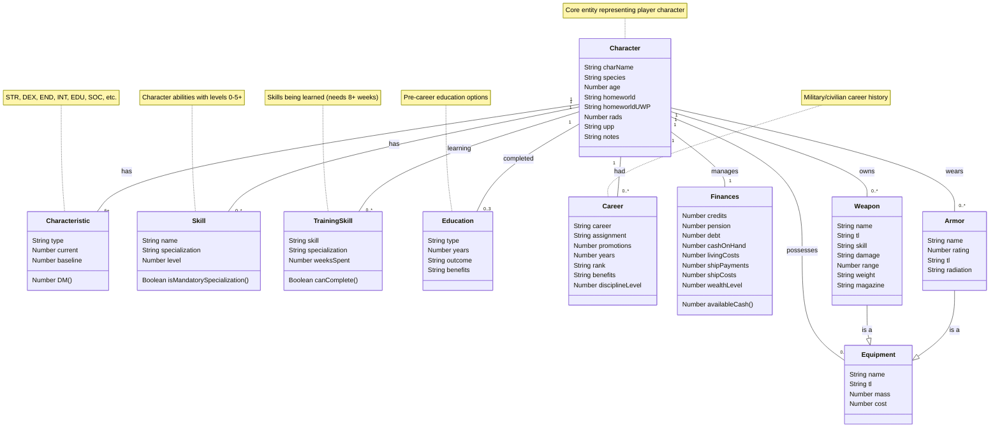

# Traveller Character Sheet Data Model

## Relationships & Constraints

1. **Character to Characteristics**: One-to-many relationship where each character has exactly one value for each characteristic type (STR, DEX, END, INT, EDU, SOC, etc.)

2. **Character to Skills**: One-to-many relationship where a character can have many skills, but each skill entry belongs to only one character
   - Some skills require specializations as defined in the `skillSpecializations` object

3. **Character to Careers**: One-to-many relationship where a character can have multiple careers throughout their history
   - Each career has an associated discipline level (military: 1.0, disciplined: 0.5, other: 0.0)

4. **Career to Assignment**: Many-to-many relationship where each career can have multiple possible assignments, and assignments can exist across multiple careers
   - Rank titles are determined by career + assignment + promotion count combination

5. **Character to TrainingSkills**: One-to-many relationship where a character can be learning multiple skills simultaneously
   - When a training skill reaches 8+ weeks of training, it can be converted to a regular skill with level 1

6. **Character to Equipment**: One-to-many relationship where a character can own multiple items
