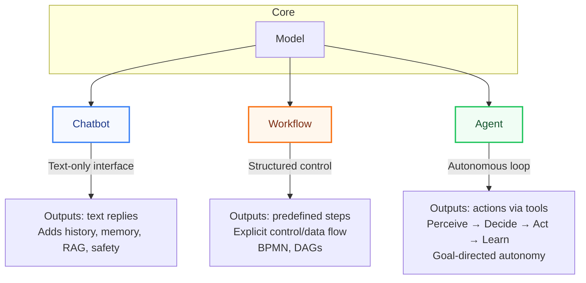

---

layout: post

title: "Model vs. Chatbot vs. Workflow vs. Agent"
subtitle: "Clarifying the distinctions between core AI concepts in formal and plain language"
quote: "A chatbot only emits text, a workflow follows a script, but an agent perceives, decides, and acts with autonomy."
excerpt: "This post breaks down the differences between models, chatbots, workflows, and agents, using both formal computer science definitions and plain-English explanations."
source: "Original Content"
source-url: ""
call-to-action: "Discuss on Mastodon"

date: 2025-09-11 05:00:00 -0700
update: 2025-09-11 05:00:00 -0700

author:
    avatar: https://secure.gravatar.com/avatar/a76b4d6291cecb3a738896a971bfb903?s=512\&d=mp\&r=g
    name: Ted Tschopp
    url: https://tedt.org/

bullets:
  - Defines models, chatbots, workflows, and agents in formal computer science notation.
  - Provides plain-English explanations for each concept.
  - Highlights the difference between text-only interfaces and autonomous systems.
  - Includes a diagram mapping relationships between the concepts.
  - Summarizes variables and notation in a consolidated reference table.

description: "A deep dive into the distinctions between AI models, chatbots, workflows, and agents. This post blends formal definitions with clear explanations, offering both a technical and intuitive understanding of these foundational terms."
seo-description: "Explore the differences between models, chatbots, workflows, and agents, explained with formal notation and plain-English clarity."

categories:
  - AI

tags:
  - ai
  - models
  - chatbots
  - workflows
  - agents
  - llms
  - automation
  - autonomy
  - computer science
  - governance

keywords:
  - chatbot definition
  - workflow vs agent
  - autonomous agents
  - llm chatbot
  - ai terminology
  - computer science definitions
  - language model
  - agent autonomy
  - workflow automation

location:
    name: Bradbury, CA
    coordinates:
        latitude: 34.1470
        longitude: -117.9709

image: "img/2025-09/AI-Model-Chatbot-Workflow-Agent.webp"
image-alt: "Diagram showing differences between model, chatbot, workflow, and agent"
image-artist: "Ted Tschopp"
image-artist-URL: https://tedt.org
image-credits: "Ted Tschopp"
image-credits-URL: https://tedt.org
image-credits-artist: "Ted Tschopp"
image-credits-artist-URL: 
image-credits-title: "Model vs. Chatbot vs. Workflow vs. Agent Diagram"
image-description: "A diagram illustrating the relationships and distinctions between models, chatbots, workflows, and agents."
image-title: "Model vs. Chatbot vs. Workflow vs. Agent"
image_width:
image_height:

mastodon-post-id: 115186286978010327

math: true
mermaid: true
no_toc: true

---

## Model vs. Chatbot vs. Workflow vs. Agent

| Concept      | Formal CS Definition (with variable definitions)                                                                                                                                                                                                                                                                                                                                                                                                                                                                                                                                                                                                                                                                                                                                                                                                                          | Plain English Definition                                                                                                                                                                                                                                         |
| ------------ | --------------------------------------------------------------------------------------------------------------------------------------------------------------------------------------------------------------------------------------------------------------------------------------------------------------------------------------------------------------------------------------------------------------------------------------------------------------------------------------------------------------------------------------------------------------------------------------------------------------------------------------------------------------------------------------------------------------------------------------------------------------------------------------------------------------------------------------------------------------------------- | ---------------------------------------------------------------------------------------------------------------------------------------------------------------------------------------------------------------------------------------------------------------- |
| **Model**    | **Language Model**:  $L_{\theta} : \Sigma^{\ast} \to \Delta(\Sigma)$  **Variables:**  • $\Sigma$: token vocabulary.  • $\Sigma^{\ast}$: all finite strings of tokens.  • $\Delta(\Sigma)$: probability distributions over tokens.  • $\theta$: parameters of the model.                                                                                                                                                                                                                                                                                                                                                                                                                                                                                                                                                                                                             | The raw **LLM engine**: given a prompt (string of tokens), it returns a probability distribution over the next token and generates text by sampling/decoding. Examples: GPT-4, Claude, Mistral.                                                                  |
| **Chatbot**  | **Chatbot tuple**:  $\mathcal{C} = (L_{\theta}, s, \tau, \delta, \omega, M_c, \mu_c, \Gamma, \mathcal{B})$  **Variables:**  • $L_{\theta}$: language model (see above).  • $s \in \Sigma^{\ast}$: system prompt.  • $\tau: (R_c \times \Sigma^{\ast})^{\ast} \to \Sigma^{\ast}$: chat template (serialize history).  • $\delta$: decoding policy (greedy, top-k, nucleus).  • $R_c = \{\mathsf{sys},\mathsf{user},\mathsf{bot}\}$: roles.  • $M_c$: conversation memory space.  • $\mu_c$: memory update rule.  • $\omega$: windowing/truncation to fit context budget.  • $K_c \in \mathbb{N}$: max context tokens.  • $\Gamma$: safety/governance filter.  • $\mathcal{B}$: optional retrieval-augmented backend (documents, retrieval, ranking, selection).                                                                                                                              | A **conversation interface** around a model: it handles history, system instructions, optional memory, retrieval, and safety checks — but **its only action is emitting text**.                                                                                  |
| **Workflow** | **Workflow net / graph**:  $W = (V, E, v_{start}, v_{end}, D_w, f_w)$  **Variables:**  • $V$: set of tasks/nodes.  • $E \subseteq V \times V$: edges (control/data flow).  • $v_{start}, v_{end} \in V$: unique start and end nodes.  • $D_w$: data schema (case variables).  • $f_w: V \times D_w \to D_w$: task update functions.  • A run is a path from $v_{start}$ to $v_{end}$ satisfying guards.  • Often formalized as Petri nets (workflow nets) with soundness (every case can complete, no dead tasks).                                                                                                                                                                                                                                                                                                                                                          | A **pre-defined process model**: a sequence/graph of tasks with explicit branching and conditions. Execution follows the script exactly (like BPMN diagrams, Airflow DAGs, or BPEL orchestrations). Predictable and testable.                                    |
| **Agent**    | **Agent in environment**:  Environment: $$\mathcal{E} = (S_a, A_a, O_a, T_a, Z_a, R_a)$$ Agent: $$\mathcal{A} = (M_a, \mu_a, \Theta_a, \pi_{\theta_a}, \Lambda_a, \iota_a, \mathcal{G}_a)$$  **Variables:**  • $S_a$: environment states.  • $A_a$: actions (tool invocations).  • $O_a$: observations.  • $T_a: S_a \times A_a \to \Delta(S_a)$: transition kernel.  • $Z_a: S_a \times A_a \to \Delta(O_a)$: observation kernel.  • $R_a: S_a \times A_a \times S_a \to \mathbb{R}$: reward/utility.  • $M_a$: internal state/memory.  • $\mu_a$: memory update.  • $\Theta_a$: parameter space.  • $\pi_{\theta_a}: G_a \times H_a \times M_a \to \Delta(A_a)$: policy.  • $\Lambda_a$: learning/adaptation rule.  • $\iota_a$: initialization function.  • $\mathcal{G}_a = (\mathsf{Perm}, \mathsf{Cons}, \mathsf{Audit})$: governance (permissions, constraints, audit). | A **goal-directed autonomous system**: it perceives environment inputs, chooses and executes actions (via tools), maintains state, and adapts based on feedback. Unlike a chatbot, it has actuators beyond text and can operate under uncertainty with autonomy. |

## Quick mental picture

* **Model** = the **engine** (statistical text predictor).
* **Chatbot** = the **interface** around a model (dialogue handling, memory, RAG, safety).
* **Workflow** = the **scripted process** (pre-drawn map of tasks, deterministic once defined).
* **Agent** = the **autonomous actor** (perceives, decides, acts, learns in a loop toward goals).

## Diagram

## Variables by Concept

| Concept      | Variables (formal notation)                                                                                                                                                                                                                                                                                                                                                                                                                                                                                                                                                                                                                                                                                                                                                                                 |
| ------------ | ----------------------------------------------------------------------------------------------------------------------------------------------------------------------------------------------------------------------------------------------------------------------------------------------------------------------------------------------------------------------------------------------------------------------------------------------------------------------------------------------------------------------------------------------------------------------------------------------------------------------------------------------------------------------------------------------------------------------------------------------------------------------------------------------------------- |
| **Model**    | • $\Sigma$: token vocabulary    • $\Sigma^{\ast}$: strings (finite token sequences)    • $\theta$: model parameters    • $L_\theta : \Sigma^{\ast} \to \Delta(\Sigma)$: mapping from prompt to distribution over next token                                                                                                                                                                                                                                                                                                                                                                                                                                                                                                                                                                                |
| **Chatbot**  | • $L_\theta$: base model    • $s \in \Sigma^{\ast}$: system prompt    • $R_c = \{\mathsf{sys}, \mathsf{user}, \mathsf{bot}\}$: roles    • $\tau: (R_c \times \Sigma^{\ast})^{\ast} \to \Sigma^{\ast}$: chat template (serialize history)    • $\delta$: decoding policy    • $\omega$: windowing function    • $K_c \in \mathbb{N}$: context budget    • $M_c$: memory state    • $\mu_c$: memory update rule    • $\Gamma$: safety / governance filter    • $\mathcal{B}$: retrieval backend (documents, retrieval, ranking, selection)                                                                                                                                                                                                                                                      |
| **Workflow** | • $V$: set of tasks/nodes    • $E \subseteq V \times V$: directed edges (control/data flow)    • $v_{start}, v_{end} \in V$: designated start/end tasks    • $D_w$: data schema (case variables)    • $f_w: V \times D_w \to D_w$: task update functions    • **Runs**: executions = paths from $v_{start}$ to $v_{end}$ respecting guards/conditions                                                                                                                                                                                                                                                                                                                                                                                                                                        |
| **Agent**    | **Environment $\mathcal{E}$:**    • $S_a$: environment states    • $A_a$: action set (tools/actuators)    • $O_a$: observations    • $T_a: S_a \times A_a \to \Delta(S_a)$: transition kernel    • $Z_a: S_a \times A_a \to \Delta(O_a)$: observation kernel    • $R_a: S_a \times A_a \times S_a \to \mathbb{R}$: reward function     **Agent $\mathcal{A}$:**    • $M_a$: internal memory state    • $\mu_a$: memory update rule    • $\Theta_a$: parameter space    • $\pi_{\theta_a}: G_a \times H_a \times M_a \to \Delta(A_a)$: policy    • $\Lambda_a$: learning / adaptation rule    • $\iota_a$: initialization function    • $\mathcal{G}_a = (\mathsf{Perm}, \mathsf{Cons}, \mathsf{Audit})$: governance controls (permissions, constraints, audit) |
