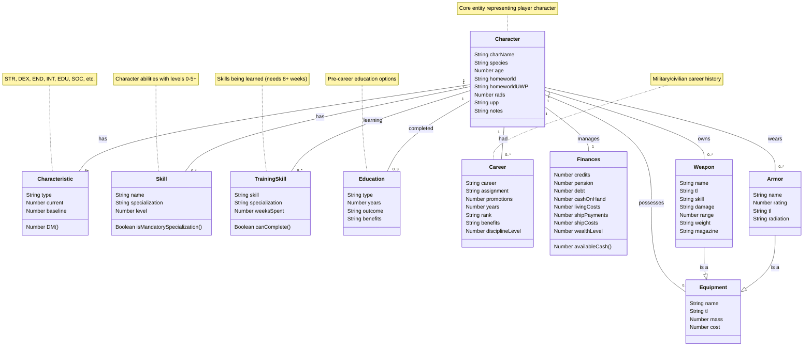

TedTschopp: write for me the ISO 29148:2018 specification for this code

GitHub Copilot: # ISO 29148:2018 Software Requirements Specification for Traveller Character Sheet Application

### 1. Introduction

#### 1.1 Purpose
This document specifies the requirements for the Traveller 2nd Edition Character Sheet web application, which provides an interactive digital character sheet for the Mongoose Traveller 2nd Edition role-playing game.

#### 1.2 Scope
The Traveller Character Sheet application allows users to create, manage, save, and print character information for the Traveller role-playing game. It includes functionality for tracking character skills, careers, equipment, and finances in accordance with the game's rules.

#### 1.3 Stakeholders
- Primary users: Players and Game Masters of Traveller role-playing game
- System administrators: Website administrator
- Content providers: Traveller game publishers (indirectly)

#### 1.4 Document Conventions
This specification follows ISO 29148:2018 requirements structuring.

### 2. Overall Description

#### 2.1 Product Perspective
The Traveller Character Sheet is a standalone web application that operates within a web browser and uses local storage for data persistence. It does not require server connectivity after initial page load.

#### 2.2 Product Functions
- Character creation and management
- Skill and characteristic tracking
- Career history recording
- Equipment and finances management
- Character data storage and retrieval
- Dice rolling for game mechanics
- Character data export and import

#### 2.3 User Characteristics
Users are expected to be familiar with the Traveller role-playing game rules and terminology. Technical expertise required is minimal beyond basic web browsing capabilities.

#### 2.4 Operating Environment
- Web browsers: Modern browsers with JavaScript and localStorage support
- Platforms: Desktop and tablet devices
- Dependencies: Bootstrap 5.3, no server-side requirements

#### 2.5 Design and Implementation Constraints
- Browser-only functionality with no server-side processing
- Data storage limited to localStorage capacity
- Print formatting requirements for physical character sheets

### 3. Specific Requirements

#### 3.1 Functional Requirements

##### 3.1.1 Character Data Management
**REQ-01**: The system shall allow users to input and modify basic character information (name, species, age).  
**REQ-02**: The system shall enable users to record character characteristics with both current and baseline values.  
**REQ-03**: The system shall automatically calculate characteristic modifiers based on characteristic values.

##### 3.1.2 Character Career Management
**REQ-04**: The system shall allow users to add pre-career education options with associated years, outcomes, and benefits.  
**REQ-05**: The system shall enable recording of career history including assignments, promotions, years of service, and benefits.  
**REQ-06**: The system shall automatically suggest appropriate rank titles based on career and promotion count.  
**REQ-07**: The system shall calculate biological age based on pre-career and career years.

##### 3.1.3 Character Skills
**REQ-08**: The system shall provide a comprehensive catalog of skills from the Traveller rule system.  
**REQ-09**: The system shall support skill specializations when applicable to specific skills.  
**REQ-10**: The system shall allow recording skills in training with time tracking.  
**REQ-11**: The system shall handle specialized skill requirements such as mandatory specialization tracking.

##### 3.1.4 Equipment, Weapons, and Finances
**REQ-12**: The system shall allow recording of weapons with relevant combat statistics.  
**REQ-13**: The system shall allow recording of armor with protection values.  
**REQ-14**: The system shall allow recording of general equipment with specifications.  
**REQ-15**: The system shall track financial information including credits, pension, debt, and regular expenses.

##### 3.1.5 Data Persistence
**REQ-16**: The system shall save all character data to browser localStorage.  
**REQ-17**: The system shall allow exporting character data to JSON files.  
**REQ-18**: The system shall allow importing character data from previously exported JSON files.  
**REQ-19**: The system shall provide ability to delete saved character data.

##### 3.1.6 Game Utility Features
**REQ-20**: The system shall provide dice rolling functionality for common Traveller dice mechanics.  
**REQ-21**: The system shall support task resolution rolls with difficulty levels.  
**REQ-22**: The system shall generate printable character sheets.

#### 3.2 External Interface Requirements

##### 3.2.1 User Interfaces
**REQ-23**: The user interface shall be organized in thematic sections with clear headers.  
**REQ-24**: The system shall use form controls appropriate to data types (dropdowns for selections, numeric inputs for values).  
**REQ-25**: The system shall hide utility functions when printing character sheets.

##### 3.2.2 Hardware Interfaces
**REQ-26**: The system shall support standard input devices (keyboard, mouse, touch).

##### 3.2.3 Software Interfaces
**REQ-27**: The system shall interact with browser localStorage API for data persistence.  
**REQ-28**: The system shall interact with browser's file system API for import/export operations.

#### 3.3 Quality Attributes

##### 3.3.1 Usability
**REQ-29**: The system shall provide autocomplete functionality for skill selection.  
**REQ-30**: The system shall provide dynamic updating of calculated fields when input values change.

##### 3.3.2 Performance
**REQ-31**: The system shall load completely within 5 seconds on standard broadband connections.  
**REQ-32**: The system shall respond to user input within 0.5 seconds.

##### 3.3.3 Reliability
**REQ-33**: The system shall validate user inputs to prevent invalid data entry.  
**REQ-34**: The system shall provide feedback when data operations succeed or fail.

##### 3.3.4 Portability
**REQ-35**: The system shall function on all major modern browsers (Chrome, Firefox, Safari, Edge).  
**REQ-36**: The system shall use responsive design for multiple device sizes.

### 4. Verification

#### 4.1 Verification Approach
Requirements shall be verified through:
- Manual testing of all user interface components
- Validation of calculations against Traveller rule examples
- Cross-browser testing for compatibility
- Usability testing with target users

#### 4.2 Traceability
**TR-01**: User interface elements shall be traceable to specific functional requirements.  
**TR-02**: Data persistence operations shall be fully traceable through browser dev tools.  
**TR-03**: Calculation functions shall be documented with references to relevant game rules.

### 5. Appendices

#### 5.1 Data Dictionary
- Character: Primary data entity representing a player character
- Characteristic: Core abilities (STR, DEX, END, INT, EDU, SOC, etc.)
- Skill: Character capabilities with associated proficiency levels
- Career: Professional background with assignments and ranks
- Equipment: Items in character possession

## Relationships & Constraints

1. **Character to Characteristics**: One-to-many relationship where each character has exactly one value for each characteristic type (STR, DEX, END, INT, EDU, SOC, etc.)

2. **Character to Skills**: One-to-many relationship where a character can have many skills, but each skill entry belongs to only one character
   - Some skills require specializations as defined in the `skillSpecializations` object

3. **Character to Careers**: One-to-many relationship where a character can have multiple careers throughout their history
   - Each career has an associated discipline level (military: 1.0, disciplined: 0.5, other: 0.0)

4. **Career to Assignment**: Many-to-many relationship where each career can have multiple possible assignments, and assignments can exist across multiple careers
   - Rank titles are determined by career + assignment + promotion count combination

5. **Character to TrainingSkills**: One-to-many relationship where a character can be learning multiple skills simultaneously
   - When a training skill reaches 8+ weeks of training, it can be converted to a regular skill with level 1

6. **Character to Equipment**: One-to-many relationship where a character can own multiple items

#### 5.2 Glossary
- DM: Dice Modifier
- UPP: Universal Personality Profile
- TL: Technology Level