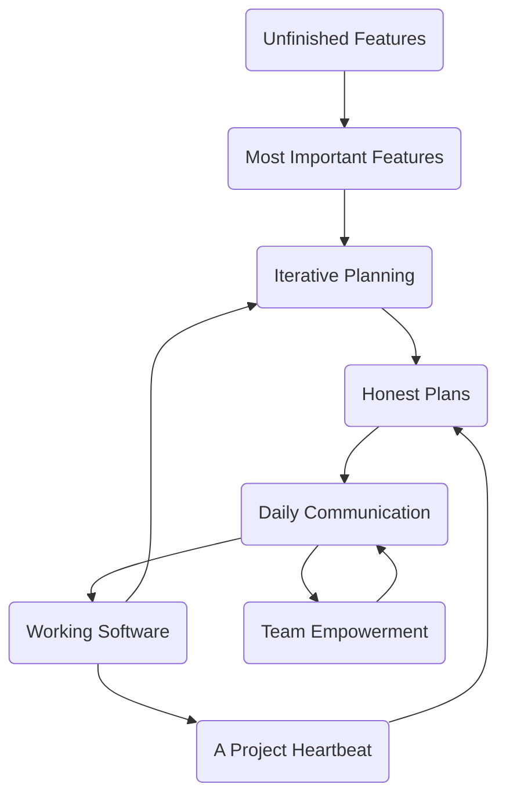
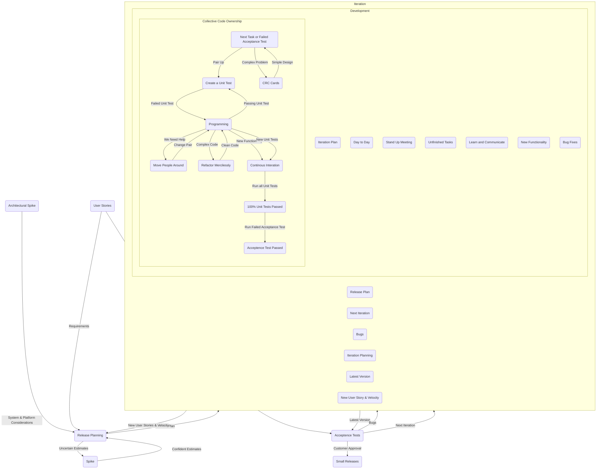

## Introduction

The first Extreme Programming project was started March 6, 1996. Extreme Programming is one of several popular [Agile Processes](http://www.agile-process.org/). It has already been proven to be very successful at many companies of all different sizes and industries world wide.

Extreme Programming is successful because it stresses customer satisfaction. Instead of delivering everything you could possibly want on some date far in the future this process delivers the software you need as you need it. Extreme Programming empowers your developers to confidently respond to changing customer requirements, even late in the life cycle.

Extreme Programming emphasizes teamwork. Managers, customers, and developers are all equal partners in a collaborative team. Extreme Programming implements a simple, yet effective environment enabling teams to become highly productive. The team self-organizes around the problem to solve it as efficiently as possible.

Extreme Programming improves a software project in five essential ways; communication, simplicity, feedback, respect, and courage. Extreme Programmers constantly communicate with their customers and fellow programmers. They keep their design simple and clean. They get feedback by testing their software starting on day one. They deliver the system to the customers as early as possible and implement changes as suggested. Every small success deepens their respect for the unique contributions of each and every team member. With this foundation Extreme Programmers are able to courageously respond to changing requirements and technology.

The most surprising aspect of Extreme Programming is its [simple rules](#rules). Extreme Programming is a lot like a jig saw puzzle. There are many small pieces. Individually the pieces  make no sense, but when combined together a complete picture can be seen. The rules may seem awkward and perhaps even naive at first, but are based on sound [values](values.html) and principles.

Our rules set expectations between team members but are not the end goal themselves. You will come to realize these rules define an environment that promotes team collaboration and empowerment, that is your goal. Once achieved productive teamwork will continue even as rules are changed to fit your company's specific needs.

This [flow chart](map/project.html) shows how Extreme Programming's rules work together. Customers enjoy being partners in the software process, developers actively contribute regardless of experience level, and managers concentrate on communication and relationships. Unproductive activities have been trimmed to reduce costs and frustration of everyone involved.

Take a [guided tour](http://www.agile-process.org/) of Extreme Programming by following the trail of littlebuttons, starting here.

## Flowchart

## Agile Process

[TODO] - http://www.agile-process.org/

## Rules

### Planning

* [User stories](rules/userstories.html) are written.
* [Release planning](rules/planninggame.html) creates the [release schedule](rules/commit.html).
* Make frequent [small releases](rules/releaseoften.html).
* The project is divided into [iterations](rules/iterative.html).
* [Iteration planning](rules/iterationplanning.html) starts each iteration.

### Managing

* Give the team a dedicated [open work space](rules/space.html).
* Set a [sustainable page](rules/overtime.html).
* A [stand up meeting](rules/standupmeeting.html) starts each day.
* The [Project Velocity](rules/velocity.html) is measured.
* [Move people around](rules/movepeople.html).
* [Fix XP](rules/fixit.html) when it breaks.

### Designing

* [Simplicity](rules/simple.html).
* Choose a [system metaphor](rules/metaphor.html).
* Use [CRC cards](rules/crccards.html) for design sessions.
* Create [spike solution](rules/spike.html)s to reduce risk.
* No functionality is [added early](rules/early.html).
* [Refactor](rules/refactor.html) whenever and wherever possible.

### Coding

* The customer is [always available](rules/customer.html).
* Code must be written to agreed [standards](rules/standards.html).
* Code the [unit test first](rules/testfirst.html).
* All production code is [pair programmed](rules/pair.html).
* Only one pair [integrates code at a time](rules/sequential.html).
* [Integrate often](rules/integrateoften.html).
* Set up a dedicated [integration computer](rules/dedicated.html).
* Use [collective ownership](rules/collective.html).

### Testing

* All code must have [unit tests](rules/unittests.html).
* All code must pass all [unit tests](rules/unittests.html) before it  can be released.
* When [a bug is found](rules/bugs.html) tests are created.
* [Acceptance tests](rules/functionaltests.html) are run often and the score is published.

## Values

Extreme Programming (XP) is based on values. The rules we just examined are the natural extension and consequence of maximizing our values. XP isn't really a set of rules but rather a way to work in harmony with your personal and corporate values. Start with XP's values listed here then add your own by reflecting them in the changes you make to the rules.

**Simplicity:** We will do what is needed and asked for, but no more. This will maximize the value created for the investment made to date. We will take small simple steps to our goal and mitigate failures as they happen. We will create something we are proud of and maintain it long term for reasonable costs.

**Communication:** Everyone is part of the team and we communicate face to face daily. We will work together on everything from requirements to code. We will create the best solution to our problem that we can together.

**Feedback:** We will take every iteration commitment seriously by delivering working software. We demonstrate our software early and often then listen carefully and make any changes needed. We will talk about the project and adapt our process to it, not the other way around.

**Respect:** Everyone gives and feels the respect they deserve as a valued team member. Everyone contributes value even if it's simply enthusiasm. Developers respect the expertise of the customers and vice versa. Management respects our right to accept responsibility and receive authority over our own work.

**Courage:** We will tell the truth about progress and estimates. We don't document excuses for failure because we plan to succeed. We don't fear anything because no one ever works alone. We will adapt to changes when ever they happen.

What lessons have we [learned](lessons.html) about implementing XP so far.