## Introduction

The first Extreme Programming project was started March 6, 1996. Extreme Programming is one of several popular [Agile Processes](#agile-process). It has already been proven to be very successful at many companies of all different sizes and industries world wide.

Extreme Programming is successful because it stresses customer satisfaction. Instead of delivering everything you could possibly want on some date far in the future this process delivers the software you need as you need it. Extreme Programming empowers your developers to confidently respond to changing customer requirements, even late in the life cycle.

Extreme Programming emphasizes teamwork. Managers, customers, and developers are all equal partners in a collaborative team. Extreme Programming implements a simple, yet effective environment enabling teams to become highly productive. The team self-organizes around the problem to solve it as efficiently as possible.

Extreme Programming improves a software project in five essential ways; communication, simplicity, feedback, respect, and courage. Extreme Programmers constantly communicate with their customers and fellow programmers. They keep their design simple and clean. They get feedback by testing their software starting on day one. They deliver the system to the customers as early as possible and implement changes as suggested. Every small success deepens their respect for the unique contributions of each and every team member. With this foundation Extreme Programmers are able to courageously respond to changing requirements and technology.

The most surprising aspect of Extreme Programming is its [simple rules](#rules). Extreme Programming is a lot like a jig saw puzzle. There are many small pieces. Individually the pieces  make no sense, but when combined together a complete picture can be seen. The rules may seem awkward and perhaps even naive at first, but are based on sound [values](#values) and principles.

```mermaid
graph LR

    Start((Start Next Release)) --> A
    Start --> B

    subgraph Release
        A(User Stories) 
        B(Architectural Spike)
        C(Release Planning)
        H(Spike)
        subgraph D[Iteration]
            D1(Release Plan)
            D2(Next Iteration)
            D3(Bugs)
            D4(Iteration Planning)
            subgraph D5[Development]
                D51(Iteration Plan)
                D52(Day by Day)
                D53(Stand Up Meeting)
                D54(Unfinished Tasks)
                D55(Learn and Communicate)
                subgraph D56[Collective Code Ownership]
                    D561(Next Task or Failed Acceptance Test)
                    D562(CRC Cards)
                    D563(Create a Unit Test)
                    D564(Programming)
                    D565(Move People Around)
                    D566(Refactor Mercilessly)
                    D567(Continuous Iteration)
                    D568(100% Unit Tests Passed)
                    D569(Acceptance Test Passed)
                end 
                D57(New Functionality)
                D58(Bug Fixes)
            end
            D6(Latest Version)
            D7(New User Story & Velocity)
        end
        E(Acceptance Tests)
        G(Small Releases)
    end

    D562 -- CRC Cards Lessons Learned --> D55
    D564 -- Programming Lessons Learned --> D55
    D565 -- Move People Around Lessons Learned --> D55
    D566 -- Refactoring Lessons Learned --> D55

    G --> Stop(((End This Release)))
    Stop -- Do Next Release --> Start

    B -- System & Platform Considerations --> C
    A -- Requirements --> C
    C -- Uncertain Estimates --> H
    H -- Confident Estimates --> C
    C -- Release Plan --> D1
    D7 -- New User Stories & Velocity --> C
    D6 -- Latest Version --> E
    E -- Bugs --> D3
    E -- Next Iteration --> D2
    E -- Customer Approval --> G
    A -- Test Scenarios --> E

    D1 -- User Stories --> D4
    D2 -- Project Velocity --> D4
    D3 -- Failed Acceptance Tests --> D4
    D4 -- Iteration Plan --> D51
    D54 -- Unfinished Tasks --> D4
    D55 -- Learn and Communicate --> D7
    D57 -- New Functionality --> D6
    D58 -- Bug Fixes --> D6
    D6 -- Day by Day --> D52

    D51 -- Tasks --> D53
    D52 -- Failed Acceptance Tests --> D53
    D53 -- Too Much To Do --> D54
    D53 -- Next Task or Failed Acceptance Test --> D561
    D55 -- Share --> D53
    D568 -- 100% Unit Tests Passed --> D57
    D569 -- Acceptance Test Passed --> D58 

    D561 -- Pair Up --> D563
    D561 -- Complex Problem --> D562
    D562 -- Simple Design  --> D561
    D563 -- Failed Unit Test --> D564
    D564 -- Passing Unit Test --> D563
    D564 -- We Need Help --> D565
    D565 -- Change Pair --> D564
    D564 -- Complex Code --> D566
    D566 -- Clean Code --> D564
    D564 -- New Functionality --> D567
    D564 -- New Unit Tests --> D567
    D567 -- Run all Unit Tests --> D568
    D568 -- Run Failed Acceptance Test --> D569
```

[![](https://mermaid.ink/img/pako:eNqNV21vozgQ_isW0p0cqbsqCdAkH05KSV9Oaveqpt2VrrkPLriJr8TmbOg2V_W_39gGgglpjy8Q5pnxvD4T3rxEpNSbeitJ8jW6ul3yJUdwLQoiC4zNDX2jrwW6pRklig4G6MuX39CsBTMvTmtNVT5aY5WCfauvGb5XVIKOkIyqAdpJTvFMJmtW0KQoJcnQImfPdLCTx7gyhm4ywjnjq5bwEnfhjQvzh98LKknBBP9rJ9bX3HdMDjrSITYxN9pd-QiflivVfRvgRqHPUde18GFOX2gm8g3lRcc7Yy30O-YGfaAhnpMtetwiuPUCRrqIPEX3ObqmtNh3ycICfM-fGGdqTVN0R9Sz6oWF-IoSyZG2GIvNpuQsIQXtwbYijR5ikWVQXPZCQSul6I-fnEq1ZnlP4PagyLcl0K4gIdE5YRl4NksSmkM8CUV3VBWDg-pDHN_GKCYyVYdBIxxLCu4jgu45Kz4xGeAbKSCmzaY_iRUsxNcC4ryhIs8omklR8vQwOoI-fCIJzASURyYQpFLZ9jD-BMeCQxVLUaqD_dnCj7F_fPzLLjyFbohS9AOPJriT5MMaFLqgr0tOoHY_0XnJE-0cyVjR35tjPUbonL3SbpHAcme4InwFlQJvvkPn9IykPbNhmC36FZCZSNyzHbtn3UjbXlzgxYZkWU1jtcgYsI-6y4D7UNNo6AqKJ7i-w4xAt2pihJlp4IGGt5roU4VQK-y306d6kdarG-vDg6zKhXkBecsxxmdwwN2aqR3lD2q2F7k2PBfOSqh0YRPU5k41arFVBd1AGYC7iichNzD6XLG0alll1GKrMLP-_lMySTUfOsJYC--hRrIgjKMzVbCNbgWDubSYS1MIARSWgnoH07bTZn2bBb_K2okWOz0EW6rVRW1Tc5NgtyGN_MzKz7RYrwh7xKj11l0sVj5syeNSFWIDHszyXIoX2IYactHKk5nJRUI5kUyo-tjKMd8kqx2BOSGoxMOqA_8GNnYjayAjDemn244x087ujqoaq85pGNjauZvFtRKaJu9dKxZ4UgObCjnMYkFRDRpXqbe04gpN1Xb7snJ2uBtok72Wj-Golgw_zcoOazJ4JwS6LpM1POiBsZDAgfyPBVfpRb6TrMWaSNo9NTKR97N9hW0yGU00tp_nK-wYtXjO5OWGMKn_RlQujVwplA0I6lU312MGc1-hhi5XLphGoTlVbAWCbnRRu_maKGpY0CFScFdz2x5u5OJ-UMg02LukWeN8h2LjNeEraiPsP6wOz_x9qSCRy7cxMAt3AB0bB1oXlvo-rlXCPZCZg9sSxgX20z5w7HaEBn7cXBPvyAPG2RCWwqfAm1ZfesUamHjpTeExJfJ56S35O-BIWYjFlifetJAlPfJgH63W3vSJZAp-lXkKYztnRG-4GpIT_qcQzU-aMmCma_vdYT4_DMSbvnmv3nQ0Dr-Ox1EQ-UE4PJ6E4yNv60390dfoODiZHAf-xI_8KAjfj7x_jVH__T8ydnmt?type=png)](https://mermaid.live/edit#pako:eNqNV21vozgQ_isW0p0cqbsqCdAkH05KSV9Oaveqpt2VrrkPLriJr8TmbOg2V_W_39gGgglpjy8Q5pnxvD4T3rxEpNSbeitJ8jW6ul3yJUdwLQoiC4zNDX2jrwW6pRklig4G6MuX39CsBTMvTmtNVT5aY5WCfauvGb5XVIKOkIyqAdpJTvFMJmtW0KQoJcnQImfPdLCTx7gyhm4ywjnjq5bwEnfhjQvzh98LKknBBP9rJ9bX3HdMDjrSITYxN9pd-QiflivVfRvgRqHPUde18GFOX2gm8g3lRcc7Yy30O-YGfaAhnpMtetwiuPUCRrqIPEX3ObqmtNh3ycICfM-fGGdqTVN0R9Sz6oWF-IoSyZG2GIvNpuQsIQXtwbYijR5ikWVQXPZCQSul6I-fnEq1ZnlP4PagyLcl0K4gIdE5YRl4NksSmkM8CUV3VBWDg-pDHN_GKCYyVYdBIxxLCu4jgu45Kz4xGeAbKSCmzaY_iRUsxNcC4ryhIs8omklR8vQwOoI-fCIJzASURyYQpFLZ9jD-BMeCQxVLUaqD_dnCj7F_fPzLLjyFbohS9AOPJriT5MMaFLqgr0tOoHY_0XnJE-0cyVjR35tjPUbonL3SbpHAcme4InwFlQJvvkPn9IykPbNhmC36FZCZSNyzHbtn3UjbXlzgxYZkWU1jtcgYsI-6y4D7UNNo6AqKJ7i-w4xAt2pihJlp4IGGt5roU4VQK-y306d6kdarG-vDg6zKhXkBecsxxmdwwN2aqR3lD2q2F7k2PBfOSqh0YRPU5k41arFVBd1AGYC7iichNzD6XLG0alll1GKrMLP-_lMySTUfOsJYC--hRrIgjKMzVbCNbgWDubSYS1MIARSWgnoH07bTZn2bBb_K2okWOz0EW6rVRW1Tc5NgtyGN_MzKz7RYrwh7xKj11l0sVj5syeNSFWIDHszyXIoX2IYactHKk5nJRUI5kUyo-tjKMd8kqx2BOSGoxMOqA_8GNnYjayAjDemn244x087ujqoaq85pGNjauZvFtRKaJu9dKxZ4UgObCjnMYkFRDRpXqbe04gpN1Xb7snJ2uBtok72Wj-Golgw_zcoOazJ4JwS6LpM1POiBsZDAgfyPBVfpRb6TrMWaSNo9NTKR97N9hW0yGU00tp_nK-wYtXjO5OWGMKn_RlQujVwplA0I6lU312MGc1-hhi5XLphGoTlVbAWCbnRRu_maKGpY0CFScFdz2x5u5OJ-UMg02LukWeN8h2LjNeEraiPsP6wOz_x9qSCRy7cxMAt3AB0bB1oXlvo-rlXCPZCZg9sSxgX20z5w7HaEBn7cXBPvyAPG2RCWwqfAm1ZfesUamHjpTeExJfJ56S35O-BIWYjFlifetJAlPfJgH63W3vSJZAp-lXkKYztnRG-4GpIT_qcQzU-aMmCma_vdYT4_DMSbvnmv3nQ0Dr-Ox1EQ-UE4PJ6E4yNv60390dfoODiZHAf-xI_8KAjfj7x_jVH__T8ydnmt)

## Agile Process

Computer science is a young science. Computer programmers my age were trained by engineers. That training dictated how we approached software development for an entire generation. But now after decades of building software to be expensive, unwanted, and unreliable we have come to realize software is different. Building software is more like creating a work of art, it requires creativity in design and ample craftsmanship to complete. Software remains malleable, often illogical, and incomplete forever. [Agile software development](#manifesto-for-agile-software-development) is based on fundamental changes to what we considered essential to software development ten years ago.  

The most important thing to know about Agile methods or processes is that there is no such thing. There are only Agile teams. The processes we describe as Agile are environments for a team to learn how to be Agile.  

We realize the way a team works together is far more important than any process. While a new process can easily improve team productivity by a fraction, enabling your team to work effectively as a cohesive unit can improve productivity by several times. Of course to be eligible for such a big improvement you must be working at a fraction of your potential now. Unfortunately, it isn't that uncommon.  

The most brilliant programmers alive working competitively in an ego-rich environment can’t get as much done as ordinary programmers working cooperatively as a self disciplined and self-organizing team. You need a process where team empowerment and collaboration thrive to reach your full potential.  

The second change is making the [customer](http://www.extremeprogramming.org/rules/customer.html), the one who funds the software development, a valuable and essential team member. When the dead line gets close a traditional approach to reducing scope is to let the developers decide what will work properly and what won't. Instead let the customer make scope decisions a little at a time throughout the project.  

When your customer, or domain expert works directly with the development team everyone learns something new about the problem. True domain expertise and experience is essential to finding a simple, elegant, correct solution. A document can have plenty of information, but real knowledge is hard to put on paper. Left alone programmers must assume they know everything they need. When asking questions is difficult or slow the knowledge gap grows. The system will get built, but it won't solve the problem like one guided by an expert on a daily basis.  

Perhaps the biggest problem with software development is changing requirements. Agile processes accept the reality of change versus the hunt for complete, rigid specifications. There are domains where requirements can't change, but most projects have changing requirements. For most projects readily accepting changes can actually cost less than ensuring requirements will never change.  

We can produce working software starting with the first week of development so why not show it to the customer? We can learn so much more about the project requirements in the context of a working system. The changes we get this way are usually the most important to implement.

Agile also means a fundamental change in how we manage our projects. If working software is what you will deliver then measure your progress by how much you have right now. We will change our management style to be based on getting working software done a little at a time. The documents we used to create as project milestones may still be useful, just not as a measure of progress.  

Instead of managing our activities and waiting till the project ends for software, we will [manage our requirements](http://www.agile-process.org/byfeature.html) and demonstrate each new version to the customer. It is a hard change to make but it opens up new ways to develop software.  

## Manage by Feature

  

With a traditional process we schedule our activities one after another until the project end date. Design always starts when analysis is finished. Coding starts when the design is done, etc. We make a plan to get everything finished on time. At the end of the schedule we demonstrate our new software and see if the customer likes it.  
  

We can visualize our requirements remaining constant throughout the project. Requirements flow through the different activities like a production line. We finish each activity on all the requirements at the same time and deliver a fully functioning program at the end. This approach offers many cost and effort efficiencies.  

We can have people who specialize in one specific activity and change our team as each phase is finished. Unfortunately most projects can't use that efficiency because requirements get changed before the project ends, usually right from the start.  

Agile processes like [Extreme Programming](http://www.extremeprogramming.org/) (XP) and Scrum accept that requirements will change and create opportunities for improvement and competitive advantage. We just can't count on requirements being a constant. Instead we will represent each feature the customer wants as a [user story](http://www.extremeprogramming.org/rules/userstories.html). Story cards are a low cost mechanism for scoping out a project without spending our entire analysis budget up front.  

  

Now we can flip the axis of the previous chart. We visualize the activities, our process itself as the constant. Our process is applied to our user stories in sequence. The activities are on going and the user stories get what ever they need.  

Don't panic. With professional software engineers on our project we can relax knowing that the team will do what is needed to get the job done. Any activity needed with any combination of people will just get done without any further scheduling or ceremony. This is the spirit and benefit of a self organizing team.  

  

So now when we create our schedule we pencil in the features in order of importance. This offers us a different kind of efficiency; we can change our minds about what we want without huge cost over runs. We can also stop at any time and have the most important features done.  

An Agile process takes the traditional process and turns it 90 degrees on its side. This allows managers to get an estimated cost per feature instead of per activity. Customers can make the difficult decisions about what can be left undone in an intelligent way. If you find yourself running short on money you will not have wasted your money on analysis and design for features that will never be coded and tested. Costs make more sense this way since customers can't pick and choose which activities should be done. This gives us a "shopping list" style of requirements and planning.  

One of the costs of managing this way is to always be ready for new features. We must keep [code and design quality](http://www.agile-process.org/change.html) up throughout the entire project. 

## Code and Design Quality

### Surprise! Software Rots!

Is software designed to be simple and elegant more valuable than software that is complex and hard to maintain? An Agile process accepts this as an important fact.  
It may surprise you to learn software rots. Intellectually we know it really doesn't, but it might as well. Software rot is caused by improper design and limited project resources. Complexity creeps in as easy code changes are made instead of difficult design changes. Code duplication accumulates rapidly during maintenance tasks.  
After a while we notice that fixing one bug causes several even more subtle (and expensive) bugs to occur and the cost of maintenance goes up significantly. Eventually the cost of maintenance exceeds resources. It seems as if our code has decayed on its own in spite of our best efforts.  
[Barry Boehm](http://csse.usc.edu/people/barry.html) found that as software proceeded through its life cycle the cost of making a change became larger. Ratios of 100:1 for making a change after delivery versus project start are common. But ratios as low as 5:1 can be found. How flat this curve stays depends on many individual project factors.  
This cost curve is commonly interpreted to mean that you must create infallible requirements documents followed by complete, detailed, and error-free designs or pay a huge price later. That isn't what it means. Boehm's findings are not a condemnation of change but rather a caution to be prepared when changes occur. A well run project keeps the cost of changes lower longer.  
There are three life cycle events that seem

  
to accelerate software rot. When we proclaim the design is done and accept no more changes. When we move the system into maintenance and change the team's process. Last when the cost of making vital changes exceeds our resources we reach the wall of unmaintainability.  
To stay Agile you must fight software rot. [Refactoring](http://www.extremeprogramming.org/rules/refactor.html) is the art of making design changes over time to keep the software fit for its purpose and ready for more changes. [Unit](http://www.extremeprogramming.org/rules/unittests.html) and [acceptance](http://www.extremeprogramming.org/rules/functionaltests.html) tests can almost eliminate the fear that drives inappropriate easy changes on a delivered system. [Early delivery](http://www.extremeprogramming.org/rules/releaseoften.html) of partial systems helps detect big changes before they become expensive. An Agile process accepts that requirements, analysis, and design are never truly done. An Agile process runs equally well in maintenance or development easing the transition.  
We know that some changes will cost much more than others. Boehm's findings were that 20% of the changes make up 80% of the effort. We accept that. We counter it with honest estimates and use a planning process that requires the customer to guide our spending decisions and cost compromises. We fight software rot from start to finish so it can never dominate our decisions.  
One common misconception about testing software is the cost. Most developers only know two data points; no tests, and too many tests. Finding bugs cost you something. If you don't test your software you are essentially moving that cost to your users/customers. If you only pay for fixing bugs but not finding them you save money.  
On the other hand if you set out determined to test every possible input to your software you will find the cost of testing rises exponentially as you get close to 100% tested. Of these two data points not testing is obviously cheaper.  
We know now that you can not effectively increase software quality at the end of the project by testing and fixing bugs. It remains low quality but with fewer bugs. Second, designing code to be testable lowers the cost of testing it. There is a sweet spot between no tests and too many tests that minimizes the total cost of development. It lies some where close to testing everything that could actually break.  
Agile processes are a re-evaluation of the way software is created. The quality of the source code is much more important than you may think. Just because customers don't see code doesn't mean we are excused from the effort needed to be ready for changes by keeping quality up, complexity down, and full test coverage.  

## Most Important Features First

How can we help our business grow? It seems like an obvious question for everyone to ask. Yet many software teams never do. When we consider adopting an Agile process we worry about iterations and testing. But the very first thing you must do to become Agile is establish a good relationship with your customers, users, and domain experts; who ever it is that directly or indirectly pays for your work.  

The first symptom of a damaged customer relationship is when your customer considers it a waste of time to participate in the project. You may have delivered software that just doesn't meet return on investment (ROI). You may have delivered software that is frustrating to use. You may even have treated the customer with disdain. In any case your customer is important and you need to repair your relationship first.  

One way to start a partnership with your customers is to listen to their needs and respond immediately. The best way to guarantee your customer's time (and thus money) isn't wasted is to involve them enough to guarantee success. Customers who don't want to be involved in their own software project believe the software will be built the same even if they don't participate. This belief needs to be dispelled.  

Damage to the customer relationship can be the result of careless disdain for the customer's expertise by the development team. It doesn't matter how smart you may think you are, you simply can't expect to know as much as your customer. You can't learn in weeks what someone else learned over years. Respect your customer by acknowledging their expertise, listen carefully, defer to their authority, and never insert your own opinions into your code.  

Repairing an abused relationship takes time. Trust takes months to establish but minutes to destroy. Start out by being honest about your process. Everyone will give up something before the project is over. Giving up something first is a good way to start. Give up on having the most interesting and complex system around by simplifying and listening to customer objectives.  

Communicate with your customers simply and in a language they understand. Most specifications are way too technical for customers to understand. Do you really expect your customer to approve your SQL queries? So where do you draw the line? What is technical by-product and what is requirements? Many Agile projects use [stories](http://www.extremeprogramming.org/rules/userstories.html) and face to face daily communication as requirements.  

Agile projects keep a set of unfinished features as stories in a simple spreadsheet, list, or stack of cards that form the backlog of product features. You want to prune or groom this list on a regular basis by removing and destroying things your customer or product owner doesn't need anymore. Only keep features you would consider paying good money for, the rest go into the trash can or shredder.  

From the list of unfinished features you will choose the most important. Important means different things to different teams. You can choose the highest return on investment (ROI). You can choose the architecturally significant features first. Risk is a very important way to sort. You can choose the features in groups that make good business sense together. Most projects settle on a combination. The one constraint is that the customers guided by [estimates](http://www.agile-process.org/honest.html) of effort from developers choose what is most important next.  

This collection of most important features is the input to the planning process. Features are represented in a minimal way that allows rough estimates of effort, but not detail. You will probably only implement a fraction of the features, so spending time on details is a waste until they are actually part of an iteration or sprint plan. Many Agile teams use a quick way to scope projects called [story cards](http://www.extremeprogramming.org/rules/userstories.html).  

Stories are the currency of your project. Like money they don't have much value themselves, just a piece of paper, but they represent value and can be used to buy things. Stories represent valuable software to customers, time to developers, and negotiable increments of scope to managers. Stories without value to the customer are counterfeit. Destroy any stories that have no value. If you find that you can't tear up or delete a story without second thoughts then you are making your stories more valuable than mere currency by spending too much time on them. Use cases can be especially hard to throw away once created unless you limit them to title, estimate, and a brief description at first.  

Important project decisions are difficult and stressful. Agile projects distribute the responsibility for decisions amongst the entire team. Developers make technical desicions, managers make people descicions, and customers make business decisions. The best way to ensure bad choices is to have one person make them all.  

Spending a million dollars on a software project does not mean you have software worth a million dollars. If your customers think being part of software development is wasteful you might be  building the wrong software. Don't just sort user stories by importance, sort your entire portfolio of potential projects by importance as well.  

Once we know what we want to build next we will use [iterative planning](http://www.agile-process.org/iterative.html) to stay on track.

## Iterative Planning

I prefer to say iterative planning instead of [iterative](http://www.extremeprogramming.org/rules/iterative.html) development because it places the emphasis where it belongs: You must adapt as the project unfolds by changing your plans. You can plan out an entire project into detailed iterations in advance, but that isn't Agile. You change plans based on feedback from incremental delivery of working software. The [customer](http://www.extremeprogramming.org/rules/customer.html)/product owner is part of your team so let them guide your project not just at the start but day by day. Show them the system as it is being built so they can learn more about the solution and then listen to them.  

Some Agile projects don't even have iteration ends. They remain Agile by balancing the need for stable requirements with the need to change requirements while launching working software on a regular and frequent basis. Iterations are just an easy way to demarcate when changes are accepted, when a new plan is created, and when working software is released to customers. Shorter iterations give more opportunities to plan.  

There are three Agile levels of planning. [Release planning](http://www.extremeprogramming.org/rules/planninggame.html) is a group of stories selected because they represent a usable set of features that can be released together. These types of plans are made by selecting the stories and deciding how many iterations are needed or by selecting a release date and seeing how much can be done by then. Release plans have no details other than a list of stories to be done by a date.  

The second level of planning is the [iteration](http://www.extremeprogramming.org/rules/iterationplanning.html) or sprint plan. This plan is a subset of the release plan stories that will be done in the very next iteration or sprint. Only one iteration plan exists at a time. With our chosen collection of important features we can now estimate the amount of effort to implement them. The people who will do the work, namely the developers, have authority to set the estimates. The manager will set the total amount of work that the next iteration can have planned. The customer then chooses a subset of the most important features that will fit into the next iteration.  

The iteration plan will often be verified by breaking the stories into development tasks and estimating them with finer grain units. At this level use cases could also be created. This greater level of detail is permissible because iterations or sprints are kept very short.  

The third level is the daily plan. A daily plan isn't usually represented by any artifacts. At the daily scrum or [stand up meeting](http://www.extremeprogramming.org/rules/standupmeeting.html) everyone will announce their plan for the day and then act on it. Even greater detail is allowed because the plan's duration is one day and no more.  

When you slip your schedule you acknowledge how far you have come and make a new plan based on the new information. Trying to catch up only puts you further behind long term. Even if you can make it up in a short time the strain on the team puts them behind schedule next week. Keep a sustainable pace going.  

When you get ahead of schedule you make a new plan. Being ahead of schedule does occasionally happen. Keep your pace steady. Some slack time is nice, but you need to keep your team challenged or they will challenge themselves in ways you wouldn't have chosen.  

When your customer learns something important about requirements or a competitive advantage you make a new plan. Changes to requirements are welcome because we have already decided we will be making new plans  anyway.  

The changes we get late in a project are usually the most valuable because that is when we know the most about our problem domain and solution. Consider every dollar spent on development as also being spent on learning about a better solution. The last change request is always the one you paid the most for, so use it to your advantage.  

Iterative planning is exactly what you think it is; make a plan, build some software, and then make another plan based on what you learned. Agile processes are based on the idea that planning throughout the project is just as important as having a plan. Things change, plans must either be short in duration or very sketchy in details to remain useful.  

How do we know how much we can get done in an iteration or sprint? We need to talk about creating [honest plans.](http://www.agile-process.org/honest.html)

## Honest Plans

How wide is my table? I look at my table and see it is about 6 feet wide. I then triple that to 18 feet wide so I don’t underestimate. But I know this room is only 14 feet wide. So my final estimate is 14 feet wide. Unfortunately we also estimate software projects this way. Agile processes support honest estimates by accepting and mitigating honest mistakes.  

An agile process makes honest plans based on feedback. If a mistake is made a new plan is created by accepting how far we have come and revising our plans based on the new information. There is no blame, there is no sense of failure, we have learned something we didn't know before.  

  

Let's try a simple exercise. Estimate these three lines for me. You probably just made three estimates in inches or centimeters. Those seem like good units of measure except every different type of monitor displays those lines differently. Let's estimate them in hectopixels instead. That still doesn't help too much does it? Let me tell you the top line is 1.5 hectopixels long. Now it is easy to estimate the remaining two as 3 and 2 hectopixels.  

That was a silly exercise but it has a serious point. We estimate software development using units that seem familiar to us like hours, days, and weeks, but do we really know how long that is? Every team will produce a different amount of work in an hour. You can't multiply an hour by the number of people and compute how much will get done. People just don't add up like that on a team. At the start of our project we don't know what our units of estimation are. We learn what our units mean only after we get our first measurement of actual progress.  

Some Agile projects face the problem by using a fictitious unit like story point. It makes no real difference what units we use so long as the estimates are proportionate to each other. There is nothing wrong with using units of time so long as everyone knows they can't be measured by the clock on the wall.  

[Velocity](http://www.extremeprogramming.org/rules/velocity.html) will be an important parameter to our [iterative planning](http://www.agile-process.org/iterative.html) process. We compute velocity by adding up hours, days, or story point estimates to get a single number that represents work finished this iteration. The project manager can use this to suggest how much work can be done in the next iteration or sprint. The team can commit to more or less, but it is a good number to start with. For our very first iteration we may not have a velocity. If we did some initial prototypes and measured our progress we can make a guess, but we don't know yet.  

We don't break down velocity by team members because people don't scale, only teams do. Everyone contributes something different to a team effort. Assuming any one team member out of a team of 8 will be 12.5% of the capacity is just plain wrong.  

Comparing velocity between two teams is also a bad idea. Any two teams will have different velocities. Consider for example a team moving as fast as possible without making mistakes. What happens when you tell them to go faster like some other team? Take an incredibly productive team that severely under estimates their work, what happens if you then decide to pay them less because some other team consistently over estimates? Don't start a competition to see who has the largest estimates, that is how my table got to be 14 feet wide.  

Product owner/customer, team members/ developers, and Scrum master/manager all work together to figure out what is feasible in the time that is available. Product owners don't get every feature, developers don't just work on interesting things, and managers don't get to tell the team it isn't doing enough. There are cost and timing trade offs to be made and getting everyone together to make them is best.  

Honest plans are more than just truthful estimations. They are about realizing that plans have an expiration date. Scrum recommends a month, Extreme Programming (XP) suggests one week. Be honest about how long a plan can remain useful and plan on creating a new plan soon.  

When asked to prioritize a group of features your customer may say they are all needed this iteration or sprint. What you have is a customer who does not want to make the hard decision and is delegating to the manager. If the manager responds by saying "we will try" then he is delegating to the developers. When a customer refuses to prioritize features and drop one or a manager demands a change in estimates it may seem like that customer or manager is grabbing control. They are in fact loosing control by refusing to make a difficult decision. Pushing a decision onto another person or group isn't honest. An honest plan means you have made all the difficult decisions you are responsible for making.  

Another change is the way estimates are detailed; they aren't. You want a single estimate for each feature represented in the product backlog. Customers must weigh the different options to find the most important things to do next. You can't burden them with such issues as dependencies. Put the cost of developing that feature and that feature alone on every story.  

If building this feature lowers the cost of that feature then you have already designed some shared code. Separate technical decisions from requirements decisions by estimating each feature independently and as if that is the only feature you will build. If developing this feature still lowers that feature's estimate then lower the estimate only after this feature is working. Remember that you are creating a shopping list for people without technical backgrounds.  

## A Project Heartbeat

If your Agile project doesn't have a heartbeat declare it dead. A steady heartbeat has a fixed length iteration as short as you can make it. A strong heartbeat produces working software ready for deployment to production with completely finished iteration/sprint commitments. A responsive heartbeat creates a [new plan](http://www.agile-process.org/iterative.html) each iteration based on feedback from the previous iteration and changing customer needs, not what was left unfinished.  

Steady your heartbeat by making your iteration length a constant then shorten the length to less than you think is possible. Push against resistance to short iterations forcing your team to learn and adapt to Agile processes. Don't just accept that a one week iteration seems impossible. Trust your people to figure it out and fix existing broken procedures. Shorter iterations actually increase the chances of being done on time not reduce it.  

Within an iteration make each day a heartbeat all its own. Start each day with a [stand up](http://www.extremeprogramming.org/rules/standupmeeting.html)/scrum meeting. [Integrate](http://www.extremeprogramming.org/rules/integrateoften.html) code at least once a day if not every couple hours. With everyone integrating often you can frequently pull the latest code from your repository so that you always work in the context of the latest versions of everything. Work as if everyday has a deadline too.  

The one essential ingredient that changes repetitive development into iterative development is feedback. A shorter iteration gives you more frequent feedback and more opportunities to learn and steer your project. Scrum recommends 30 day sprints while Extreme Programming (XP) recommends one week iterations.  

You want your team to have a sense of iteration length to work at a steady pace, estimate better, and be fully prepared for iteration end. You want your customer/product owner to see new functionality often so they feel optimistic about progress and can learn about their problem and potential solution quickly. You want managers/scrum masters to feel a sense of urgency in removing obstacles to success so the team continues steadily throughout the iteration and not rush at the end.  

You want to set expectations that in a short while customers will receive a new version of the system with the features they identified as most important. You want to reflect on how the process went and make improvements. You will make new plans for the next heartbeat. You will finish as much working software as you can and make a simple measurement of progress.  

A measurable, predictable, sustainable pace helps you plan and meet your commitments. Developers are known to steal from the future by working many extra hours to stay on schedule today. But we all know trying to catch up always puts us farther behind because we can't continue that pace. Eventually our pace slows down to almost nothing. With a steady easy to predict pace we can make [plans](http://www.agile-process.org/honest.html) that are more likely to come true.  

Always deliver working software at the end of each and every iteration. Conduct a demonstration of new features every iteration. End every iteration with a retrospective on what could be done better next time. Start every iteration with a planning meeting. Iterations must start from scratch and not what was left over from last iteration. Every iteration should feel like a fresh start, a blank canvas full of new opportunities for an [empowered team.](http://www.agile-process.org/team.html)

## Team Empowerment

Traditional teamwork has the project manager controlling everything. The manager is given responsibility and authority over all decisions and plans. If you can only trust one person with power then this makes sense. But, if you have a team of good people it becomes inefficient and inhibits working at your full potential. Don't bottle neck decisions with a single authority. Change from one person controlling everything to empowering the entire team.  

Who is responsible, who has authority? Everyone. The most important thing on a project is good leadership; the least important thing is who leads. Leadership and management are two very different things. Leadership is about seeing a problem then getting people together to solve it. Any team member who knows enough to foresee a problem also knows enough to lead the solution. It is your responsibility to do so.  

It may be counter intuitive, but a team that is calm and confident about their work is very decisive without a single person as boss. There are plenty of jokes about committees being unable to produce a good design. Bad designs can happen to any team if the product vision isn't strong and well voiced. That is the responsibility of the customer/product owner.  

Being the customer on an Agile project isn't easy. You will find yourself almost constantly in a leadership role. You must be actively involved in most discussions to make sure your vision is followed. You will often be put in the unenviable position of breaking hotly debated deadlocked discussions. You will decide when the team's code is ready for deployment. The most difficult part will be setting priorities and making the hard decision of what will get done and what won't. This is a far different role from signing the front page of a requirements specification.  

If your customer is too valuable to spend time with your software team then maybe you are building the wrong software. Ask the customer what would be valuable and exciting enough to make him want to be there with the team.  

The role of developer/team member includes programmers, architects, DBAs, testers, all of us digital construction workers. Our responsibilities now include deciding how to get organized and what to do next. We will accept the responsibility of leading ourselves and looking for potential problems while mitigating risks. This is different than just writing code as directed.  

The manager/scrum master will have many new responsibilities. The biggest change is just watching the team interact and being there in the middle of it. If relationships are broken then the manager must repair them. If the customer isn't leading with a consistent product vision the manager must act. An unsuitable customer can lead a team in circles and get nothing done. A developer that breaks the process can slow the entire project down. Replacing customers or developers is a hard choice and must be done wisely and kindly.  

People develop emotional attachments to their projects. Agile projects are even worse because we work together tightly. Some people will fear getting hurt if a project fails and try to sever their emotions or leave before they are hurt. It can seem like people are trying to make the project fail. I call these types of bad behavior "escape velocity." Managers might wonder why team members would want to hurt the project and consider replacing them. That is the wrong point of view; wonder instead why the project makes people afraid they will be hurt, then fix the project.  

One management responsibility that doesn't change is removing obstacles to success. What does change is that you don't get to decide what is an obstacle and what must be accepted as non-negotiable. Your team tells you everyday at the daily stand up/scrum meeting and you must act to the best of your abilities.  

The manager also decides if the team should be refocused during an iteration/sprint. The manager has the authority to schedule planning meetings (or abnormal sprint termination) and must do so wisely. Too many planning meetings can create chaos and nothing will get done, too few planning meetings doesn't provide the customer opportunities to steer the project. Scrum recommends no changes during the 30 day sprint. Extreme Programming (XP) recommends short iterations of one week so an opportunity to change directions is never more than a few days away. You must listen to why a mid-iteration change is needed and decide.  

Everyone needs to get used to distributed leadership. The people most involved with a decision make it when they face it. There is some evidence from the Lean Development people that putting off decisions till the latest responsible moment when you know the most about the impact is a good idea. I prefer to simply say that if you know enough to see a decision must be made and believe you know most of the consequences then you know enough to make it. If you find it wasn't a good decision later just estimate the cost of going back to it and let the team negotiate with the customer.  

Highly productive self organizing teams are not easy they require discipline. Good leadership isn't doing what ever you want when ever you want. The team member with the least discipline has the most control by simply not following the process. You must set and meet team expectations at all times. Other team members must be able to trust you and know what to expect from you.  

There will be decisions to make and they don't always get made well. Decisions being made by whoever gets there first can cause significant amounts of disharmony. Accept that decisions will need to be made. Accept that you will not make all of them. Your responsibility as an empowered team member is to be aware of discussions going on that you feel strongly about. You are responsible for joining in, and contributing without prompting.  

One thing that can expedite team empowerment is to remove blame. Some of your team will hesitate to make important decisions if they feel someone else will bully them over it later. In some companies being late with someone else to blame is just as good as being on time. Eliminate blame as acceptable by making it clear no one wants to hear it.  

One of the biggest misunderstandings of team empowerment is that teams just become empowered when you announce Agility has arrived. The team starts out following a set of rules designed to set expectations between team members. Most people don't like rules because rules usually constrain. An Agile team sets rules to become free. Create simple rules focused on defining the interfaces between team members. A good example is the daily stand up/scrum meeting. A rule to have it in the same place at the same time for no more than 15 minutes actually frees up time for other things.  

Eventually you will feel the ebb and flood of leadership. You learn to follow reluctant leaders because you know they see something you overlooked. You get organized around problems without prompting. You will understand team empowerment enough to mold your process to suit your project and company easily.  

If it seems like chaos could result you are correct, unless you also change the way you communicate. With a single control point you only need a single completely informed person. Team members can go months without speaking to each other so long as one person knows everything and controls everything. Unfortunately even with smaller projects this command and control model breaks down quickly. You must eliminate barriers to communication for Agile to work. No one works alone anymore.

## Daily Communications

The team sits together, hopefully in a large open space that promotes continuous communication between everyone everyday.  By everyone I mean developers, managers, business people, and even customers. Everyone talks face to face every single day. That is what daily communication means and is essential to [team empowerment.](team.html)  

Many Agile processes have a [stand up](http://www.extremeprogramming.org/rules/standupmeeting.html)/scrum meeting everyday. One meeting with the entire team can eliminate much miscommunication later. Setting a consistent time and place helps make the meeting happen and adds to the feeling of a project [heartbeat](heartbeat.html). During the daily meeting everyone answers at least three questions; what did you do yesterday, what will you do today, and what blocks your progress. Let this be an [honest plan](honest.html) for what you will do today.  

When you keep the meeting short you won't have a problem getting people to participate. Scrum has rules about who can speak at this meeting. The customer/product owner, developers/team members, and manager/scrum master talks, everyone else is welcome to listen and take notes. People outside of the team like to show up and drop stressful deadlines in these meetings. You may need Scrum's rule about who can talk if management uses this meeting as a convenient way to lecture to the entire team instead of a give and take communication as intended.  

  

This flow chart shows feedback loops or channels of communication recommended by Extreme Programming ([XP](http://www.extremeprogramming.org)) you should have many of them on any Agile project. These communication channels are arranged in a spiral of granularity and frequency. It is important to communicate within the proper granularity. Don't waste bandwidth by getting too detailed in front of the wrong audience.  

If you find yourself explaining details at the higher level ask yourself why? If you feel the need to explain you may be trying to justify your actions, so don't. [Honest plans](http://www.agile-process.org/honest.html) accept honest mistakes, learn from the mistake, make a new plan, then move on. Remove blame from your project so that everyone speaks freely and openly. You don't need an excuse for making a mistake you just need to learn from it.  

One important communication channel omitted from the flow chart are the walls that surround your project space. Post large charts that can be read from a distance to encourage change without bullying. Post designs as Agile [models](http://www.agile-process.org/model.html) on white boards or Agile documents. The walls of your projects space can communicate honestly and neutrally if you use them well.  

Count how many people are on the project, now communicate like a group that size. Even a project in a huge company can communicate like a small start up among themselves. Communication efficiency drops off rapidly with increasing distance so get everyone together. Being able to see meetings and gatherings occur and eavesdrop as needed boosts communication. Hermits don’t share, communities are based on sharing and being near each other.  

There is more to owning software than just paying for it. Intellectual property is only valuable if you understand it, can modify it, or reproduce it as needed. People are not disposable, they are needed to continue owning the intellectual property you are investing in. Allow everyone to talk to everyone else to avoid loosing your competitive edge. Keeping people isolated doesn't just slow down your development process, it throws your intellectual property away.  

"The customer didn't know what he wanted" is a common excuse for project failure and it is invalid. The customer knows exactly what he wants; a solution to the problem at hand. If the project fails because the wrong software was built it isn't the customers who are at fault it is the developers. Developers are responsible for asking the right questions until a clear picture of the problem and a good solution is found interactively. Make a customer part of your project team.  

On a traditional project we do our analysis up front as a specified activity with an end date. The result is a project milestone called the requirements document. This document is approved by the customer as correct and complete. Now you may start building. The problem with this is that we often encode our requirements in a language no customer should be expected to learn and understand. Signing off on a document written in a language you don't understand is just as valuable as you expect. Instead sit together and talk about what you want.  

I often hear people criticize Agile processes because the expert's time is way too valuable to be available. They often speak with anger and suggest customer representatives as a viable alternative. My thoughts are always the same; if the return on investment (ROI) is so low that you can't afford spending an expert's time you are solving the wrong problem.  

You will also be adapting your process to your project in an iterative way. On a regular and frequent basis you will talk about your project and corporate culture to figure out how the process needs to change. These meetings are called retrospectives and are a very important part of the iterative process. Schedule a retrospective after each iteration or at least every other iteration. Ask team members what needs to be improved and what worked well. Also ask what is extra process baggage that can be eliminated.

## Working Software

Very important to Agile projects but often overlooked is getting working software done regularly and frequently. The definition of working software may vary slightly between projects, but not much. Working software is fully integrated, tested, and ready to be shipped to customers or deployed into production. That doesn't mean you tried it a couple times and it ran without aborting. It means you created unit tests, QA tests, and actually looked at output to prove it works. It isn't as difficult as you think. In fact some teams deploy new software into production every single day.  

When we were managing our projects [by activity](http://www.agile-process.org/byfeature.html) we needed a way to guard our progress. The people who finished an activity like analysis might not participate in design or coding. So we safe guarded all progress by creating extensive documentation of what was decided and what was done. We had people with authority sign the front page to verify our efforts were going in the right direction.  

An Agile project has all activities going on all the time as needed. We can't use documents with signatures to guard our progress. Instead Agile teams rely on automated tests and working software to safe guard progress. We show working software to our customer/product owner often and accept changes to ensure our efforts continue in the right direction. You can't empower your team to find its own solution using documents with signatures, you need the intense feedback that working software provides.  

Working software is an Agile theme that affects everything you do. You will set a project [heartbeat](http://www.agile-process.org/heartbeat.html), but unless you produce working software each and every [iteration](http://www.agile-process.org/iterative.html) your heart beat won't be meaningful. [Honest plans](http://www.agile-process.org/honest.html) are only possible if you have honest estimates based on done meaning finished and working. Iterative planning adapts to changes, but good changes only come from customers looking at, and trying out a working incremental version of the system. A big part of your [project heartbeat](http://www.agile-process.org/heartbeat.html) is delivering working software into production regularly and frequently.  

Take your iteration end seriously. If you are using one week iterations it can be tempting to just push unfinished work into the next iteration. If you find yourself approaching iteration end with several unfinished stories the right thing to do is get your team together and decide which stories could be finished if you work together on them. Your project's velocity is a measure of how much software you got working, not how much you promise to have working next week.  

When we produce working software in small increments we are no longer locked into a minimum cost to get return on investment (ROI). We don't need to spend the entire budget (usually with overruns) to get something back from our project. We can stop when ever we think we have done enough or a higher priority projects comes along.  

Measure your progress honestly. If software is what you intend to deliver than count how much is working right now. You can't consider the project half done if all you have is a design document. This means you will need to iteratively deliver working software and demonstrate that it is fit for it's purpose. Anything else isn't considered measurable, predictable progress.  

Working software ready for production release is easy when you have automated unit tests, automated acceptance/QA tests, and a one button build that runs them in a reasonable time. Your customers don't always know the best way how to solve their problem, help them by demonstrating working software frequently.

## The Paradox of Process

An agile process creates plans as needed and allows teams to self organize directly around a problem. We must trust our process to keep our project on track, but there is a paradox associated with any process: If you don't use your process it can't help you; if your process doesn't help, you won't use it.  

I use a personal digital assistant (PDA) or handheld organizer as a metaphor. You want your PDA to alert you every time you have a meeting. But right out of the box that PDA won't alert you to anything. You must move all your appointments onto it. But even more than that your PDA comes with a hidden process:  You must constantly keep it up to date. You must enter every appointment with out fail.  If you don't it will fail to remind you.  

A PDA is a tool that helps implement the hidden process of writing down every appointment in one place and then checking for appointments regularly. You could use a pencil and a paper calendar to implement that process and get most of the benefit. It's that hidden process that's important, not the implementation. People have told me their software process is Rational Rose(TM). Rose is a UML tool, not a process. Installing an automated build tool instead of a real continuous integration process is another common mistake. Never confuse having a tool with actually having a process.  

  

The obvious consequence of the paradox of process is that when you begin a new process it seems totally useless and a waste of time. You need to have faith and really use the process until it begins to return on your investment.  

Unit testing is a prime example. The graph below shows the number of unit tests for the EarlyPay project at InStream Financial Services. It was a large system that didn't have unit tests yet. We added tests when we added new features and fixed bugs. After a year there were no bugs in production anymore. The big pay off came after two years when we had complete coverage and could confidently redesign the system. We simplified and removed about one third of the code while maintaining a perfect record of no production bugs.  

Many of the rules and practices of Agile processes seem like a waste of time when you start them. It takes time and patience to get to a point where they begin to help you in unexpected ways.  

## Agile Models are Paintings

Models are useful as tools of discovery. The process of creating a model is just as important as the model itself, often more. When you are unsure about how to proceed you can model to get your direction. When confronted with code that defies understanding modeling can help. Models include flowcharts, class diagrams, interaction diagrams, UI mock ups, etc. There are many different model types well suited to learning new things about your project.  

Models can become very anti-agile if you let them. Don't think of models like a photograph, instead consider them like a painting. Above is a photograph of the night sky. It correctly notes the position and size of all the stars. Above right is a Van Gogh painting of the night sky. The artist is communicating something important about the sky. Van Gogh is telling us his impression of what a night sky means. This is exactly how you want to approach modeling.  

"If you understand your painting beforehand, you might as well not paint it." Salvador Dali could just as easily have been talking about Agile models. Create them to understand. Printing huge models generated by a tool from code is another way to view your code but it isn't an Agile model. A painting of your code that highlights important objects and interactions for a specific operation or process step is an Agile model.  

  The best modeling tools are an old fashioned fountain pen and an artist's blank sketch book with pages that pull out. These simple tools let each model be unique with a language of its own. Some things will be exaggerated, others omitted. A model should express the modeler's thoughts and subjective point of view. So be creative, use a drop shadow to indicate more important objects, put a shinning star on newly created objects, try drawing little stacks to show collections. UML was created to document complexity, not expose it. Instead of the typical class hierarchy diagram try an instance diagram to find complexity. Don't let conventions stop you from communicating your thoughts rather than details.  

Don't spend time getting everything just right. You certainly don't want to spend time getting all the lines straight. When modeling ask yourself a simple question: How much effort should I put into this model if it will be thrown away tomorrow? That is how you know when you are done modeling.  

CRC cards can be used two different ways. Originally a card would have class name, responsibilities, and collaborations. The second way is more Agile. Get your team together and use cards as instances instead of classes. Move the cards around with your hands to show messages and interactions. Stack them to show collections. Overlap them to show collaborations. Designing this way uses the artistic right side of your brain, the side that understands relationships and movement. You will find that you don't need to label more than a few cards to tell them apart.  

Sometimes the activity of modeling can be more important than the model. Agile CRC cards are an expression of that. You model together as a team. At the end the model disappears but the understanding, insight, and team collaboration remains. Designing this way is more dynamic and object oriented than static versions.

Create a model to answer specific questions, keep the answer short and concise. If you think others could learn from your model you can keep the document, but make it Agile. Saving a document is an implicit agreement to keep it up to date or destroy it. Restrict documents to one page and post them on a wall. Then you can easily update them by finding all the old versions and replacing them with the new edition. If you decide to destroy it, just pull down all the obsolete pages and throw them out.  

  

Depending on your project you may also need some larger documents for validation or standards compliance. Those are not Agile documents but need to be created and archived anyway. Don't use your Agile process as an argument to avoid creating them. Create them just-in-time and as efficiently as possible.  

Having a model printed out with straight lines and square corners in a specially labeled binder does not mean you have a good design, it just means you have a well documented one. I have found that a huge UML document is an excellent way to hide a complex design. [Agile modeling](http://www.agilemodeling.com/) can help discover areas of complexity and eliminate them. You can use tools that create diagrams as an alternative to browsing source code, but not as an alternative to Agile modeling. 

## Agile Process Proverbs

Here are some things to think about. I have summarized them into pithy sentences, added bullet points and called them proverbs to make them sound important. Don't be fooled. These are ideas, not rules. Ideas to help you think about making your current process, what ever it is, a more Agile process.

### Iterative Planning  

* The best way to meet customer objectives is to [explicitly schedule](http://www.agile-process.org/byfeature.html) their completion.  
* Trying to catch up is the fastest way to get further behind.  
* The changes you get late in a project are very valuable because you paid the most to get them.  
* One third of your requirements will represent two thirds of the project's value.  
* Showing someone something they can change is helpful, showing something they can't change is spiteful.  
* Iterative development gives you a few "oppes!" during development instead of one big "This is a complete SNAFU" at the end.

### Honest Plans

* An estimate not based on a measurement is a guess; an estimate based on a measurement is a prediction.  
* He who does the work sets the estimate.  
* If software is what you want to deliver then measure progress by how much you have working right now.

### Team Empowerment  

* The most important thing on a project is good leadership; the least important thing is who leads.  
* If you can see a need for leadership you know enough to lead.  
* When you only have responsibility you will know worry, but when you also have authority you will know opportunity.  
* The organization of your team will be reflected in the code. (Conway's Law)  
* Calm and relaxed plus confident yields decisive.  
* Count how many people are on the project, now communicate like a group that size.  
* Hermits don’t share, communities are based on sharing.

### Documentation/Models  

* [Agile models](http://www.agile-process.org/model.html) are paintings, not photographs.  
* The creation of a document is an [implicit agreement](http://www.agile-process.org/model.html) to keep it up to date or destroy it.  
* Without the use they are just cases.
* Ideas move faster than documents.

### Customers/Product Owners

* There is more to owning software than just paying for it.  
* Negotiating is basic to being human, don't give it up that right before the project even begins.

### Managers/Scrum Masters  

* Challenge your team intellectually or they will challenge themselves in ways you wouldn't have chosen.  
* Demanding estimates change seems like taking control, but you lose control by not making a decision.  
* People don't scale, teams do.  
* The only way to guarantee bad decisions is to make all of them yourself.

### Developers/Team Members  

* Big changes cause big problems.  
* Egoless programming doesn't work; expand your ego to include everyone's code.  
* Don't guess, measure it.  
* Don't theorize, try it.  
* Everything you did today can be done over tomorrow in half an hour and be better.  
* Measure twice cut once saves wood, but software isn't made of wood.  
* The best way to get help is to offer help.

### Testing  

* The first test is the hardest.  
* Your test suite is more valuable than your code.  
* The harder the test is to create the greater your savings.  
* Where there is a will there is a way to test.  
* If you want a good suite of tests next year you must start collecting them today.

### Process  

[* ](http://www.agile-process.org/process.html)If you don't [use your process](http://www.agile-process.org/process.html) it can't help you; if your process doesn't help, you won't use it.  
* The one essential ingredient that turns repetitive development into iterative development is feedback.
* If less doesn't work try more, if more doesn't work try less, if neither works stop doing it.  
* If 10 people slow the project down by just 10% each it will take twice as long.  
* If it isn't fun you're doing something wrong.  
[* ](http://www.agile-process.org/process.html)A [hammer](http://www.agile-process.org/process.html) without a good process is a sore thumb waiting to happen.  
* Process is something you do, not something you do to someone.  
* The person least likely to save time is the person in the biggest hurry.  
* The least disciplined team member has the greatest control over your process.

### Simplicity  

[* ](http://www.extremeprogramming.org/rules/simple.html)[Simple](http://www.extremeprogramming.org/rules/simple.html) is subjective so judge it subjectively as testable, browsable, understandable, and explainable.  
* The best way to guarantee it costs too much is to add something you don't need.
* If it takes you too long to refactor than you are not refactoring enough.  
* A simple solution always takes less time than a complex one.  
* If you always try the simplest thing next you will always work as simply as you can.

### Design

* Who ever finds a problem knows enough to design a solution.  
* Flexibility isn't building for every imaginable possibility; it's having as little to change as possible.  
* A good design can be explained to someone else using four blank cards.  
* A design which doesn't meet business needs is bad, no matter how pretty.  
* UML was designed to document complexity, not expose it.

Finish your guided tour with [Links and Books](http://www.agile-process.org/more.html).

## More Agile Process Information

### Training

* [Hendrickson XP](http://www.hendricksonxp.com/) offers XP and Scrum Master classes.
* [Mike Cohn](http://www.mountaingoatsoftware.com/) offers several classes including Scrum.
* [J. B. Rainsberger](http://www.jbrains.ca/services) has flexible training and coaching.
* [SCRUM](http://www.controlchaos.com/)
* Ken Schwaber at [Advanced Development Methods](http://www.controlchaos.com/)
* Charlie Poole at [Poole Consulting](http://www.charliepoole.org/pc.php).

### Group Discussion

* An [Agile project management](http://finance.groups.yahoo.com/group/agileprojectmanagement/) group at yahoo.com
* A [Scrum](http://groups.yahoo.com/group/scrumdevelopment/) group at yahoo.com
* An [Extreme Programming group](http://www.egroups.com/group/extremeprogramming/) at yahoo.com.

### Websites

* [Agile Alliance](http://www.agilealliance.org/)
* Don Wells' [extreme programming](http://www.extremeprogramming.org/) website.
* [Scrum alliance](http://www.scrumalliance.org/).
* [Ron Jeffries'](http://www.xprogramming.com/) website.
* [Kelly Waters](http://www.agile-software-development.com/) at Agile software development made easy.
* [Martin Fowler](http://martinfowler.com/)'s website.
* Mary and Tom on lean software development at  [Poppendieck](http://www.poppendieck.com/index.htm) LLC
* The manifesto for [agile](http://agilemanifesto.org/) development.
* The official [refactoring](http://www.refactoring.com/) website.

### Books

* 
* [User Stories Applied.](http://www.amazon.com/exec/obidos/ASIN/0321205685)

### Books

* [Mike Cohn](http://www.amazon.com/exec/obidos/ASIN/0321579364)'s new book. Solutions to most problems transitioning to Agility. Written for Scrum, but good for any Agile team.
* Alistair Cockburn's [Agile Software Development](http://www.amazon.com/exec/obidos/ASIN/0321482751) 2nd edition.
* A complete survey of [Agile project philosophies](http://www.amazon.com/exec/obidos/ASIN/0131111558) and processes. Contrast and comparisons.
* Jim Highsmith's book on [Agile Software Development](http://www.amazon.com/exec/obidos/ASIN/0201760436).
* How to use [Scrum](http://www.amazon.com/exec/obidos/ASIN/073561993X).
* [Lean Software Development](http://www.amazon.com/exec/obidos/ASIN/0321150783) is all about cutting wasteful activities to a minimum. You will find most Agile concepts are backed up by Lean practices.
* [Alistair Cockburn](http://www.amazon.com/exec/obidos/ASIN/0201699478)'s Agile process. Crystal Clear was designed to be Agile yet low in discipline required to run it effectively.
* [James Shore](http://www.amazon.com/exec/obidos/ASIN/0596527675) on Agile Development.
* [Agile Retrospectives](http://www.amazon.com/exec/obidos/ASIN/0977616649).
* [Agile Estimating and Planning](http://www.amazon.com/exec/obidos/ASIN/0131479415).

### Books

* [Extreme Programming](http://www.amazon.com/exec/obidos/ASIN/0321278658) Explained 2nd edition. Explains XP in terms of values, principles, and practices. Plus general advice on getting started.
* [Extreme Programming](http://www.amazon.com/exec/obidos/ASIN/0201708426) as practiced by Ron, Chet, and Ann.
* Another book on [Scrum](http://www.amazon.com/exec/obidos/ASIN/0130676349).
* [Test Driven Development](http://www.amazon.com/exec/obidos/ASIN/0131016490) is an important part of most Agile processes.
* More about [Lean Software Development](http://www.amazon.com/exec/obidos/ASIN/0321437381)
* Lisa Crispin's book on [Agile Testing](http://www.amazon.com/exec/obidos/ASIN/0321534468).
* A book of [good advice](http://www.amazon.com/exec/obidos/ASIN/0131177052) for working with code that has no unit tests and resists testing.
* [Refactoring Improving the Design of Existing Code.](http://www.amazon.com/exec/obidos/ASIN/0201485672) The first authoritative volume on refactoring. This book teaches you how to refactor and why.
* [Agile Modeling](http://www.amazon.com/exec/obidos/ASIN/0471202827). Practices for using models in an Agile environment.

## Rules

### Planning

* [User stories](rules/userstories.html) are written.
* [Release planning](rules/planninggame.html) creates the [release schedule](rules/commit.html).
* Make frequent [small releases](rules/releaseoften.html).
* The project is divided into [iterations](rules/iterative.html).
* [Iteration planning](rules/iterationplanning.html) starts each iteration.

### Managing

* Give the team a dedicated [open work space](rules/space.html).
* Set a [sustainable page](rules/overtime.html).
* A [stand up meeting](rules/standupmeeting.html) starts each day.
* The [Project Velocity](rules/velocity.html) is measured.
* [Move people around](rules/movepeople.html).
* [Fix XP](rules/fixit.html) when it breaks.

### Designing

* [Simplicity](rules/simple.html).
* Choose a [system metaphor](rules/metaphor.html).
* Use [CRC cards](rules/crccards.html) for design sessions.
* Create [spike solution](rules/spike.html)s to reduce risk.
* No functionality is [added early](rules/early.html).
* [Refactor](rules/refactor.html) whenever and wherever possible.

### Coding

* The customer is [always available](rules/customer.html).
* Code must be written to agreed [standards](rules/standards.html).
* Code the [unit test first](rules/testfirst.html).
* All production code is [pair programmed](rules/pair.html).
* Only one pair [integrates code at a time](rules/sequential.html).
* [Integrate often](rules/integrateoften.html).
* Set up a dedicated [integration computer](rules/dedicated.html).
* Use [collective ownership](rules/collective.html).

### Testing

* All code must have [unit tests](rules/unittests.html).
* All code must pass all [unit tests](rules/unittests.html) before it  can be released.
* When [a bug is found](rules/bugs.html) tests are created.
* [Acceptance tests](rules/functionaltests.html) are run often and the score is published.

## Values

Extreme Programming (XP) is based on values. The rules we just examined are the natural extension and consequence of maximizing our values. XP isn't really a set of rules but rather a way to work in harmony with your personal and corporate values. Start with XP's values listed here then add your own by reflecting them in the changes you make to the rules.

**Simplicity:** We will do what is needed and asked for, but no more. This will maximize the value created for the investment made to date. We will take small simple steps to our goal and mitigate failures as they happen. We will create something we are proud of and maintain it long term for reasonable costs.

**Communication:** Everyone is part of the team and we communicate face to face daily. We will work together on everything from requirements to code. We will create the best solution to our problem that we can together.

**Feedback:** We will take every iteration commitment seriously by delivering working software. We demonstrate our software early and often then listen carefully and make any changes needed. We will talk about the project and adapt our process to it, not the other way around.

**Respect:** Everyone gives and feels the respect they deserve as a valued team member. Everyone contributes value even if it's simply enthusiasm. Developers respect the expertise of the customers and vice versa. Management respects our right to accept responsibility and receive authority over our own work.

**Courage:** We will tell the truth about progress and estimates. We don't document excuses for failure because we plan to succeed. We don't fear anything because no one ever works alone. We will adapt to changes when ever they happen.

What lessons have we [learned](#lessons) about implementing XP so far.

## Lessons

Values  

* You will know you are in harmony with your values when you are happy with your work.  
* A simple design is always easier to build and maintain. The problem is simplicity comes from an in depth knowledge of the system. Refactor and re-design as you gain knowledge and understanding.  
* I have been surprised many times by how efficient a simple design can be. Simple designs often out perform highly complex yet theoretically [optimized](http://www.extremeprogramming.org/stories/optimize2.html) designs.
* The system [metaphor](http://www.extremeprogramming.org/stories/metaphor.html) is just a [metaphor](http://www.extremeprogramming.org/stories/metaphor.html) for using good names for things.  
* Face to face communication is faster and more reliable than anything else.  
* Having a [software tool](http://www.agile-process.org/process.html) is not the same as having a process. The tool can enable but it can not replace the process.

Coding  

* [XP and Databases.](http://www.extremeprogramming.org/stories/testdb.html)  
* Useful [Pair Programming idioms](http://www.extremeprogramming.org/stories/pair.html).  
* Some [rules of thumb](http://www.extremeprogramming.org/stories/pair2.html) for pairing.  
* [Experimental evidence](http://www.extremeprogramming.org/stories/pair6.html) for pairing.  
* [Code reviews](http://www.extremeprogramming.org/stories/pair7.html) considered hurtful.  
* [Egoless programming](http://c2.com/cgi/wiki?EgolessProgramming) never works. You should be proud of good code. So instead be proud of everyone's code by working together to make it so.  
* Analysis, design, code, and test are all on going and simultaneous activities that are not explicitly managed. You allow your team to decide what needs to be done by whom.

Planning  

* Treat iteration end as a serious dead line and create working, finished software to demonstrate.  
* Tear up unwanted user stories as soon as they become low value. If you dread tearing one up then you spent too much time creating it.  
* When user stories are consistently small in scope you can skip turning them into tasks.  
* When your team finishes numerous user stories per iteration try a shorter iteration. One week is considered optimal.  
* When a manager asks to change an estimate or a customer refuses to prioritize stories it seems like they have taken control, but in reality they have lost control by refusing an important decision.  
* Trying to catch up is the fastest way to get further behind. Instead call for a planning meeting, accept how far you have come and create a new plan.

**Automatic Tests**  

* Unit tests could have [saved us some time](http://www.extremeprogramming.org/stories/unittests.html).  
[Testing first](http://www.extremeprogramming.org/stories/testfirst.html) makes the code testable.  
* Acceptance tests give a feeling of [stability](http://www.extremeprogramming.org/stories/functionaltests.html).  
* Download a tool ([FIT](http://fit.c2.com/)) or create a tool to help manage the huge amounts of data that is created as part of your acceptance tests.

* Next we should look at when Extreme Programming (XP) [should be used.](http://www.extremeprogramming.org/when.html)

## When should Extreme Programming be Used

Extreme Programming (XP) was created in response to problem domains whose requirements change. Your customers may not have a firm idea of what the system should do. You may have a system whose functionality is expected to change every few months. In many software environments dynamically changing requirements is the only constant. This is when XP will succeed while other methodologies do not.

XP was also set up to address the problems of project risk. If your customers need a new system by a specific date the risk is high. If that system is a new challenge for your software group the risk is even greater. If that system is a new challenge to the entire software industry the risk is greater even still. The XP practices are set up to mitigate the risk and increase the likelihood of success.

XP is set up for small groups of programmers. Between 2 and 12, though larger projects of 30 have reported success. Your programmers can be ordinary, you don't need programmers with a Ph.D. to use XP. But you can not use XP on a project with a huge staff. We should note that on projects with dynamic requirements or high risk you may find that a small team of XP programmers will be more effective than a large team anyway.

XP requires an extended development team. The XP team includes not only the developers, but the managers and customers as well, all working together elbow to elbow. Asking questions, negotiating scope and schedules, and creating functional tests require more than just the developers be involved in producing the software.

Another requirement is testability. You must be able to create automated unit and functional tests. While some domains will be disqualified by this requirement, you may be surprised how many are not. You do need to apply a little testing ingenuity in some domains. You may need to change your system design to be easier to test. Just remember, where there is a will there is a way to test.

The last thing on the list is productivity. XP projects unanimously report greater programmer productivity when compared to other projects within the same corporate environment. But this was never a goal of the XP methodology. The real goal has always been to deliver the software that is needed when it is needed. If this is what is important to your project it may be time to try XP.

## How do I start this XP Thing

The most obvious way to start extreme programming (XP) is with a new project. Start out collecting [user stories](http://www.extremeprogramming.org/rules/userstories.html) and conducting [spike solutions](http://www.extremeprogramming.org/rules/spike.html) for things that seem risky. Spend only a few weeks doing this. Then schedule a release planning meeting. Invite customers, developers, and managers to create a schedule that everyone agrees on. Begin your iterative development with an [iteration planning](http://www.extremeprogramming.org/rules/iterationplanning.html) meeting. Now you're started.  

Usually projects come looking for a new methodology like XP only after the project is in trouble. In this case the best way to start XP is to take a good long look at your current software methodology and figure out what is slowing you down. Add XP to this problem first.  

For example, if you find that 25% of the way through your development process your requirements specification becomes completely useless, then get together with your customers and write [user stories instead.](http://www.extremeprogramming.org/rules/userstories.html)  

If you are having a chronic problem with changing requirements causing you to frequently recreate your schedule, then try a simpler and easier release planning meeting every few iterations. (You will need user stories first though.) Try an [iterative style of development](http://www.extremeprogramming.org/rules/iterative.html) and the [just in time style of planning](http://www.extremeprogramming.org/rules/iterationplanning.html) of programming tasks.  

If your biggest problem is the number of bugs in production, then try automated [acceptance tests.](http://www.extremeprogramming.org/rules/functionaltests.html) Use this test suite for regression and validation testing.  

If your biggest problem is integration bugs then try automated [unit tests.](http://www.extremeprogramming.org/rules/unittests.html) Require all unit tests to pass (100%) before any new code is released into the code repository.  
If one or two developers have become bottlenecks because they own the core classes in

the system and must make all the changes, then try [collective code ownership.](http://www.extremeprogramming.org/rules/collective.html) (You will also need unit tests.) Let everyone make changes to the core classes whenever they need to.  

You could continue this way until no problems are left. Then just add the remaining practices as you can. The first practice you add will seem easy. You are solving a large problem with a little extra effort. The second might seem easy too. But at some point between having a few XP rules and all of the XP rules it will take some persistence to make it work. Your problems will have been solved and your project is under control. It might seem good to abandon the new methodology and go back to what is familiar and comfortable, but continuing does pay off in the end. Your development team will become much more efficient than you thought possible. At some point you will find that the XP rules no longer seem like rules at all. There is a synergy between the rules that is hard to understand until you have been fully immersed.  

This up hill climb is especially true with pair programming, but the pay off of this technique is very large. Also, unit tests will take time to collect, but unit tests are the foundation for many of the other XP practices so the pay off is very great.  

XP projects are not quiet; there always seems to be someone talking about problems and solutions. People move about, asking each other questions and trading partners for programming. People spontaneously meet to solve tough problems, then disperse again. Encourage this interaction, provide a meeting area and set up workspaces such that two people can easily work together. The entire work area should be open space to encourage team communication. 

## Manifesto for Agile Software Development

We are uncovering better ways of developing software by doing it and helping others do it. Through this work we have come to value:

* Individuals and interactions over processes and tools
* Working software over comprehensive documentation
* Customer collaboration over contract negotiation
* Responding to change over following a plan

That is, while there is value in the items on the right, we value the items on the left more.

### Principles behind the Agile Manifesto

We follow these principles:

Our highest priority is to satisfy the customer through early and continuous delivery of valuable software.

Welcome changing requirements, even late in development. Agile processes harness change for the customer's competitive advantage.

Deliver working software frequently, from a couple of weeks to a couple of months, with a preference to the shorter timescale.

Business people and developers must work together daily throughout the project.

Build projects around motivated individuals. Give them the environment and support they need, and trust them to get the job done.

The most efficient and effective method of conveying information to and within a development team is face-to-face conversation.

Working software is the primary measure of progress.

Agile processes promote sustainable development. The sponsors, developers, and users should be able to maintain a constant pace indefinitely.

Continuous attention to technical excellence and good design enhances agility.

Simplicity--the art of maximizing the amount of work not done--is essential.

The best architectures, requirements, and designs emerge from self-organizing teams.

At regular intervals, the team reflects on how to become more effective, then tunes and adjusts its behavior accordingly.

