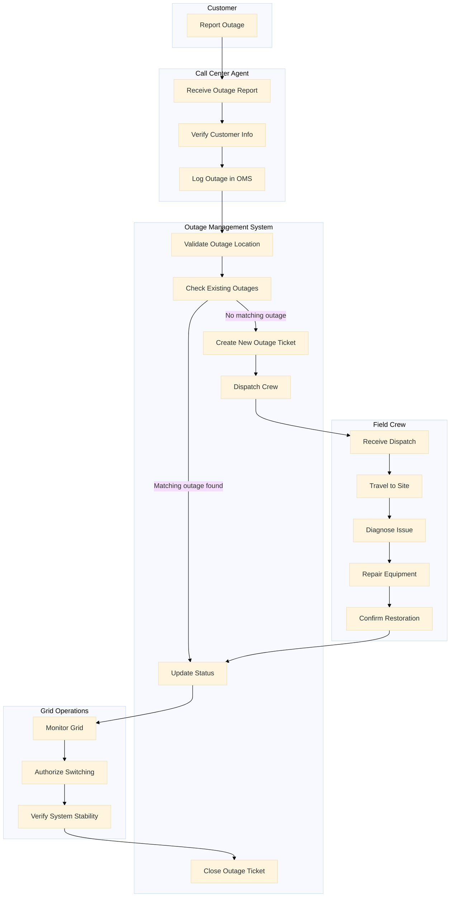
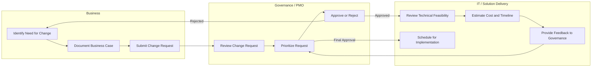
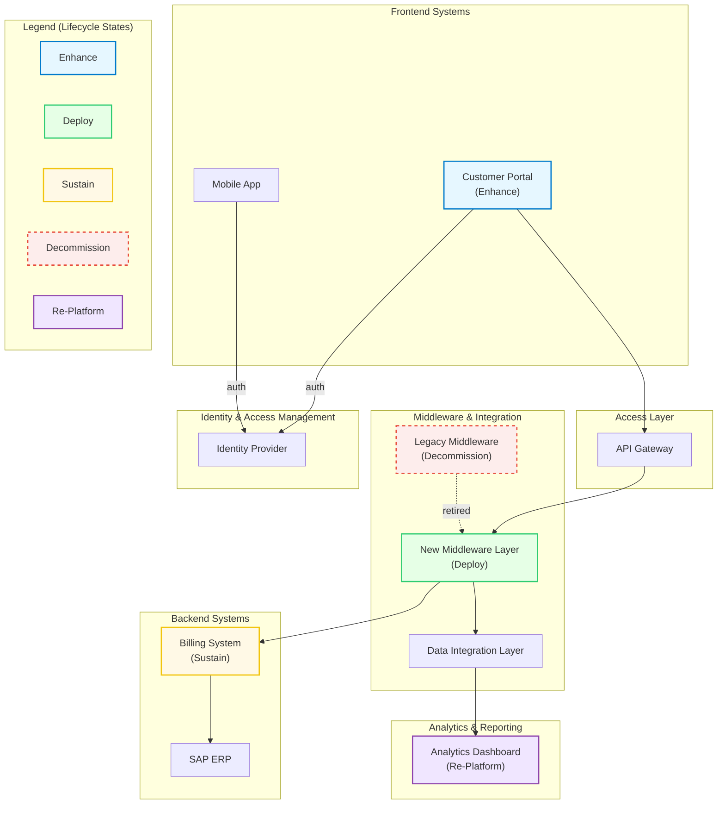

# Executive Summary

<Purpose>
The Executive Summary provides a high-level, non-technical overview of the solution architecture, tailored for senior leadership, sponsors, and non-technical stakeholders. It captures the essence of the architecture’s purpose, business alignment, strategic goals, and major outcomes without delving into detailed technical descriptions. The Executive Summary ensures that decision-makers quickly understand the value, direction, and critical importance of the architecture within the broader enterprise landscape.

<Instructions>
1. **Summarize the Business Problem and Solution:** Provide a brief, clear description of the business problem or opportunity the architecture addresses. Follow it immediately with a simple explanation of the proposed solution—what it is, what it does, and how it helps.
2. **Highlight Strategic Alignment:**  Connect the architecture to key organizational strategies, corporate initiatives, or business goals. Show how the solution fits into the company’s long-term plans for growth, operational excellence, risk reduction, or innovation.
3. **State Key Outcomes and Benefits:**  List the major expected outcomes, such as improved customer satisfaction, increased revenue, operational efficiency, risk mitigation, regulatory compliance, or innovation enablement. Keep the focus on business value rather than technical features.
4. **Mention Major Architectural Features at a High Level:**  Name important components (e.g., major platforms, cloud services, critical systems) but avoid detailed technical language. Describe them in terms of their business contribution.
5. **Include a Call to Action (Optional):** If appropriate, close the summary with a clear next step, such as "endorsement for funding," "approval to proceed," or "review by architectural governance board."
6. **Keep the Tone Executive-Friendly:**  Write in plain, professional language. Avoid jargon, acronyms without explanation, or deep technical detail. Focus on clarity, brevity, and relevance.

<Example>
The Customer Digital Onboarding Initiative modernizes and streamlines the account creation process for new residential and commercial customers, reducing onboarding time by 50% and improving customer satisfaction by 15%. This solution aligns directly with the company’s strategic goals of operational excellence and digital-first engagement. The architecture leverages cloud-native platforms, secure identity federation, and real-time analytics to deliver a scalable, future-ready customer experience. Approval of this architecture enables faster time-to-market, better customer retention, and positions the enterprise to integrate additional self-service innovations over the next two years.

<Prerequisites>
* Business Case Document found in BRD 1 or Demand Intake Form (e.g., “Investment Brief,” “Benefits Realization Plan” “Project Charter” or “Strategic Business Case”)
* IT Steering or Governance Board Presentations, PPGC Deck, Finance Deck

<Standards>
* **TOGAF Standard – Architecture Vision (Part II, Section 7)**
  Provides guidance on developing executive-level overviews.
  🔗 [TOGAF 10 – Architecture Vision](https://pubs.opengroup.org/togaf-standard/enterprise-agile/architecture-development/architecture-vision.html)

# Architecture Vision

<Purpose>
The Vision Statement section outlines the overarching goals and aspirations of the architecture project. It provides a clear and concise description of the desired future state that the architecture aims to achieve. This section should inspire and guide stakeholders by articulating the long-term vision and strategic direction.

<Instructions>
1. **Understand the Context:** Review the business goals, strategic objectives, and key drivers for the architecture project. Engage with stakeholders to gather their perspectives and expectations.
2. **Define the Vision:** Craft a vision statement that is forward-looking, inspirational, and aligned with the organization's strategic goals. Ensure it is clear, concise, and easy to understand.
3. **Validate the Vision:** Share the draft vision statement with key stakeholders for feedback. Refine the statement based on their input to ensure it resonates with all parties involved.
4. **Document the Vision:** Write the final vision statement in a structured format, ensuring it is prominently featured in the Architecture Definition Document.

<Example>
"Our vision is to create a robust, scalable, and secure enterprise architecture that enables seamless integration of business processes, enhances operational efficiency, and supports innovation. By leveraging cutting-edge technologies and best practices, we aim to deliver a flexible and adaptive architecture that meets the evolving needs of our organization and drives sustainable growth."

<Prerequisites>
* Business Goals section of the Project Charter
* Vision Statement from Business Owner or BRM Slide Decks
* Program Briefs from Strategy Office or Portfolio Planning Team

<Standards>
* **TOGAF Standard – Architecture Vision (Section 7.3)**
  🔗 [TOGAF 10 – Architecture Vision](https://pubs.opengroup.org/togaf-standard/enterprise-agile/architecture-development/architecture-vision.html#tag_7_3)

## Business Problem Description

<Purpose>
The Business Problem Description outlines the core business challenge or opportunity that the solution architecture aims to address. This section grounds the technical work in a clear understanding of the business context. A well-defined problem statement helps ensure that the architecture aligns with business needs and delivers meaningful outcomes.

<Instructions>
1. **Clarify the Problem or Opportunity:** Define the key issue or opportunity driving the initiative. Focus on what’s broken, missing, inefficient, or at risk—without jumping into solutions.
2. **Use Business Terms:** Describe the problem in the language of the business. Avoid technical jargon. Emphasize impacts on business goals, customers, employees, or operations.
3. **Include Context and Evidence:** Support the description with data points, user stories, workflow diagrams, or references to audits or incidents. Show why this matters now.
4. **Define the Scope:** Indicate which areas of the business are affected and whether the problem is localized or systemic. This helps define boundaries for the architectural solution.
5. **Link to Strategic Objectives:** If possible, tie the problem to broader company goals such as growth, risk reduction, cost optimization, or customer satisfaction.

<Example>
**Business Problem:** The company’s customer onboarding process is fragmented across multiple systems, leading to inconsistent experiences, frequent delays, and high manual effort. Customers face a 5–7 day wait time due to handoffs between departments, while internal teams spend an average of 8 hours per onboarding case on redundant data entry and approvals. These inefficiencies contribute to customer churn, lower employee satisfaction, and missed revenue opportunities. The architecture must support streamlining this process through automation, integration, and a unified digital experience.

<Prerequisites>
* Problem Statement in Business Case
* Issue Logs or Audit Findings
* Voice of Customer Reports
* Operational Metrics (e.g., from current-state assessments or Lean Six Sigma documentation)

<Standards>
* **ISO/IEC/IEEE 29148:2018 – Requirements Engineering**
  🔗 [ISO 29148 Overview](https://www.iso.org/standard/72089.html)
* **TOGAF Standard – Business Scenarios**
  🔗 [TOGAF 10: Business Scenarios](https://pubs.opengroup.org/togaf-standard/enterprise-agile/techniques/business-scenarios.html)

### Key Stakeholders

<Purpose>
The Key Stakeholders and Influence vs. Interest Mapping section identifies the main individuals, groups, or roles that have a vested interest in the success of the solution architecture and outlines how their influence and interest shape engagement strategies. Knowing who the stakeholders are and how much power and concern they bring ensures that the architecture meets organizational needs, addresses critical requirements, and secures needed support throughout the project lifecycle.

<Instructions>
1. **Identify Stakeholders:**  Work with project sponsors, business units, and technical leads to build a full list of stakeholders. Focus on individuals or groups who shape requirements, funding, governance, adoption, or maintenance of the solution.
2. **Describe Stakeholder Roles:**  For each stakeholder or group, explain their role, responsibilities, and how they interact with the architecture. Note whether they act as decision-makers, approvers, contributors, or end users.

3. **Assess Influence and Interest:**  Evaluate how much control each stakeholder has over the project's direction (influence) and how much they care about its outcomes (interest). High-influence stakeholders can change scope, funding, or priority. High-interest stakeholders see the solution's success or failure as important to their work or goals. Assign each stakeholder a simple rating of High, Medium, or Low for both influence and interest.

4. **Map Stakeholders to Engagement Strategies:**  Based on influence and interest, sort stakeholders into four groups:
   * Those with high influence and high interest must be **managed closely**. Engage them often and involve them in key decisions.
   * Those with high influence but low interest must be **kept satisfied**. Keep them informed enough to maintain their support without overloading them.
   * Those with low influence but high interest must be **kept informed**. Share updates and give chances for feedback, but they do not drive decisions.
   * Those with low influence and low interest should be **monitored with minimal effort**. Acknowledge them but do not devote major resources to engagement.
5. **Document Stakeholder Needs:**  
Capture key expectations, goals, pain points, or compliance concerns each stakeholder brings. This ensures the solution does not just meet technical goals, but also aligns with business needs and regulatory requirements.
6. **Engage Early and Often:**  
Plan how and when stakeholders will be engaged, such as through steering committees, feedback sessions, or milestone reviews. Record the planned engagement for each stakeholder group clearly.
7. **Validate the Stakeholder List and Mapping:**  
Review the list and the engagement strategies with the project sponsor and solution delivery leads. Make sure all key parties are captured and correctly categorized.

<Example>
The Executive Sponsor (CIO) holds high influence and high interest. They must be managed closely with regular briefings and active participation in steering committees.  
The Business Unit Lead for Customer Service holds medium influence and high interest. They should be kept informed through project newsletters and monthly review sessions.  
The IT Operations Manager holds high influence but medium interest. They should be kept satisfied with quarterly updates and design review touchpoints.  
The Field Technicians, who will use the solution daily, hold low influence but high interest. They should be included in user testing and training sessions.  
The Procurement Specialist holds low influence and low interest and requires only minimal updates tied to procurement milestones.

<Prerequisites>
* RACI Matrices
* Stakeholder Registry (maintained by PMO or Change Management)
* Governance Committee Rosters
* Project Team Org Chart

<Standards>
* **TOGAF Standard – Stakeholder Management (Section 7.5)**
  🔗 [TOGAF 10: Stakeholder Management](https://pubs.opengroup.org/togaf-standard/enterprise-agile/architecture-development/architecture-vision.html#tag_7_5)
* **ISO/IEC 42010:2011 – Architecture Description**
  🔗 [ISO/IEC 42010 Overview](https://www.iso.org/standard/50508.html)

### Key Contacts

<Purpose>
The Key Contacts section records the main individuals involved in the solution delivery, including their names, roles, and contact information. This ensures that project team members, stakeholders, auditors, and operational support teams have clear visibility into who holds key responsibilities and how to reach them. A full and accurate Key Contacts list strengthens communication, speeds up decision-making, and supports continuity throughout the project lifecycle and beyond.

<Instructions>
1. **Gather Contact Information:** Identify all individuals filling critical business and IT roles related to the solution. For each person, collect their full name, role, email address, and phone number.
2. **Match Contacts to Roles:** Use the defined role list as a guide to ensure full coverage. If a role is unassigned at the time of documentation, note it as "TBD" (To Be Determined) and update it once a contact is confirmed.
3. **Business Roles:** Document the following contacts for the business side of the solution:
   * Business Unit Representative
   * {Process Name} – Process Sponsor
   * {Process Name} – Process Owner
   * {Product Name} – Product Owner
4. **IT Roles:** Document the following contacts for the IT side of the solution:
   * Solution Delivery Manager
   * Project Manager
   * Project Support Analyst
   * Cyber Risk Assessor
   * IT Compliance Lead
   * Disaster Recovery Lead
   * Enterprise Architect
   * Lead Enterprise Domain Architect
   * Solution Architect
   * Project Architect
   * Information Architect
   * MSA/SOW Team Contact
   * Lead Quality Advisor
   * Security Quality Advisor
   * MSP Build Lead
   * Release Test Lead
   * TCoE SQA Lead
   * ETS Tower Lead
   * Change Delivery Manager
   * Change Coordinator
   * Release Process Owner
   * Release Delivery Manager
   * Training Lead
   * Organizational Change Management (OCM) Lead
5. **Format Clearly and Consistently:**  List each role followed by the associated contact’s full name, then their email and phone number. Keep the format uniform across the section to make lookups fast and reliable.
6. **Review and Validate:**  Confirm the contact list with the Project Manager and Solution Delivery Manager to ensure all necessary roles are covered. Verify that the contact details are current and correct.
7. **Maintain Updates:**  Flag this section for periodic review. Update the contact information as people join or leave the project to keep the section evergreen.

<Example>
Business Unit Representative: John Smith, [john.smith@example.com](mailto:john.smith@example.com), (555) 123-4567  
Customer Billing – Process Sponsor: Jane Doe, [jane.doe@example.com](mailto:jane.doe@example.com), (555) 987-6543  
Customer Billing – Process Owner: Mark Johnson, [mark.johnson@example.com](mailto:mark.johnson@example.com), (555) 321-7890  
Customer Portal – Product Owner: Emily Brown, [emily.brown@example.com](mailto:emily.brown@example.com), (555) 654-3210

Solution Delivery Manager: Alan Richards, [alan.richards@example.com](mailto:alan.richards@example.com), (555) 456-7890  
Project Manager: Lisa Greene, [lisa.greene@example.com](mailto:lisa.greene@example.com), (555) 234-5678  
Project Support Analyst: Victor Zhou, [victor.zhou@example.com](mailto:victor.zhou@example.com), (555) 678-1234  
...and so on for each listed role.

<Prerequisites>
* Project Team Roster (often in Project Kickoff Deck or PM tool like MS Project/MS Planner)
* Project Charter or Project Initiation Document
* Project Contact List in SharePoint or UMT360

<Standards>
* **TOGAF Standard – Architecture Governance**
  🔗 [TOGAF 10: Architecture Governance](https://pubs.opengroup.org/togaf-standard/enterprise-agile/architecture-development/architecture-governance.html)

### Stakeholder Concerns

<Purpose>
The Stakeholder Concerns section identifies the needs, expectations, worries, and requirements of those affected by the architecture—whether business leaders, end users, IT staff, or external partners. Capturing these concerns helps ensure the architecture reflects real-world priorities and avoids blind spots that may cause resistance or rework later. Addressing concerns early also builds trust and alignment.

<Instructions>
1. **Identify Stakeholders:** List all relevant stakeholder groups—executives, managers, operations, security, compliance, developers, end users, partners, etc.
2. **Gather Concerns:** Use interviews, surveys, workshops, or past feedback to understand what matters to each group. Look for pain points, unmet needs, and aspirations.
3. **Summarize by Role or Group:** Organize concerns by stakeholder type. Be concise and specific—focus on what they need, fear, or want from the architecture.
4. **Map Concerns to Architecture Implications:** Indicate how each concern influences architectural decisions (e.g., security models, usability, data flow, system availability).
5. **Validate and Revisit:** Share this section with stakeholders to confirm it reflects their viewpoints accurately. Keep it updated as new concerns emerge.

<Example>
Stakeholder Concerns:

1. **Business Leadership:**
   * Need to reduce time-to-market for new digital services
   * Concerned about the risk of business disruption during migration
2. **IT Operations:**
   * Want streamlined monitoring and management tools
   * Concerned about increased complexity if multiple platforms are introduced
3. **Security and Compliance Teams:**
   * Require detailed audit trails and access controls
   * Concerned about regulatory exposure during data integration efforts
4. **End Users:**
   * Expect consistent performance and intuitive interfaces across devices
   * Concerned about system downtime affecting productivity

<Prerequisites>
* Stakeholder Interviews (documented in stakeholder analysis sessions)
* Meeting Minutes and Transcripts from Requirements Workshops
* Feedback Logs
* Operational Risk Logs (for stakeholder-driven risks)

<Standards>
* **TOGAF Standard – Stakeholder Concerns**
  🔗 [TOGAF 10: Stakeholder Management](https://pubs.opengroup.org/togaf-standard/enterprise-agile/architecture-development/architecture-vision.html#tag_7_5)

### Issues / Scenarios to Be Addressed

<Purpose>
This section outlines the specific problems, challenges, or opportunities that the architecture effort must address. These may include operational pain points, user experience gaps, scalability bottlenecks, or integration limitations. Clearly stating these issues provides context for design choices and ensures the architecture remains grounded in solving real business and technical concerns.

<Instructions>
1. **Gather Inputs:** Consult with business units, technical teams, and end users to collect known issues and future scenarios. Use existing pain-point analyses, incident logs, audit reports, and customer feedback.
2. **Prioritize and Scope:** Not all issues are equal—identify those that must be addressed in this initiative. Consider urgency, impact, and alignment with project scope.
3. **Describe Clearly:** For each issue or scenario, describe the current state, the root cause or context, and what needs to be addressed. Use plain language, and avoid jargon when possible.
4. **Link to Architecture Decisions:** Briefly connect each issue or scenario to why it matters architecturally. Does it drive a particular technology choice, integration, or pattern?
5. **Validate with Stakeholders:** Review this section with key stakeholders to confirm shared understanding of what problems the architecture must solve.

<Example>
Issues to Be Addressed:

1. **Siloed Data Systems:** Key operational data is split across multiple platforms, leading to duplication, inconsistent reporting, and slow decision-making. The architecture must enable data unification through integration or centralized storage.
2. **Manual Workflow Bottlenecks:** Many core processes require manual handoffs, especially in customer onboarding and billing. These result in delays and errors. Automation and orchestration need to be addressed in the architecture.
3. **Inability to Scale:** The current platform cannot handle projected transaction volume growth over the next three years. The architecture must support elastic scalability and horizontal expansion.
4. **Poor Mobile Experience:** End users report sluggish performance and limited functionality on mobile devices. The new architecture must address responsiveness, performance tuning, and UI design across device types.

<Prerequisites>
* Pain Point Analysis / Current State Assessments
* IT Ops Incident Reports
* As-Is / To-Be Process Maps
* Problem Statements from Business Process Engineering initiatives such as Lean Six Sigma Kaizen or DMAIC, or a TPS Kaikaku.

<Standards>
* **TOGAF Standard – Stakeholder Concerns**
  🔗 [TOGAF 10: Stakeholder Management](https://pubs.opengroup.org/togaf-standard/enterprise-agile/architecture-development/architecture-vision.html#tag_7_5)

### Key Change Drivers & Opportunities

<Purpose>
The Key Drivers section identifies and explains the primary factors influencing the architecture project. These drivers can include business goals, technological advancements, regulatory requirements, and market trends. Understanding these drivers is crucial for aligning the architecture with the organization's strategic objectives and ensuring its relevance and effectiveness.

<Instructions>
1. **Identify Key Drivers:** Engage with stakeholders to gather information on the main factors impacting the architecture project. Consider business objectives, technological trends, regulatory changes, and competitive pressures.
2. **Analyze Impact:** Assess how each key driver influences the architecture. Determine the implications for design decisions, resource allocation, and project priorities.
3. **Document Drivers:** Clearly articulate each key driver, providing a detailed explanation of its significance and impact on the architecture. Use structured formats such as bullet points or tables for clarity.
4. **Validate with Stakeholders:** Share the documented key drivers with stakeholders for feedback. Ensure that all relevant factors are accurately captured and understood.

<Example>
**Key Drivers:**

1. **Business Growth:** The architecture must support the company's strategic goal of expanding into new markets and increasing revenue by 20% over the next five years.
2. **Technological Innovation:** Adoption of emerging technologies such as AI and IoT to enhance operational efficiency and customer experience.
3. **Regulatory Compliance:** Ensuring adherence to new data protection regulations to avoid legal penalties and maintain customer trust.
4. **Competitive Pressure:** Developing a flexible and scalable architecture to quickly respond to market changes and outperform competitors.

<Prerequisites>
* Strategy Maps from Strategy or Business Planning Teams
* Market and Regulatory Impact Analysis
* Executive Presentations (OKRs, QBRs, Investor Decks)
* Technology Architecture Roadmaps, Edison International Strategy Teach Roadmaps

<Standards>
* **TOGAF Standard – Drivers, Goals, and Objectives (Phase A)**
  🔗 [TOGAF 10: Architecture Vision](https://pubs.opengroup.org/togaf-standard/enterprise-agile/architecture-development/architecture-vision.html)
* **Agile Manifesto**
  🔗 [Agile Manifesto](https://agilemanifesto.org)
* **SAFe Framework – Strategic Themes**
  🔗 [SAFe Strategic Themes](https://scaledagileframework.com/strategic-themes/)

## Business Impact

### Actors with Applicable Roles & Responsibilities

<Purpose>
This section identifies all system actors in scope for the target architecture—both human and non-human. System actors are individuals, organizations, or systems that interact with or are impacted by the solution. Capturing this information is essential to understanding who will use, support, or depend upon the system. Including organizational context such as department or business unit helps clarify ownership, stakeholder alignment, access needs, and change impacts across the enterprise.

<Instructions>
1. **List Human Actors:** Begin by identifying all human users or participants in the architecture. Include both internal and external roles, using examples and categories provided below. Be specific about job titles, responsibilities, and whether the actor belongs to SCE, an affiliate, or an external party.
2. **Provide Organizational Context:** For each human actor, indicate their organizational affiliation—department, business unit, affiliate, or vendor. This helps map ownership and determine which teams will be affected or responsible for solution support.
3. **List Non-Human Actors:** Capture any system, computer, or non-human actors relevant to the architecture. Reference or describe these in Section 3, as applicable.
4. **Ensure Role Clarity:** Clarify whether each actor is expected to use the system directly, provide data, receive outputs, support the platform, or govern outcomes.
5. **Use Structured Formats:** Use bullet points, tables, or a role matrix for clarity. Group actors by type or function.
6. **Validate with Stakeholders:** Confirm this list with business and technical leads to ensure completeness and accuracy. Include emerging roles where relevant.

<Example>
Actors in Scope:

* Human Actors and Roles:**
  * **Public (External to SCE):**
    * _Public Figures:_ Individuals influencing opinion about SCE and its services
    * _Media:_ Reporters covering SCE-related stories
    * _Government Officials:_ Elected or appointed representatives serving constituents in SCE’s territory
    * _Investors:_ Individuals or institutions that hold equity or debt in SCE
    * _Energy Users:_
      * _Customers:_ Residential, commercial, or industrial users of SCE services
      * _Customer’s Family:_ Household members affected by service delivery
      * _Customer’s Employees:_ Staff at businesses who depend on energy services
  * **Workers (Internal and Partnered):**
    * _Potential Employees:_ Candidates interested in SCE job opportunities
    * _Employees:_
      * _SCE Employees:_
        * Include employee titles and clarify their function
        * Note if they hold roles with **FERC Marketing** responsibilities
      * _SCE Affiliate Company Employees:_ Identify the specific affiliate company and roles
    * _Contingent Workers:_ Individuals hired through external firms delivering outcomes in support of SCE personnel. Typically, not onboarded to internal systems
    * _Service Providers:_ External vendors or firms onboarded into the SCE environment, accountable for outcome delivery at agreed service levels
  * **Regulatory Agencies:**
    * Federal, state, or local agencies that oversee, audit, or guide SCE operations
* Computer (System) Actors:**  Include software agents, APIs, integration endpoints, and automated system roles that interact with or are part of the target architecture. Document these in detail in Section 3.
* Other System Actors:** List any additional relevant actors not covered above (e.g., AI components, decision engines, third-party platforms). Describe these in Section 3, where technical systems are detailed.

<Prerequisites>
* Use Case Definitions
* RACI Diagrams
* Org Charts with Role Descriptions
* Process Documentation (e.g., swimlane diagrams)

<Standards>
* **TOGAF Content Framework – Business Architecture Metamodel**
  🔗 [TOGAF 10: Business Layer Concepts](https://pubs.opengroup.org/togaf-standard/enterprise-agile/architecture-content/content-metamodel.html)

### Process Description

<Purpose>
The Process Description section outlines the in-scope business processes that are impacted by or relevant to the conceptual architecture. It establishes a baseline understanding of the operational workflows that must be supported, enhanced, or reimagined by the solution. By identifying and describing these processes, the architecture team can ensure alignment with business needs, anticipate integration points, and address any regulatory compliance requirements such as SOX or NERC/CEII.

<Instructions>
1. **Identify In-Scope Business Processes:**  
Clearly list all business processes that fall within the scope of the architecture effort. Include any front-office, middle-office, or back-office workflows expected to change, integrate, or rely on the target solution. Be explicit about which processes are new, existing, or changing.
2. **Provide High-Level Diagrams (if required):**  
Where helpful, include one or more high-level process diagrams that illustrate how work flows through the business. Use standard notation such as BPMN or simple swimlane diagrams. Diagrams should focus on the logical steps of the process, not technical implementation details.
3. **Include Descriptions for Each Diagram:**  
Accompany each diagram with a short narrative that explains what the diagram shows, who is involved, what the inputs and outputs are, and any assumptions or scope boundaries. The description should make the process easily understandable to non-technical stakeholders.
4. **Describe the Flow of Information:**  
Explain how information (not just data) moves through the process. Focus on how knowledge, decisions, and communication pass from one step or actor to the next. Describe inputs, outputs, approvals, triggers, and informational dependencies between roles or systems.
5. **Highlight SOX-Controlled Processes:**  
Identify any business processes that are subject to **Sarbanes-Oxley (SOX)** controls. For each, explain how the architecture will support compliance—through audit logging, approval flows, segregation of duties, or access controls.
6. **Highlight NERC / CEII-Controlled Processes:**  
Note any processes that must comply with **North American Electric Reliability Corporation (NERC)** or **Critical Energy/Electric Infrastructure Information (CEII)** requirements. Provide a brief explanation of why the process is sensitive and what control measures or isolation patterns are required to meet regulatory standards.

<Example>
Process Description:

1. **In-Scope Processes:**
   * Customer Onboarding
   * Outage Management Workflow
   * Meter Data Collection and Billing
   * Change Request Intake and Fulfillment
2. **High-Level Diagrams:**
   * Included BPMN diagram of the "Outage Management Workflow" (Below)
   * Swimlane diagram of "Change Request Intake" showing IT and business handoffs (Below)
3. **Flow of Information:**
   * In the Outage Management Workflow, field data captured by technicians flows to control center systems, triggering updates to outage maps and status notifications to customers.
   * In the Change Request process, approvals must move through at least two management layers before implementation, with notes and justification captured at each stage.
4. **SOX-Controlled Processes:**
   * Billing Reconciliation Process: Involves revenue recognition and must maintain audit logs and documented approvals.
5. **NERC / CEII-Controlled Processes:**
   * Grid Monitoring and Control Workflow: Involves access to SCADA systems and requires encryption, network segmentation, and role-based access as part of NERC CIP compliance.





<Prerequisites>
* BPMN Models in Business Process Repository (e.g., Signavio)
* SOPs (Standard Operating Procedures)
* Internal Compliance Documentation (e.g., SOX/NERC reports)
* Process Architecture Models from EA Repository

<Standards>
* **BPMN 2.0 Specification (OMG)**
  🔗 [BPMN Spec](https://www.omg.org/spec/BPMN/2.0/)
* **Mermaid Script Specification**
  🔗 [Mermaid Spec](https://mermaid.js.org/intro/syntax-reference.html)

### Business & Technical Environments

<Purpose>
The Business & Technical Environments section defines the operational context in which the solution architecture will function. This section overlays the identified in-scope business processes onto the proposed solution landscape, ensuring that both business and technical environments are fully understood and aligned. Capturing these environments helps anchor the architecture within the real-world systems, departments, and workflows it must support and integrate with. A clear and complete environment description strengthens solution fit, highlights integration needs, and surfaces key constraints early in the process.

<Instructions>
1. **Describe the Business Environment:**  Identify and describe the business units, functions, workflows, and operational areas that fall within the scope of the architecture vision. Clearly state which parts of the business are directly affected and which are indirectly impacted. Include any relevant business drivers, operational goals, or strategic initiatives shaping the environment. If the business environment is still being finalized, indicate it as "TBD" (To Be Determined) but describe the expected areas under consideration.
2. **Describe the Technology Environment:**  Outline the technology domains, platforms, and systems in scope for the architecture. Examples include Grid Operations systems, Enterprise Resource Planning (ERP) systems, Customer Information Systems (CIS), billing platforms, mobile field service systems, and cloud environments. Specify which systems the architecture will interact with, replace, extend, or depend upon.
3. **Overlay Business Processes onto Environments:**  Show how the in-scope business processes map onto the business and technology environments. Explain where each key process resides, which systems support them, and any notable gaps, overlaps, or dependencies. Use simple tables, bullet points, or mapping diagrams if necessary to make this relationship clear.
4. **Use Structured Formats for Clarity:**  Present environment details in a clean and structured way. You may use a two-column table (Business Environment | Technology Environment) to organize information. Be consistent and precise in naming systems, departments, and processes.
5. **Highlight Critical Integration Points and Constraints:**  Identify where the business and technical environments impose architectural constraints, such as legacy system limitations, regulatory compliance boundaries, high-availability needs, or integration bottlenecks.
6. **Mandatory Section:**  Completion of this section is **mandatory**. The solution architecture document must not proceed to later design sections without an agreed understanding of the business and technical environments in scope.

<Example>
Business & Technical Environments:

* **Business Environment:**
  * Customer Service Operations (Billing, Call Center Support)
  * Field Service Operations (Grid Maintenance and Repair Dispatch)
  * Energy Trading & Risk Management (ETRM) Unit
  * Regulatory Affairs (Compliance Reporting and Audit Readiness)
* **Technology Environment:**
  * Customer Information System (CIS)
  * SAP ERP Financials and Supply Chain
  * Mobile Field Service Application (MFSApp)
  * Grid SCADA System
  * Salesforce CRM for Customer Support
* **Overlay Summary:**
  * Customer billing processes occur within CIS and SAP ERP.
  * Field service dispatch links Mobile Field Service Application with Grid SCADA for outage management.
  * Regulatory reporting relies on data aggregated across SAP and Grid Systems.

<Prerequisites>
* Current State Architecture Models (from Orbus)
* Business Capability Maps
* IT Landscape Inventory
* Application Portfolio Reports

<Standards>
* **TOGAF Standard – Baseline & Target Architecture (Phase B/C)**
  🔗 [TOGAF 10: Architecture Development](https://pubs.opengroup.org/togaf-standard/enterprise-agile/architecture-development/index.html)

### Cross Project Dependencies

<Purpose>
The Cross Project Dependencies section identifies other projects that may influence, constrain, or enable the success of the architecture effort. Dependencies can include overlapping system changes, shared resources, timing conflicts, or related initiatives delivering enabling capabilities. Recognizing and managing these dependencies early is critical to ensuring architectural alignment, avoiding rework, and reducing delivery risk. This section also fosters cross-team collaboration and promotes visibility across concurrent enterprise initiatives.

<Instructions>
1. **Identify Related Projects:**  
Work with the **Enterprise Architecture (EA) Team** and the **Business Relationship Manager (BRM)** to identify other projects within the enterprise that may introduce dependencies. These may be projects that deliver enabling components, share the same systems or teams, or are scheduled to go live in overlapping timeframes.
2. **Use Formal Identifiers:**  
For each dependency, reference the unique project identifier (where available) from formal planning systems such as **UMT360**, **PPM**, or **ETS Operational Plan**. Include both the name and ID for traceability.
3. **Describe the Nature of the Dependency:**  
Provide a short description explaining how the success or timeline of your architecture project depends on, or is influenced by, the other project. Clarify whether the dependency is technical (e.g., shared APIs or infrastructure), business-driven (e.g., shared business process or customer impact), or resource-based (e.g., shared delivery teams or SMEs).
4. **Engage Peer BRMs:**  
The **BRM assigned to this architecture project** must coordinate with BRMs from the dependent projects. Together with the Solution Architect, they ensure the dependency is logged and tracked. Dependencies must be entered into **UMT360** to ensure visibility in planning and governance processes.
5. **Ensure Ongoing Monitoring:**  
Dependencies are not static. Establish a regular cadence to review, update, and manage the status of identified cross-project dependencies. Escalate changes in scope or schedule that could impact architectural alignment.

<Example>
Cross Project Dependencies:

1. **Dependent Project:** Customer Digital Experience Platform
   * **Project ID:** UMT360-04578
   * **Dependency Description:** This platform is responsible for delivering the unified customer identity layer that this architecture depends on for authentication and personalization features. Any delays or changes to their API contract would directly impact our timeline.
   * **BRMs Involved:** Jane Doe (Current Project), Mark Smith (Dependent Project)
   * **Logged in UMT360:** Yes
2. **Dependent Project:** Grid Modernization Data Hub
   * **Project ID:** PPM-22143
   * **Dependency Description:** Our architecture relies on streaming data pipelines built as part of this initiative. Coordination is needed to ensure compatibility with our planned analytics services.
   * **BRMs Involved:** Jane Doe (Current Project), Priya Patel (Dependent Project)
   * **Logged in UMT360:** In Progress

<Prerequisites>
* UMT360
* ETS/BRM Operational Plans
* Dependency Logs
* Architecture Review Board (ARB) meeting notes

<Standards>
* **TOGAF Standard – Opportunities and Solutions (Phase E)**
  🔗 [TOGAF 10: Phase E](https://pubs.opengroup.org/togaf-standard/enterprise-agile/architecture-development/opportunities-and-solutions.html)

## Resulting Architecture Models

### Conceptual End-to-End Solution

<Purpose>
The Conceptual End-to-End Solution section defines the high-level architecture that addresses the business needs and capabilities outlined in previous sections. It presents a visual and narrative representation of the target state solution, illustrating how applications, capabilities, and systems interact across the enterprise. This section helps stakeholders understand the big picture before detailed designs are developed and supports alignment between technical delivery teams and business goals.

<Instructions>
1. **Create High-Level Diagrams:**  
Include architecture diagrams that depict the target conceptual solution. The diagram(s) should show major systems, platforms, integrations, user interaction points, and data flows. Focus on logical relationships and component roles—not implementation detail. Keep the level appropriate for executive and business stakeholder audiences while still informing technical planning.
2. **Provide Diagram Descriptions:**  
For each diagram included, write a narrative that explains what the diagram shows, how the parts relate, and how the diagram reflects the architecture vision. Describe how business capabilities are enabled by the depicted architecture. Clarify system boundaries, interaction flows, and any assumptions.
3. **Document Application Life Cycle States:**  For each application represented in the conceptual architecture, identify its current or planned **Application Life Cycle** status. Refer to **Orbus** for authoritative Application Life Cycle status. If introducing a new business capability with no current system in place, mark the life cycle status as **Deploy**. If introducing a new system to take over a capability from an existing solution, mark it as **Re-Platform**.  This helps clarify the degree of change involved and supports planning and impact analysis. The life cycle states to use are:
   * **Deploy** – New application introduced for a new business capability.
   * **Enhance** – Existing application remains in place but will receive new features or updates.
   * **Sustain** – Application remains unchanged but stays in use to support current capabilities.
   * **Re-Platform** – New application replaces one or more legacy systems to support the same or extended capabilities.
   * **Replace** – Application is being swapped out entirely due to obsolescence or functionality gaps.
   * **Decommission** – Application is being retired and removed from the portfolio.
4. **Ensure Consistency Across Views:**  
Align this section with related sections such as Business Processes, Actors, and Dependencies. Ensure terminology, system names, and roles are consistent.

<Example>
Conceptual End-to-End Solution:

* **Diagram Included:** High-level architecture map showing:
  * Customer Portal → API Gateway → Middleware → Billing System → SAP ERP
  * Identity Provider connected to Customer Portal and Mobile App
  * Data Integration Layer feeding Analytics Dashboard
* **Diagram Description:** The conceptual diagram shows how customer interactions are routed through the API Gateway to backend billing and ERP systems. Identity management is centralized through a shared identity provider. The solution also includes a data integration layer to support near real-time analytics for business insights.
* **Application Life Cycle Description:**
  * **Customer Portal:** (_Enhance_) - The Customer Portal will remain in use but will receive new features focused on personalization and user experience improvements.
  * **Billing System:** (_Sustain_) - The Billing System will continue operating without change. It will remain the core system supporting billing operations.
  * **New Middleware Layer:** (_Deploy_) - A new Middleware Layer will be introduced to manage system integration and data transformation between frontend and backend systems.
  * **Legacy Middleware:** (_Decommission_) - The Existing Legacy Middleware will be retired after the successful deployment of the new Middleware Layer.  Its current functions will be fully transitioned
  * **Analytics Dashboard:** (_Re-Platform)_ - The legacy business intelligence tool will be replaced by a new cloud-based Analytics Dashboard, providing modern reporting and insight capabilities.



<Prerequisites>
* High-Level Architecture Diagrams (stored in EA repository or Solution Design docs)
* Application Lifecycle Reports
* Capability-to-System Traceability Matrix
* Previous Solution Design Templates or Patterns

<Standards>
* **TOGAF 10 – Content Metamodel**
  🔗 [TOGAF Content Metamodel](https://pubs.opengroup.org/togaf-standard/enterprise-agile/architecture-content/content-metamodel.html)

### Other Architectural Options

<Purpose>
The Other Architectural Options section outlines alternative solution approaches that were considered during the architecture design process. This section documents the evaluation of different architectural paths and provides transparency into why certain options were not selected. Including this analysis helps stakeholders understand trade-offs, supports architectural governance, and ensures the chosen approach was based on a reasoned comparison of alternatives—not just assumed best practices or default patterns.

<Instructions>
1. **Identify Alternative Approaches:** List the architectural approaches, patterns, or platforms that were seriously considered but ultimately not selected. These could include variations in system integration patterns, infrastructure choices (e.g., cloud vs. on-premise), data management strategies, vendor solutions, or service orchestration models.
2. **Describe Each Option:** For each alternative, provide a brief but clear description. Identify the core idea, the technologies involved, and how the option would have addressed the business and technical requirements.
3. **Evaluate Strengths and Weaknesses:** For each option, highlight key advantages (e.g., lower cost, faster implementation, vendor alignment) and limitations (e.g., scalability issues, integration complexity, misalignment with roadmap). Include architectural trade-offs and constraints that influenced the decision.
4. **Explain the Decision Rationale:** Clearly articulate why the alternative was not selected. This could relate to technical feasibility, total cost of ownership, operational risk, organizational readiness, or alignment with long-term strategic goals. Link decisions back to stakeholder priorities or enterprise architecture principles where possible.
5. **Ensure Traceability and Transparency:** If applicable, cite reference materials, evaluation matrices, or meeting notes where the alternatives were discussed. The goal is to make the decision-making process auditable and repeatable.

<Example>
Other Architectural Options Considered:

1. **Hybrid Cloud Architecture (Cloud for Front-End, On-Prem for Back-End):**
   * _Description:_ This option proposed keeping the core transactional systems on-premises while migrating all customer-facing portals and mobile apps to a public cloud environment.
   * _Strengths:_ Improved scalability and flexibility for customer channels; potential for faster innovation cycles.
   * _Weaknesses:_ Increased integration complexity between cloud and on-prem systems; added latency and security challenges.
   * _Reason Not Selected:_ Ultimately not aligned with the enterprise’s cloud-first strategy and would have created duplicated infrastructure maintenance overhead.
2. **Single-Vendor Suite Solution:**
   * _Description:_ Leverage an end-to-end suite from a single vendor that covered CRM, billing, and case management.
   * _Strengths:_ Simplified integration, faster procurement, and consolidated vendor support.
   * _Weaknesses:_ Lower flexibility, lack of best-of-breed capabilities in certain domains, vendor lock-in.
   * _Reason Not Selected:_ The suite lacked maturity in several key capability areas needed by the business, and customization requirements would have undermined the advantages of the pre-integrated suite.

<Prerequisites>
* Architecture Option Evaluations / Trade-Off Analyses
* Decision Logs or Architectural Runway Docs
* Vendor Proposals or RFP Evaluations
* Meeting Notes from Architecture Working Group

<Standards>
* **TOGAF 10 – Architecture Development Phases B, C, D**
  🔗 [TOGAF 10: Architecture Development](https://pubs.opengroup.org/togaf-standard/enterprise-agile/architecture-development/index.html)

### Constraints

<Purpose>
The Constraints section identifies the limitations and restrictions that impact the architecture project. These constraints can be related to budget, time, resources, technology, and regulatory requirements. Understanding these constraints is essential for realistic planning and effective decision-making throughout the project lifecycle.

<Instructions>
1. **Identify Constraints:** Engage with stakeholders to gather information on the limitations affecting the project. Consider factors such as budget restrictions, timelines, resource availability, technological limitations, and regulatory requirements.
2. **Analyze Impact:** Assess how each constraint influences the architecture. Determine the implications for design decisions, project scope, and resource allocation.
3. **Document Constraints:** Clearly articulate each constraint, providing a detailed explanation of its significance and impact on the architecture. Use structured formats such as bullet points or tables for clarity.
4. **Validate with Stakeholders:** Share the documented constraints with stakeholders for feedback. Ensure that all relevant limitations are accurately captured and understood.

<Example>
**Constraints:**

1. **Budget Limitations:** The project budget is capped at $2 million, requiring careful prioritization of features and technologies.
2. **Time Constraints:** The architecture must be delivered within a 12-month timeframe to align with the company's strategic initiatives.
3. **Resource Availability:** Limited availability of skilled personnel in specific technologies, necessitating training and outsourcing.
4. **Technological Limitations:** Existing legacy systems must be integrated, posing challenges for compatibility and performance.
5. **Regulatory Requirements:** Compliance with industry-specific regulations, such as GDPR, imposes constraints on data handling and security measures.

<Prerequisites>
* Project Charter and Budget Constraints
* Risk Register
* Procurement and Vendor Management Docs
* Compliance Checklists

<Standards>
* **PMBOK® Guide (Project Management Institute)**
  Categorizes constraints as any limiting factors that affect the execution of a project—typically scope, schedule, budget, resources, risk, and quality. These are documented in the Project Charter and Scope Statement.
  🔗 [PMI PMBOK Guide](https://www.pmi.org/pmbok-guide-standards/foundational/pmbok)
* **TOGAF® Standard (The Open Group Architecture Framework)**
  Defines constraints in architecture as conditions limiting available choices, such as legacy systems, mandated tools, compliance requirements, or vendor contracts. Documented in the Architecture Requirements Specification.
  🔗 [TOGAF Standard](https://pubs.opengroup.org/architecture/togaf-standard/)
* **ISO/IEC/IEEE 29148:2018 – Life Cycle Processes – Requirements Engineering**
  Establishes how to document both functional and non-functional requirements, including **design constraints**, **implementation constraints**, and **external constraints** like laws or standards.
  🔗 [ISO/IEC/IEEE 29148 Summary](https://www.iso.org/standard/72036.html)
* **SAFe® (Scaled Agile Framework)**
  Treats architectural and technical constraints as part of the Architectural Runway and Guardrails, limiting design decisions and ensuring enterprise alignment in Agile delivery.
  🔗 [SAFe Framework – Architecture](https://scaledagileframework.com/architecture/)
* **ITIL® 4 – IT Service Management**
  Defines constraints within Service Design and Strategy Phases. These constraints (e.g., SLAs, OLAs, regulatory requirements) must be documented to align services with business needs.
  🔗 [ITIL 4 Overview](https://www.axelos.com/certifications/itil-4)
* **Archimate® 3.2 Specification – Modeling Notation**
  Provides a way to model constraints graphically within enterprise architectures, including business rules, compliance, or platform limitations using “Constraints” and “Requirements” elements.
  🔗 [ArchiMate 3.2 Standard](https://pubs.opengroup.org/architecture/archimate3-doc/)
* **CMMI® – Capability Maturity Model Integration**
  Describes how constraints should be captured in Requirements Development and Project Planning process areas, especially for high-maturity software engineering teams.
  🔗 [CMMI Institute](https://cmmiinstitute.com/)

### Dependencies

<Purpose>
The Dependencies section identifies external factors, systems, teams, or initiatives that the success of the solution architecture depends upon. Dependencies can include technology enablers, integration points, vendor deliverables, resource availability, or the outcomes of other projects. Capturing these dependencies ensures risks are surfaced early, timelines are coordinated, and critical assumptions are documented for proper planning and governance.

<Instructions>
1. **Identify All Relevant Dependencies:** List any external elements outside the immediate project team's direct control that the solution relies on. Examples include dependent system upgrades, data availability from other sources, third-party service delivery, enterprise platform readiness, regulatory approvals, or resource commitments from other departments.
2. **Describe Each Dependency:** For each dependency, describe it in clear, non-technical language. Include what specifically is needed, when it is needed, and who owns it. Be specific enough that readers understand the nature of the reliance without needing further explanation.
3. **Categorize Dependencies:** Group dependencies into logical categories, such as:
   * **Technical Dependencies:** Systems, APIs, cloud platforms, network services.
   * **Business Dependencies:** Process readiness, end-user training, regulatory approvals.
   * **Resource Dependencies:** Availability of SMEs, developers, testers, or operational support staff.
   * **Project-to-Project Dependencies:** Delivery timelines or outcomes from related initiatives.
4. **Assess Impact and Risk:**  For each dependency, briefly state the potential impact to the architecture or project timeline if the dependency is delayed, changed, or not met. Highlight critical-path dependencies where delay could block major milestones.
5. **Ensure Alignment and Monitoring:** Engage with owners of each dependency early and set up regular check-ins or monitoring processes. Include dependency tracking in project status updates and risk reviews.

<Example>
Dependencies:

1. **Technical Dependency:**
   * **Description:** Availability of new Enterprise Identity Provider platform to support single sign-on capabilities for the solution’s customer portal.
   * **Owner:** Enterprise Identity Services Team
   * **Impact if Not Met:** Delay in customer onboarding go-live; fallback authentication process would need to be developed.
2. **Business Dependency:**
   * **Description:** Completion of updated regulatory compliance policies for new data handling requirements tied to customer account management.
   * **Owner:** Regulatory Affairs Department
   * **Impact if Not Met:** Risk of non-compliance with data protection laws; could delay system launch or require rapid last-minute changes.
3. **Resource Dependency:**
   * **Description:** Dedicated Test Automation Engineers needed for full regression testing of new integrations.
   * **Owner:** QA Center of Excellence
   * **Impact if Not Met:** Increased manual testing effort, higher risk of undetected defects, potential project schedule slip.
4. **Project-to-Project Dependency:**
   * **Description:** Data Lake Expansion Project (UMT360 ID: 33421) must complete Phase 1 to enable data ingestion for real-time analytics dashboard.
   * **Owner:** Data Platform Program Management
   * **Impact if Not Met:** Analytics capability would be delayed or require interim solution with reduced functionality.

<Prerequisites>
* Dependency Logs (UMT360)
* Integration Test Plans for As Is Components
* Project Coordination Plans
* Business Readiness Assessments

<Standards>
* **PMBOK® Guide (Project Management Institute)**
  Defines dependencies as logical relationships between tasks or deliverables, often documented using **Precedence Diagramming Method (PDM)** and represented as Finish-to-Start (FS), Start-to-Start (SS), etc. Also includes internal/external and mandatory/discretionary types.
  🔗 [PMBOK Guide – Dependencies](https://www.pmi.org/pmbok-guide-standards/foundational/pmbok)
* **TOGAF® Standard (The Open Group Architecture Framework)**
  Documents dependencies in the Architecture Views and Roadmap components. Explicit dependency mapping is done via **plateaus, work packages, and capability increments**, identifying sequencing and coupling between architectures or projects.
  🔗 [TOGAF Standard](https://pubs.opengroup.org/architecture/togaf-standard/)
* **ISO/IEC/IEEE 29148:2018 – Requirements Engineering**
  Treats dependencies as **requirement relationships**, including "depends-on", "precedes", and "conflicts-with". Traceability is essential, often captured in **requirements traceability matrices (RTM)**.
  🔗 [ISO/IEC/IEEE 29148 Summary](https://www.iso.org/standard/72036.html)
* **SAFe® (Scaled Agile Framework)**
  Manages dependencies across teams using **Program Boards**, **PI Planning**, and **Dependency Mapping** techniques such as ART Sync. Emphasizes minimizing external dependencies to increase delivery agility.
  🔗 [SAFe Dependencies](https://scaledagileframework.com/coordination/)
* **ArchiMate® 3.2 Specification – Modeling Notation**
  Provides visual modeling of **structural and behavioral dependencies**, including **serving, triggering, flow, realization**, and **assignment relationships** between elements in layers (business, application, technology).
  🔗 [ArchiMate 3.2 Specification](https://pubs.opengroup.org/architecture/archimate3-doc/)
* **CMMI® – Capability Maturity Model Integration**
  Encourages identification and management of dependencies in the **Project Planning**, **Integrated Project Management**, and **Risk Management** process areas—especially in complex multi-team environments.
  🔗 [CMMI Institute](https://cmmiinstitute.com/)
* **ITIL® 4 – IT Service Management**
  Highlights dependencies in **Service Design and Change Enablement** processes. Services are described along with **supporting components and configuration items**, forming a **Service Dependency Map (SDM)**.
  🔗 [ITIL 4 Overview](https://www.axelos.com/certifications/itil-4)

### Assumptions

<Purpose>
The Assumptions section outlines the foundational assumptions that underpin the architecture project. These assumptions are conditions believed to be true and necessary for the project's success. Clearly documenting assumptions helps manage risks and ensures all stakeholders have a shared understanding of the project's basis.

<Instructions>
1. **Identify Assumptions:** Engage with stakeholders to gather information on the key assumptions influencing the project. Consider factors such as market conditions, resource availability, technological capabilities, and organizational readiness.
2. **Analyze Impact:** Assess how each assumption influences the architecture. Determine the implications for design decisions, project scope, and risk management.
3. **Document Assumptions:** Clearly articulate each assumption, providing a detailed explanation of its significance and impact on the architecture. Use structured formats such as bullet points or tables for clarity.
4. **Validate with Stakeholders:** Share the documented assumptions with stakeholders for feedback. Ensure that all relevant assumptions are accurately captured and understood.

<Example>
**Assumptions:**

1. **Market Stability:** The market conditions will remain stable over the next five years, allowing for predictable growth and investment.
2. **Resource Availability:** Skilled personnel required for the project will be available and can be allocated as needed.
3. **Technological Capabilities:** The necessary technologies will be mature and available for integration without significant delays.
4. **Organizational Readiness:** The organization is prepared to adopt and support the new architecture, including necessary training and change management efforts.
5. **Regulatory Environment:** No major changes in regulations that would impact the architecture are expected during the project timeline.

<Prerequisites>
* Project Assumptions Log
* Risk and Issue Registers
* Requirements Traceability Matrix (RTM)
* Pre-Design Architecture Briefs

<Standards>
* **PMBOK® Guide (Project Management Institute)**
  Defines assumptions as factors considered true, real, or certain without proof during planning. They are captured in the **Assumption Log**, used throughout planning and updated in risk assessments.
  🔗 [PMBOK Guide – Assumptions and Constraints](https://www.pmi.org/pmbok-guide-standards/foundational/pmbok)
* **TOGAF® Standard (The Open Group Architecture Framework)**
  Requires the documentation of assumptions in the **Architecture Vision**, **Architecture Requirements Specification**, and **Risk Log**. Assumptions often underpin stakeholder expectations, solution feasibility, or environment readiness.
  🔗 [TOGAF Standard](https://pubs.opengroup.org/architecture/togaf-standard/)
* **ISO/IEC/IEEE 29148:2018 – Requirements Engineering**
  Recognizes assumptions as unverified beliefs about the solution environment, operational context, or user behavior. These must be stated explicitly and managed alongside risks.
  🔗 [ISO/IEC/IEEE 29148 Summary](https://www.iso.org/standard/72036.html)
* **SAFe® (Scaled Agile Framework)**
  Documents team and program-level assumptions during **PI Planning** and **Risk ROAMing**. Assumptions must be converted into hypotheses and validated through MVPs, spikes, or enablers.
  🔗 [SAFe Assumptions & Risks](https://scaledagileframework.com/risk-roaming/)
* **ITIL® 4 – IT Service Management**
  Assumptions are typically surfaced in **Service Strategy** and **Design Coordination**, where planning relies on expected customer behavior, funding, or third-party performance. Captured in service design records or risks.
  🔗 [ITIL 4 Overview](https://www.axelos.com/certifications/itil-4)
* **CMMI® – Capability Maturity Model Integration**
  Recognizes the role of assumptions in **Project Planning** and **Decision Analysis** activities. Assumptions should be explicitly listed when defining estimates, dependencies, or evaluation criteria.
  🔗 [CMMI Institute](https://cmmiinstitute.com/)

### Architectural Principles

<Purpose>
The Architectural Principles section outlines the core guidelines that shape and govern the design of the target architecture. These principles ensure that solution decisions align with broader enterprise goals and provide a consistent foundation for planning, execution, and future scalability. Architectural principles serve as a compass during trade-off discussions, solution evaluation, and design refinement, ensuring that the architecture remains coherent, sustainable, and strategically aligned over time.

<Instructions>
1. **Leverage Enterprise Architecture (EA) Standards:** Use the organization's formal **EA Vision, Mission, and Guiding Principles** as the primary source for selecting architectural principles. These documents establish the broader enterprise intent and should inform every architectural decision made in the project. (https://edisonintl.sharepoint.com/:p:/r/teams/itprocess/Guidelines/EA Vision - Mission - Guiding Principles.pptx?d=w22ad17c70a974813a15b6c74a2654bb7&csf=1&web=1&e=23Da8P)
2. **Select Relevant Principles:** Identify the specific architectural principles from the enterprise library that are most applicable to the solution being designed. Focus on those principles that directly influence technology choice, integration design, security patterns, scalability, maintainability, or user experience.
3. **Clearly Describe Each Principle:** For each principle included, provide a short but clear description. Explain what the principle means in the context of this solution and why it matters. Avoid simply copying the enterprise statement verbatim; tailor the explanation to the architecture’s needs.
4. **Connect Principles to Design Outcomes:** For each principle, briefly note how it shapes or constrains architectural decisions. Make clear connections between the guiding principle and solution choices to show traceability.
5. **Maintain Consistency:** Ensure that the listed principles do not contradict each other or the broader EA standards. Confirm with the Enterprise Architecture Team if new principles must be created or existing ones refined.
6. **Ensure Completeness:** Address principles across the full solution landscape, including areas such as business alignment, technical excellence, data management, security, interoperability, and sustainability.

<Example>
Architectural Principles:

1. **Standardization Over Customization:**
   * _Description:_ Wherever possible, leverage standardized platforms and processes instead of custom-built solutions.
   * _Impact on Architecture:_ Selection of a common enterprise integration platform for all data exchanges rather than bespoke point-to-point integrations.
2. **Security by Design:**
   * _Description:_ Incorporate security practices into the earliest stages of solution design, ensuring that confidentiality, integrity, and availability are protected by default.
   * _Impact on Architecture:_ Application design includes encryption of sensitive data in motion and at rest; strict role-based access controls embedded into application workflows.
3. **Cloud First:**
   * _Description:_ Prioritize cloud-native solutions where appropriate to maximize scalability, resilience, and operational agility.
   * _Impact on Architecture:_ Target solution favors SaaS and PaaS offerings unless technical or regulatory reasons require on-premises deployments.
4. **Data as a Strategic Asset:**
   * _Description:_ Design solutions that treat data as a critical enterprise asset, ensuring it is accurate, accessible, and governed.
   * _Impact on Architecture:_ Inclusion of metadata tagging, data cataloging, and governance frameworks integrated with enterprise data lakes.

<Prerequisites>
* EA Guiding Principles Presentation (internal deck or SharePoint link)
* Architecture Review Templates
* Architecture Governance Charter

<Standards>
* **TOGAF – Architecture Principles (Part III, Chapter 20)**
  🔗 [TOGAF 10: Architecture Principles](https://pubs.opengroup.org/togaf-standard/enterprise-agile/architecture-content/architecture-principles.html)

### Architectural Standards, Reference Models, Patterns, and Building Blocks

<Purpose>
The Architectural Standards, Reference Models, Patterns, and Building Blocks section describes the reusable guidance, frameworks, and components that inform and support the target architecture. This section ensures that solution designs align with recognized best practices, comply with internal and external standards, and make use of proven architectures wherever possible. Establishing a foundation of standards and patterns helps increase consistency, reduce risk, and improve maintainability across the enterprise.

<Instructions>
1. **Identify Relevant Standards:** Document the standards—both industry-wide (e.g., NIST, ISO, TOGAF) and internal to the organization—that are applicable to the solution architecture. Specify standards for areas such as security, data management, system integration, cloud adoption, application development, and infrastructure design.
2. **List Applicable Reference Models:** Include any enterprise reference models or frameworks that apply to the solution, such as Information Architecture Models, Security Reference Architectures, Integration Frameworks, or Cloud Adoption Frameworks. Reference official model names or versions where possible.
3. **Describe Architectural Patterns:** Identify and describe architectural patterns that should guide the solution design. Patterns might include Microservices Architecture, Event-Driven Architecture, Layered Architecture, API Gateway Patterns, or Domain-Driven Design. Explain why each pattern is appropriate and how it contributes to solving the business or technical challenges outlined earlier.
4. **Identify Architectural Building Blocks (ABBs):** List pre-existing, reusable architectural components or building blocks that the solution should leverage. Examples include authentication services, data pipelines, messaging platforms, enterprise APIs, shared cloud services, or UI component libraries. Clarify if these building blocks must be reused as-is or if extension or customization is permitted.
5. **Link Back to the Conceptual Architecture:** For each standard, reference model, pattern, or building block, briefly describe how it supports the conceptual end-to-end solution. Show traceability to architecture decisions wherever possible.
6. **Ensure Alignment and Validation:** Confirm that all listed standards and models align with enterprise strategy and current governance frameworks. Validate the selection with the Enterprise Architecture Team or Architecture Review Board if required.

<Example>
Architectural Standards, Reference Models, Patterns, and Building Blocks:

* **Standards:**
  * _NIST Cybersecurity Framework:_ Guides all security and privacy design considerations.
  * _ISO/IEC 27001:_ Referenced for defining information security management processes.
  * _Internal Cloud Standards Document v4.2:_ Provides approved configurations for AWS-hosted workloads.
* **Reference Models:**
  * _Enterprise Information Architecture Model:_ Governs logical data domains and master data management structures.
  * _SCE Integration Reference Architecture:_ Establishes principles and approved platforms for system integration projects.
* **Architectural Patterns:**
  * _Microservices Architecture Pattern:_ Chosen to enable independent scaling and rapid deployment of customer-facing services.
  * _API Gateway Pattern:_ Centralized management of service interfaces, providing security, throttling, and monitoring capabilities.
* **Architectural Building Blocks:**
  * _Single Sign-On (SSO) Service:_ All customer and employee-facing applications must integrate with the existing enterprise SSO platform.
  * _Enterprise Service Bus (ESB):_ Must be used for all synchronous system-to-system messaging where real-time communication is required.
  * _Shared Analytics Platform (based on Azure Databricks):_ Analytics workloads must land in the shared platform to ensure standardization and scalability.

<Prerequisites>
* EA Repository (Orbus, iServer)
* Technology Standards Documents
* Solution Architecture Templates
* Integration Framework Documents

<Standards>
* **TOGAF – Architecture Repository (Part VI)**
  🔗 [TOGAF 10: Architecture Repository](https://pubs.opengroup.org/togaf-standard/enterprise-agile/architecture-content/architecture-repository.html)

### Architectural Component Types

<Purpose>
The Architectural Component Types section classifies the systems and sub-systems within the solution according to their primary purpose and interaction model. This classification helps frame integration strategies, manage complexity, and align expectations around system behavior. It also highlights areas where system goals may conflict—particularly when combining innovation-driven systems with record-keeping systems—and ensures the architecture accounts for these differences.

<Instructions>
1. **List Systems and Sub-Systems:** Identify all major systems or sub-systems that are part of the solution architecture. Include both newly introduced components and existing components impacted by the project.
2. **Categorize Each System by Type:** For each system or sub-system, indicate which of the following architectural types it belongs to:
   * **System of Record:** Systems that serve as the authoritative source for business data (e.g., ERP, CRM, Financial Systems).
   * **System of Engagement:** Systems used for one-way communication where user actors consume information (e.g., websites, dashboards, notification systems).
   * **System of Interaction:** Systems enabling two-way communication between users and the system (e.g., portals, mobile apps, chatbots).
   * **System of Differentiation:** Systems that help set the organization apart from competitors by enabling decision-making, optimization, or unique service delivery.
   * **System of Innovation:** Systems based on emerging technologies not yet fully standardized by the industry (e.g., Blockchain, AR/VR, AIOps, MLOps, IoT devices).
3. **Explain System Interaction Models:** Provide a brief explanation of how each system interacts with users or other systems. Make clear whether the user is primarily consuming information, interacting with the system, or leveraging the system for competitive advantage or innovation.
4. **Address Architectural Challenges:** If Systems of Innovation are tied directly to Systems of Record, describe anticipated friction points. Highlight how integration will be handled and whether an Engagement or Interaction layer will be introduced to buffer the conflicting system goals.
5. **Plan for Evolution:** For any System of Innovation, outline a preliminary roadmap showing how the solution might transition the innovation into a more stable System of Engagement or Interaction over time, as technology and business processes mature.
6. **Use Structured Formats for Clarity:** Where useful, present the system listing and type classification in a structured format such as bullet points or a simple list. Tables can also be used for visual clarity but are not mandatory.

<Example>
Architectural Component Types:

* **Customer Information System (CIS):**
  * _Type:_ System of Record
  * _Interaction Model:_ Stores authoritative customer data, billing information, and service agreements.
* **Customer Web Portal:**
  * _Type:_ System of Interaction
  * _Interaction Model:_ Provides customers with two-way access to their account data and service requests.
* **Mobile Outage Notification App:**
  * _Type:_ System of Engagement
  * _Interaction Model:_ Sends real-time outage alerts to customers; users consume information but do not interact directly with back-end systems.
* **Predictive Maintenance AI Engine:**
  * _Type:_ System of Innovation
  * _Interaction Model:_ Uses machine learning to predict asset failures before they occur. This system drives innovation but creates integration friction when tied directly to the Asset Management System (a System of Record).
  * _Note:_ Integration between the AI Engine and Asset Management will occur through an Engagement Layer that decouples experimental models from authoritative records. A roadmap exists to mature the AI Engine into a validated System of Differentiation over the next 18 months.

<Prerequisites>
* Application Portfolio Reports
* Solution Blueprint Diagrams
* Integration Strategy Documents
* System Classification Reports

<Standards>
* **TOGAF Content Metamodel – Application Component Classification**
  🔗 [TOGAF 10 Content Metamodel](https://pubs.opengroup.org/togaf-standard/enterprise-agile/architecture-content/content-metamodel.html)

### Architectural Areas of Impact

<Purpose>
The Architectural Areas of Impact section identifies and measures how the proposed solution affects key elements of the existing and planned enterprise architecture. Capturing these impacts ensures that necessary governance reviews, approvals, and technical validations are performed before solution delivery begins. This section enables early risk detection, helps scope effort for integration and support, and informs downstream teams such as Domain Architects, IT Operations, Security, and Infrastructure Services.

<Instructions>
1. **Review Logical Architecture Elements:** Examine the Logical Architecture Elements provided for your solution domain. Determine which technology domains your solution will touch and how your solution will interact with existing architectural patterns, building blocks, or technology services.
2. **Use the Impact Level Definitions:** Assess each area based on the following impact scale:
   * **Blank:** No impact.
   * **Very Low:** Negligible modifications to defined patterns or building blocks.
   * **Low:** Minor modifications to defined patterns or minor changes to existing building blocks.
   * **Medium:** Modifies defined patterns or modifies building blocks — Domain Architecture sign-off **may** be needed for QDRT/SDC review.
   * **High:** Introduces new patterns or building blocks — Domain Architecture sign-off **will** be needed for QDRT/SDC review.
   * **Very High:** Introduces multiple new patterns or building blocks — Domain Architecture sign-off **will be required** for QDRT/SDC review.
3. **Complete the Table:** Fill out the Architectural Areas of Impact table, indicating the appropriate impact level for each category. Provide supporting notes or clarifications where needed.
4. **Address Each Architectural Area:** Evaluate and document impacts across the following domains:
   * **Financial Impacts – IT Op Plan** e.g., Does the solution require OpEx or CapEx budget adjustments?
   * **Grid Impacts** e.g., Does the solution affect grid operations, field devices, or energy data flow?
   * **Information Systems: Data** e.g., Enhances or creates new Data Objects to be added to Systems of Record.
   * **Information Systems – Machine Learning** e.g., Solution uses or develops new Machine Learning models.
   * **Information Systems – Artificial Intelligence** e.g., Solution incorporates Purchased AI Model solutions to create business outcomes.
   * **Information Systems – Application** e.g., Custom application development, AR/VR, Mobile Apps, Automation Tools like RDA/BPM, Push Notifications, DevOps pipelines, IT Factory Floor solutions.
   * **Software as a Service (SaaS)** e.g., Commercial or Custom Cloud Services purchased where IT does not administer.
   * **Devices** e.g., Help desk support changes, new device introduction, end-user application installations, device security profile updates, Office Client usage.
   * **Infrastructure** e.g., Solution runs on IT-administered platforms, private data centers, or Cloud IaaS/PaaS services; changes to SCE network.
   * **Security** e.g., Changes to identity management, actor-role access models, or deployment of new cybersecurity tools.
5. **Prepare for Review:** Depending on the impact level and domains affected, Domain Architecture and Security Architecture reviews may be triggered. Ensure proper routing for QDRT/SDC approvals if necessary.

<Example>
Architectural Areas of Impact:

* **Financial Impact:** Low — Minimal OpEx increase for licensing new SaaS service.
* **Grid Impact:** Blank — No impact on core grid systems or operations.
* **Data Impact:** Medium — Enhancing existing Customer Account Objects to support new digital onboarding workflows.
* **Machine Learning Impact:** Very Low — Utilizing existing ML models for customer churn prediction.
* **Artificial Intelligence Impact:** Low — Consuming off-the-shelf AI models for chatbot customer support without model retraining.
* **Application Impact:** High — Custom mobile app developed; new DevOps CI/CD pipeline needed; BPM workflows created for internal task automation.
* **SaaS Impact:** Medium — Deploying customer onboarding portal as a SaaS solution.
* **Devices Impact:** Low — Mobile app installation required for field technicians; minor updates to device security policies.
* **Infrastructure Impact:** Medium — New hosting required on Azure IaaS; SCE network segmentation adjustment needed for secure app access.
* **Security Impact:** High — Implementation of new identity federation services for mobile and SaaS applications, changes to existing access control models.

<Prerequisites>
* Impact Assessment Worksheets
* Logical Architecture Assessments
* QDRT/SDC Templates
* IT Operational Plan Alignment Documents

<Standards>
* **TOGAF – Architecture Development Phases**
  🔗 [TOGAF 10: Architecture Development](https://pubs.opengroup.org/togaf-standard/enterprise-agile/architecture-development/index.html)

### Architecture Vision Risk Assessment

<Purpose>
The Architecture Vision Risk Assessment identifies risks associated with the early architectural direction of the project. It ensures that major assumptions, gaps, and dependencies are captured and assessed before significant solution development begins. This process enables better decision-making, highlights risk exposure early, and ensures that risk mitigation strategies are incorporated into the architecture lifecycle. Proper risk identification at the vision stage improves alignment with enterprise risk tolerance and prepares the project for architectural governance review.

<Instructions>
1. **Use UMT360 if Available:**
   * If your project is tracked in **UMT360 (**[UMT360](https://edisonintl.sharepoint.com/sites/umt360/SitePages/Home.aspx)), complete the Architecture Vision Risk Assessment within the tool.
   * Navigate to the **Assessments** tab associated with your project.
   * Locate and complete the Architecture Vision Risk Assessment form provided in UMT360.
   * No additional documentation needs to be inserted into the Solution Architecture Document (SAD) if completed and stored in UMT360.
2. **Follow Manual Process if UMT360 is Not Used:**  If UMT360 is not being used for your project, you must manually complete the risk assessment by following the steps below:
   * **Step 1:** Open the Architecture Vision Risk Assessment – Template ([_Architecture Risk Assessment – Template_](https://edisonintl.sharepoint.com/:x:/r/teams/itprocess/Process%20Templates%20%20Doc%20Library/Architecture%20Risk%20Assessment%20-%20Template.xlsx?d=w7e3d4fbf6c5149bcae2c93d7beab6d05&csf=1&web=1&e=HSwgKt)).
   * **Step 2:** Save a local copy of the template into the project's document repository (such as UMT360, Octane, SharePoint, or another system of record).
      * Replace the word "Template" in the filename with the official project name to ensure clear traceability.
   * **Step 3:** Complete the **Architecture Vision** tab within the assessment spreadsheet.
      * Address all required fields, evaluating risks associated with architecture readiness, platform maturity, integration points, technology choices, regulatory alignment, and other key concerns.
   * **Step 4:** After completing the Architecture Vision tab, select all active (non-blank) cells.
      * Copy the selected content to the clipboard.
      * Paste the copied cells as a **picture** into this section of the Solution Architecture Document.
      * Ensure the picture is clear, properly formatted, and legible in both screen and print views.
3. **Inserting the Risk Assessment into the SAD:**
   * If not using UMT360, insert the pasted picture of the completed Architecture Vision Risk Assessment here, directly beneath this section heading.
   * Ensure that the inserted content is labeled and referenced correctly for traceability during future project reviews or audits.

<Example>
Architecture Vision Risk Assessment:

* **If Using UMT360:**
  * Assessment completed under Project ID 32456.
  * Risk categories assessed: Platform Readiness, Data Migration Complexity, External Vendor Dependencies.
  * No medium or high risks identified requiring escalation at this time.
* **If Not Using UMT360:**
  * Pasted Image of Completed Architecture Vision Risk Assessment – Architecture Vision Tab inserted below.
  * Filename: "CustomerOnboardingPortal\_ArchitectureVisionRiskAssessment\_v1.xlsx"
  * Key Risks Highlighted:
    * Identity Provider integration may not meet timeline for onboarding portal launch (medium risk).
    * API Gateway capacity limits require validation under projected peak loads (medium risk).

<Prerequisites>
* UMT360 Risk Assessment Tab
* Risk Assessment Spreadsheet (if UMT360 not used)
* Architecture Governance Logs
* Early-phase Tech/Platform Evaluation Notes

<Standards>
* **ISO/IEC 31000 – Risk Management**
  🔗 [ISO 31000 Overview](https://www.iso.org/iso-31000-risk-management.html)
* **TOGAF – Risk Management Guidelines**
  🔗 [TOGAF 10: Architecture Vision](https://pubs.opengroup.org/togaf-standard/enterprise-agile/architecture-development/architecture-vision.html#tag_7_6)

### Software Development Lifecycle Selection

<Purpose>
The Software Development Lifecycle (SDLC) Selection section defines the initial development methodology chosen to guide the solution delivery. Selecting an appropriate SDLC approach ensures that the solution development aligns with the maturity of the platform, complexity of the architecture, and readiness of requirements. This decision also provides a foundation for setting delivery expectations, managing risks, and organizing work across teams and subsystems.

<Instructions>
1. **Assess Platform Status:** Determine whether the solution is based on an existing, approved, and operational platform. If the platform is already mature and running, Agile-based approaches (e.g., Agile-DevOps, Agile-Scrum) may be used immediately. If the platform needs to be created, matured, or heavily customized as part of the project, a more structured SDLC such as Waterfall or Systems Engineering must be considered.
2. **Evaluate Prior Design and Implementation Considerations:**  Review whether prior designs, architectural models, or decompositions exist. If the design is already well defined and stable, lighter SDLC models can be adopted. If architecture scoping is still immature, or if detailed technical decomposition is needed, a more formal SDLC is required.
3. **Analyze Maturity of Architecture Scope:** Assess the overall maturity of the solution architecture. Immature or evolving architectures favor structured and phased approaches. Mature and stable architectures support more iterative, Agile methods.
4. **Select the Initial SDLC Approach:** Choose one of the following SDLC approaches for the overall solution:
   * **Agile-DevOps**
   * **Agile-SAFe**
   * **Agile-Scrum**
   * **Agile-Kanban**
   * **Platform Specific (if platform constraints dictate the SDLC model)**
   * **Systems Engineering**
   * **Vendor Specific (if the vendor provides a pre-defined SDLC model)**
5. **Provide Justification for the SDLC Selection:**   Explain the rationale for selecting the SDLC approach. Your justification should reference platform maturity, solution complexity, business delivery needs, team skillsets, vendor involvement, and project risk factors.
6. **Identify SDLC for Each Subsystem / Component:**  For solutions with multiple subsystems or major components, specify the SDLC approach selected for each. Subsystems tightly tied to stable platforms may use Agile, while platform-building subsystems may require Systems Engineering or Waterfall approaches.
7. **Ensure Stakeholder Alignment:**  Share the SDLC selection with key stakeholders, including project sponsors, delivery managers, and technical leads, to ensure broad agreement on development expectations and sequencing.

<Example>
Software Development Lifecycle Selection:

* **Overall Solution SDLC Approach:**
  * _Selection:_ Agile-DevOps
  * _Justification:_ The solution is built on an already approved and operational cloud platform. Platform services (identity management, billing integration) are mature and stable. Business priorities require frequent incremental releases and continuous improvement cycles, which aligns with Agile-DevOps principles.
* **Subsystem SDLC Approaches:**
  * _Customer Mobile App:_ Agile-Scrum, due to short development sprints and rapid UX iteration needs.
  * _Analytics Data Lake Extension:_ Agile-Kanban, due to a continuous flow of backlog items without strict sprint boundaries.
  * _New Grid Asset Management Platform:_ Systems Engineering, as it involves complex integration of SCADA telemetry, IoT sensor ingestion, and regulatory compliance requirements, requiring detailed upfront decomposition and phased validation.

<Prerequisites>
* Project Delivery Framework Selection Tool
* Platform Maturity Reports
* SDLC Guidance Documents
* PMO SDLC Checklist

<Standards>
* **ISO/IEC/IEEE 12207:2017 – Software Lifecycle Processes**
  🔗 [ISO/IEC 12207](https://www.iso.org/standard/63712.html)
* **Agile Manifesto**
  🔗 [Agile Manifesto](https://agilemanifesto.org)
* **XP Principles – Extreme Programming**
  🔗 [XP Explained](http://www.extremeprogramming.org/)
* **SAFe Framework**
  🔗 [SAFe Framework](https://scaledagileframework.com)

## End-to-End Solution

<Purpose>
The End-to-End Solution section provides a high-level description of how the proposed architecture solves the business problem identified earlier. It connects strategic drivers to practical outcomes by offering a conceptual solution overview that spans all architectural layers—from business motivation through application realization. This section ensures that the solution is anchored in business needs, shaped by guiding principles, and presented with a broad but coherent system view.

<Instructions>
1. **Describe the Solution Broadly:**  Summarize the overall solution approach in clear, plain language. Focus on how the architecture addresses the business problem and ties back to the key change drivers, goals, and outcomes described earlier. Keep the description big-picture but specific enough to show how different architecture layers come together to solve the problem.
2. **Provide a Conceptual Solution Diagram:**  Include a conceptual architecture diagram that visually depicts the end-to-end solution. The diagram should show major components, flows between them, and the roles of key actors. It should be simple enough to be understood by business and technical audiences alike, without requiring deep technical expertise.
3. **Include Motivational Layer Elements:**  Integrate elements from the **Motivational Layer** into your solution description. Be sure to address:
   * **Stakeholders** who drive or are impacted by the solution
   * **Drivers** motivating the change
   * **Goals** the solution seeks to achieve
   * **Outcomes** expected from the solution implementation
   * **Principles** guiding design and delivery
   * **Constraints** limiting solution choices
   * **Values** that the solution must uphold (such as reliability, innovation, customer trust)
4. **Address Strategy Layer Elements:**  Document key aspects from the **Strategy Layer**, including:
   * **Capabilities** the solution must deliver or enhance
   * **Value Streams** that show how value is created and delivered to stakeholders
5. **Describe Business Layer Elements:** Cover the **Business Layer** aspects by describing:
   * **Actors:** People, roles, or systems involved in the solution
   * **Products and Services:** Business offerings impacted or enabled by the solution
   * **Processes and Functions:** Key business workflows or operational activities supported or changed
6. **Outline the Application Layer Components:**  List and describe the major applications that form the backbone of the solution. Include new applications being introduced, existing ones being enhanced, and any platforms critical to delivering the product or service addressed in this Solution Architecture Document (SAD).
7. **Ensure Clear Cross-Layer Linkages:**  The narrative should make visible how motivations translate into strategy, strategy into business operations, and business operations into application architecture. Clear traceability across layers strengthens architectural coherence.

<Example>
End-to-End Solution:

* **Solution Overview:**  The solution addresses the business need to streamline customer onboarding by introducing a unified digital experience platform integrated with backend CRM and billing systems. It simplifies user interactions, automates approval processes, and supports real-time reporting for business operations.
* **Conceptual Solution Diagram as a Mermaid.js Script:**

``` Mermaid.js
flowchart TD
    %% Motivational Layer
    subgraph "Motivational Layer"
        Stakeholders["Stakeholders"]
        Drivers["Drivers"]
        Goals["Goals"]
        Outcomes["Outcomes"]
        Principles["Principles"]
        Constraints["Constraints"]
        Values["Values"]
    end

    %% Strategy Layer
    subgraph "Strategy Layer"
        Capabilities["Capabilities: Self-Service, Profile Management, Service Activation"]
        ValueStreams["Value Streams: Customer Acquisition"]
    end

    %% Business Layer
    subgraph "Business Layer"
        Customers["Actor: Customer"]
        ServiceAdvisor["Actor: Service Advisor"]
        FieldTech["Actor: Field Technician"]
        ProductsServices["Products/Services: Energy Service, Account Portal"]
        Processes["Processes: Enrollment, Verification, Provisioning"]
    end

    %% Application Layer
    subgraph "Application Layer"
        MobileApp["Customer Mobile App"]
        APIGateway["API Gateway"]
        CRM["CRM System (Salesforce)"]
        BillingSystem["Billing System (SAP)"]
        IdentityProvider["Identity Provider"]
        AnalyticsPlatform["Data Analytics Platform"]
        NotificationService["Notification Service"]
        OutageMgmtSystem["Outage Management System"]
    end

    %% Motivational to Strategy Layer
    Stakeholders --> Drivers
    Drivers --> Goals
    Goals --> Outcomes
    Outcomes --> Capabilities
    Principles --> Capabilities
    Constraints --> Capabilities
    Values --> Capabilities

    %% Strategy to Business Layer
    Capabilities --> ValueStreams
    ValueStreams --> ProductsServices
    ProductsServices --> Processes
    Processes --> Customers
    Processes --> ServiceAdvisor
    Processes --> FieldTech

    %% Business to Application Layer
    Customers --> MobileApp
    ServiceAdvisor --> CRM
    FieldTech --> MobileApp
    ProductsServices --> CRM
    Processes --> BillingSystem
    Processes --> APIGateway

    %% Internal Application Flows
    MobileApp --> APIGateway
    APIGateway --> CRM
    APIGateway --> BillingSystem
    MobileApp --> IdentityProvider
    CRM --> AnalyticsPlatform
    BillingSystem --> AnalyticsPlatform
    NotificationService --> Customers
    OutageMgmtSystem --> NotificationService
```

<Prerequisites>
* Solution Architecture Document (SAD)
* Business Capability-to-Application Mapping
* Value Stream Maps
* High-Level Solution Blueprints

<Standards>
* **TOGAF – Motivation and Strategy Layers**
  🔗 [TOGAF 10: Content Framework](https://pubs.opengroup.org/togaf-standard/enterprise-agile/architecture-content/index.html)

### Additional Context

<Purpose>
The Additional Context section provides supporting background information that helps readers fully understand the End-to-End Solution. It captures assumptions, architectural decisions, known risks, and environmental factors that may not be obvious in the diagrams or primary descriptions. Including this context improves transparency, sets expectations, and ensures that future readers, reviewers, and downstream teams can accurately interpret the intent behind the architectural design.

<Instructions>
1. **State Key Assumptions:** Identify any assumptions made during the solution design. This includes platform readiness, resource availability, organizational support, technology maturity, vendor commitments, or user adoption expectations.
2. **Document Architectural Decisions:**  Summarize critical design choices made during solution development. Focus on decisions that shaped the architecture meaningfully, such as technology selection, major integrations, layering strategies, or trade-offs between agility and control.
3. **Highlight Known Risks and Issues:**  List known risks, challenges, or unresolved concerns related to the end-to-end solution. Include risks tied to integration complexity, emerging technologies, regulatory changes, scalability limits, or potential stakeholder resistance.
4. **Describe External Influences:** Mention any external factors that influenced the architecture but are outside the project’s control. Examples include regulatory deadlines, enterprise-wide platform mandates, market shifts, vendor roadmaps, or mergers and acquisitions.
5. **Keep the Focus Clear:**  This section should not repeat the solution description. Focus purely on clarifying the surrounding conditions and "what you should know" points that are essential for understanding and future decision-making.

<Example>
Additional Context:

* **Assumptions:**
  * Identity Provider modernization effort will be completed by Q4 before customer onboarding launch.
  * Data integration pipelines will support near real-time synchronization without major redesign.
  * Business unit will provide dedicated subject matter experts during system integration testing.

* **Architectural Decisions:**
  * Chose an API Gateway pattern to decouple front-end applications from back-end system changes.
  * Introduced a cloud-native analytics platform rather than enhancing the legacy BI environment to support future scaling needs.
  * Selected an Agile-DevOps SDLC to align with existing enterprise DevOps practices.

* **Known Risks:**
  * Potential delays in the Identity Provider migration could impact authentication services for the Mobile App.
  * Legacy Billing System’s API limitations may require custom integration layers, increasing complexity.
  * Mobile App performance tuning may be challenging if real-time API throughput does not meet load expectations.

* **External Influences:**
  * New data residency regulations require all customer data for California residents to remain within the state, impacting cloud hosting decisions.
  * Corporate commitment to cloud-first strategy mandated preference for SaaS solutions where possible.

<Prerequisites>
* Architecture Decision Records (ADR)
* Meeting Notes from Architecture Review Boards
* Integration Risk Logs
* Compliance Mapping Documents

<Standards>
* **TOGAF – Architecture Vision, Architecture Development, and Governance Content**
  🔗 [TOGAF 10 Overview](https://pubs.opengroup.org/togaf-standard/enterprise-agile/overview.html)
