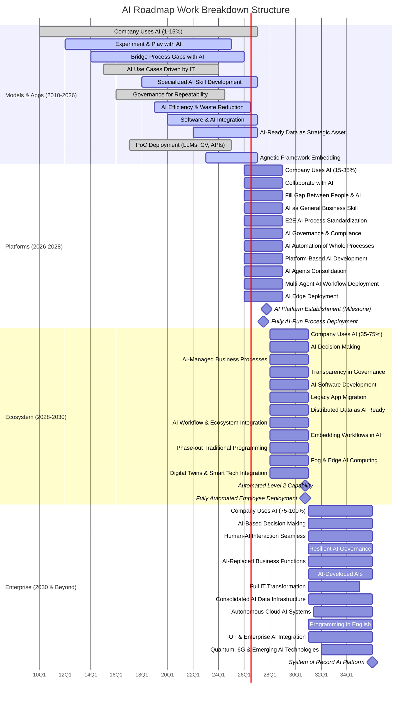

# AI Timeline


## Timeline

```mermaid
graph TD

%% Phase 1
AI_Platform_Establishment --> Company_Uses_AI_15_35
AI_Platform_Establishment --> Collaborate_with_AI
Company_Uses_AI_15_35 --> Collaborate_with_AI
Collaborate_with_AI --> Fill_Gap_People_AI
Company_Uses_AI_15_35 --> AI_as_General_Business_Skill
AI_Platform_Establishment --> E2E_AI_Process_Standardization
AI_Platform_Establishment --> AI_Governance_Compliance
E2E_AI_Process_Standardization --> AI_Automation_Whole_Processes
AI_Platform_Establishment --> Platform_Based_AI_Development
Platform_Based_AI_Development --> AI_Agents_Consolidation
AI_Agents_Consolidation --> Multi_Agent_Workflow_Deployment
AI_Platform_Establishment --> AI_Edge_Deployment

%% Phase 2
AI_Automation_Whole_Processes --> Fully_AI_Run_Process_Deployment
Fully_AI_Run_Process_Deployment --> Company_Uses_AI_35_75
AI_Governance_Compliance --> AI_Decision_Making
AI_Automation_Whole_Processes --> AI_Managed_Business_Processes
AI_Decision_Making --> AI_Managed_Business_Processes
AI_Governance_Compliance --> Transparency_in_Governance
Platform_Based_AI_Development --> AI_Software_Development
AI_Software_Development --> Legacy_App_Migration
AI_Platform_Establishment --> Distributed_Data_AI_Ready
Multi_Agent_Workflow_Deployment --> AI_Workflow_Ecosystem_Integration
AI_Workflow_Ecosystem_Integration --> Embedding_Workflows_in_AI
AI_Software_Development --> Phase_out_Traditional_Programming
AI_Edge_Deployment --> Fog_Edge_AI_Computing
AI_Workflow_Ecosystem_Integration --> Digital_Twins_Smart_Tech_Integration
AI_Automation_Whole_Processes --> Automated_Level_2_Capability
Automated_Level_2_Capability --> Fully_Automated_Employee_Deployment

%% Phase 3
Company_Uses_AI_35_75 --> Company_Uses_AI_75_100
AI_Decision_Making --> AI_Based_Decision_Making
Fill_Gap_People_AI --> Human_AI_Interaction_Seamless
AI_Governance_Compliance --> Resilient_AI_Governance
Fully_Automated_Employee_Deployment --> AI_Replaced_Business_Functions
AI_Software_Development --> AI_Developed_AIs
Legacy_App_Migration --> Full_IT_Transformation
Phase_out_Traditional_Programming --> Full_IT_Transformation
Distributed_Data_AI_Ready --> Consolidated_AI_Data_Infrastructure
AI_Platform_Establishment --> Autonomous_Cloud_AI_Systems
Phase_out_Traditional_Programming --> Programming_in_English
Fog_Edge_AI_Computing --> IoT_Enterprise_AI_Integration
Consolidated_AI_Data_Infrastructure --> System_of_Record_AI_Platform
```







```Mermaid
graph LR

AI_Platform_Establishment[AI Platform Establishment]
AI_Policy_Written[AI Policy Established]
AI_Governance_Compliance[AI Goverance Compliance]
Company_Uses_AI_15_35[15 - 35% of the company uses AI]
Company_Uses_AI_1_15[1 - 15% of the company uses AI]
AI_Standards_Written[AI Development and Usage Standards Established]
Experment_with_AI[Experment with AI]
AI_Specialized_Skill[AI is a specialized skill]
Processes_Touched_by_AI[Processes Touched by AI]
E2E_AI_Process_Standardization[End to End AI Standardization of a Process for AI]
Repeatability_Enabled_by_Governance[Repeatability and Standardization enabled by Governance]
Software_Developed_by_Employees[Software Developed by Employees]
AI_Software_Development[Software Developed by AI]

Start_Embedding_In_The_Edge[Start Embedding AI in the Edge]


%% Phase 0
Experment_with_AI --> AI_Policy_Written
Experment_with_AI --> AI_Standards_Written 
Experment_with_AI --> AI_Specialized_Skill
Experment_with_AI --> Company_Uses_AI_1_15
Experment_with_AI --> Processes_Touched_by_AI


AI_Policy_Written --> AI_Governance_Compliance
AI_Standards_Written --> AI_Governance_Compliance
Company_Uses_AI_1_15 --> Company_Uses_AI_15_35

AI_Standards_Written --> AI_Platform_Establishment
AI_Policy_Written --> AI_Platform_Establishment

Processes_Touched_by_AI --> E2E_AI_Process_Standardization

AI_Policy_Written --> Repeatability_Enabled_by_Governance
AI_Standards_Written --> Repeatability_Enabled_by_Governance

Software_Developed_by_Employees --> AI_Standards_Written
Software_Developed_by_Employees --> AI_Software_Development
Software_Developed_by_Employees --> AI_Platform_Establishment

Start_Embedding_In_The_Edge --> AI_Edge_Deployment

%% Phase 1
AI_Specialized_Skill --> AI_as_General_Business_Skill
AI_Platform_Establishment --> Company_Uses_AI_15_35
AI_Platform_Establishment --> Collaborate_with_AI
Company_Uses_AI_15_35 --> Collaborate_with_AI
Collaborate_with_AI --> Fill_Gap_People_AI
Company_Uses_AI_15_35 --> AI_as_General_Business_Skill
AI_Platform_Establishment --> E2E_AI_Process_Standardization
AI_Platform_Establishment --> AI_Governance_Compliance
E2E_AI_Process_Standardization --> AI_Automation_Whole_Processes
AI_Platform_Establishment --> Platform_Based_AI_Development
Platform_Based_AI_Development --> AI_Agents_Consolidation
AI_Agents_Consolidation --> Multi_Agent_Workflow_Deployment
AI_Platform_Establishment --> AI_Edge_Deployment

%% Phase 2
AI_Automation_Whole_Processes --> Fully_AI_Run_Process_Deployment
Fully_AI_Run_Process_Deployment --> Company_Uses_AI_35_75
AI_Governance_Compliance --> AI_Decision_Making
AI_Automation_Whole_Processes --> AI_Managed_Business_Processes
AI_Decision_Making --> AI_Managed_Business_Processes
AI_Governance_Compliance --> Transparency_in_Governance
Platform_Based_AI_Development --> AI_Software_Development
AI_Software_Development --> Legacy_App_Migration
AI_Platform_Establishment --> Distributed_Data_AI_Ready
Multi_Agent_Workflow_Deployment --> AI_Workflow_Ecosystem_Integration
AI_Workflow_Ecosystem_Integration --> Embedding_Workflows_in_AI
AI_Software_Development --> Phase_out_Traditional_Programming
AI_Edge_Deployment --> Fog_Edge_AI_Computing
AI_Workflow_Ecosystem_Integration --> Digital_Twins_Smart_Tech_Integration
AI_Automation_Whole_Processes --> Automated_Level_2_Capability
Automated_Level_2_Capability --> Fully_Automated_Employee_Deployment

%% Phase 3
Company_Uses_AI_35_75 --> Company_Uses_AI_75_100
AI_Decision_Making --> AI_Based_Decision_Making
Fill_Gap_People_AI --> Human_AI_Interaction_Seamless
AI_Governance_Compliance --> Resilient_AI_Governance
Fully_Automated_Employee_Deployment --> AI_Replaced_Business_Functions
AI_Software_Development --> AI_Developed_AIs
Legacy_App_Migration --> Full_IT_Transformation
Phase_out_Traditional_Programming --> Full_IT_Transformation
Distributed_Data_AI_Ready --> Consolidated_AI_Data_Infrastructure
AI_Platform_Establishment --> Autonomous_Cloud_AI_Systems
Phase_out_Traditional_Programming --> Programming_in_English
Fog_Edge_AI_Computing --> IoT_Enterprise_AI_Integration
Consolidated_AI_Data_Infrastructure --> System_of_Record_AI_Platform
```