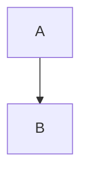

# ADR 0011: `mermaid` Front Matter Flag for Conditional Diagram Support

Date: 2025-09-14
Status: Accepted
Decision Type: Presentation / Asset Loading Optimization

## Context
Mermaid diagrams were made possible via an always-included loader script in the post layout. Although the loader itself lazily detects diagrams before fetching the Mermaid library, including the loader snippet on pages that never use diagrams still injects code and complexity. A front matter flag already appears in some posts (`mermaid: true`) but enforcement was not strict.

## Problem
We want a clear, documented mechanism to enable diagram support only where needed, avoiding:

- Unnecessary script tags on diagram-free posts.
- Confusion for authors about implicit vs explicit activation.
- Potential future expansion (e.g., multiple diagram libraries) without global overhead.

## Decision
Honor a boolean `mermaid` front matter flag. Load `assets/mermaid.html` only when `page.mermaid == true`.

```yaml
---
mermaid: true
---
```

## Implementation
In `/_layouts/post.html` we guard the include:

```liquid

  

```

## Rationale

- Explicit opt‑in minimizes per‑page script surface.
- Consistent with other feature flags (e.g., `math`, potential future `charts`, etc.).
- Retains current behavior for posts already using `mermaid: true`.

## Alternatives Considered

| Alternative | Reason Rejected |
| ----------- | --------------- |
| Auto-detect code fences server-side | Requires parsing markdown twice or custom plugin (adds build complexity). |
| Always include (status quo) | Slight performance + cognitive overhead on posts without diagrams. |
| Global site-level toggle | Too coarse; not all posts need diagrams. |

## Consequences

### Positive

- Reduced JS on pages without diagrams.
- Clear author intent documented in front matter.
- Easier to introduce additional diagram types later.

### Negative

- Authors must remember to add the flag (documentation mitigates this).
- Existing posts missing the flag will not render diagrams until updated.

## Migration Plan

1. Merge conditional include (done).
1. Audit existing posts containing Mermaid code fences; add `mermaid: true` where missing.

Example Mermaid fence to search for:



1. Add documentation to README/front matter section (done).

## Testing

- Page with `mermaid: true` loads loader and renders diagrams.
- Page without flag: no loader include; code fences remain literal text (expected).

## Future Enhancements

- Build-time linter to warn if mermaid fence detected but flag absent.
- Add `diagram-libs:` array for multi-library expansion (Mermaid, Graphviz via WASM, Vega-Lite).

## Amendment (2025-09-14): Collapsible Source Panels & Copy Button

### Motivation

Authors and readers often want to inspect or reuse the raw Mermaid script underlying a rendered diagram. Previously, enabling this required viewing the page source or keeping a duplicate code block (which created maintenance duplication and cluttered long articles). We want a discoverable, low‑noise way to expose the original script while preserving performance and not re‑introducing unconditional code fences into the DOM.

### Addition

For every rendered Mermaid diagram, a collapsed `<details>` element titled "Mermaid Source" is injected immediately after the diagram. Inside is:

1. A `Copy` button which writes the raw script to the clipboard (with optimistic UI feedback: `Copied!` then reverts).
2. A syntax‑highlight friendly `<pre><code class="language-mermaid">` block containing the original (untrimmed left indentation; right trimmed) script.

Panels are collapsed by default to avoid vertical noise for posts containing many diagrams.

### Implementation Summary

Code changes were made in `/_includes/assets/mermaid.html`:

- During transformation of original `pre > code.language-mermaid` fences, the unmodified source text is stored in a `data-mermaid-source` attribute on the replacement `.mermaid` container.
- After `mermaid.run()` completes, a new helper (`ensureSourcePanels()`) appends a `<details class="mermaid-source-panel">` element (idempotent on re-renders / theme changes).
- Event delegation on `document` handles copy button clicks; clipboard API used with graceful fallback messaging.
- Lightweight CSS added (same file) for panels, copy button, responsive font sizing, and theme friendliness (leveraging existing Bootstrap CSS variables already used elsewhere on the site).

### Accessibility & UX Considerations

- Uses native `<details>/<summary>` for built‑in accessibility & keyboard toggling.
- `aria-label` applied to the copy button; button text acts as visible label.
- Button disabled briefly after copy to prevent accidental rapid re‑invocation.

### Alternatives Considered (Amendment)

| Option | Reason Rejected |
| ------ | --------------- |
| Always show raw block under diagram | Adds vertical noise, especially in posts with many diagrams. |
| Tooltip or modal for code | Higher interaction cost; less portable / harder to deep link. |
| Rely on original fenced code (don't replace) | Conflicts with existing transformation pipeline that swaps fences for `.mermaid` divs to avoid double content. |

### Consequences (Amendment)

Positive:

- Encourages reuse and learning by exposing exact diagram source.
- Eliminates need for authors to manually duplicate code blocks.
- Maintains compact layout (collapsed by default).

Negative / Minor:

- Slight additional DOM nodes per diagram (~3–5 elements) after render.
- Adds copy handler listener (negligible overhead; single delegated listener).

### Future Options

- Add a per‑diagram attribute (e.g., `data-hide-source="true"`) to suppress a panel for specific cases (large generated diagrams).
- Provide a global front matter toggle (`mermaid_show_source: false`) to disable panel injection site- or page-wide.
- Add filename labeling support (e.g., `summary` text override via data attribute).

### Verification

- Build & manual test confirm panels appear only when `mermaid: true` and diagrams present.
- Theme toggle re-renders diagrams without duplicating panels (idempotency verified by existence check on sibling panel).

### Documentation Impact

README front matter section could optionally mention that enabling `mermaid: true` also provides collapsible source panels (deferred unless requested).

### Status

This amendment is considered Accepted and incorporated into ADR 0011.

## Status Tracking

| Item | Status |
| ---- | ------ |
| Conditional include merged | Done |
| Flag audit completed | Pending |
| Docs updated | Done |

 
## Decision Owner

Content & Site Engineering
