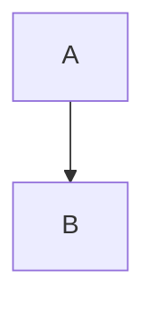

# ADR 0011: `mermaid` Front Matter Flag for Conditional Diagram Support

Date: 2025-09-14
Status: Accepted
Decision Type: Presentation / Asset Loading Optimization

## Context
Mermaid diagrams were made possible via an always-included loader script in the post layout. Although the loader itself lazily detects diagrams before fetching the Mermaid library, including the loader snippet on pages that never use diagrams still injects code and complexity. A front matter flag already appears in some posts (`mermaid: true`) but enforcement was not strict.

## Problem
We want a clear, documented mechanism to enable diagram support only where needed, avoiding:

- Unnecessary script tags on diagram-free posts.
- Confusion for authors about implicit vs explicit activation.
- Potential future expansion (e.g., multiple diagram libraries) without global overhead.

## Decision
Honor a boolean `mermaid` front matter flag. Load `assets/mermaid.html` only when `page.mermaid == true`.

```yaml
---
mermaid: true
---
```

## Implementation
In `/_layouts/post.html` we guard the include:

```liquid

  

```

## Rationale

- Explicit opt‑in minimizes per‑page script surface.
- Consistent with other feature flags (e.g., `math`, potential future `charts`, etc.).
- Retains current behavior for posts already using `mermaid: true`.

## Alternatives Considered

| Alternative | Reason Rejected |
| ----------- | --------------- |
| Auto-detect code fences server-side | Requires parsing markdown twice or custom plugin (adds build complexity). |
| Always include (status quo) | Slight performance + cognitive overhead on posts without diagrams. |
| Global site-level toggle | Too coarse; not all posts need diagrams. |

## Consequences

### Positive

- Reduced JS on pages without diagrams.
- Clear author intent documented in front matter.
- Easier to introduce additional diagram types later.

### Negative

- Authors must remember to add the flag (documentation mitigates this).
- Existing posts missing the flag will not render diagrams until updated.

## Migration Plan

1. Merge conditional include (done).
1. Audit existing posts containing Mermaid code fences; add `mermaid: true` where missing.

Example Mermaid fence to search for:



1. Add documentation to README/front matter section (done).

## Testing

- Page with `mermaid: true` loads loader and renders diagrams.
- Page without flag: no loader include; code fences remain literal text (expected).

## Future Enhancements

- Build-time linter to warn if mermaid fence detected but flag absent.
- Add `diagram-libs:` array for multi-library expansion (Mermaid, Graphviz via WASM, Vega-Lite).

## Status Tracking

| Item | Status |
| ---- | ------ |
| Conditional include merged | Done |
| Flag audit completed | Pending |
| Docs updated | Done |

## Decision Owner
Content & Site Engineering
