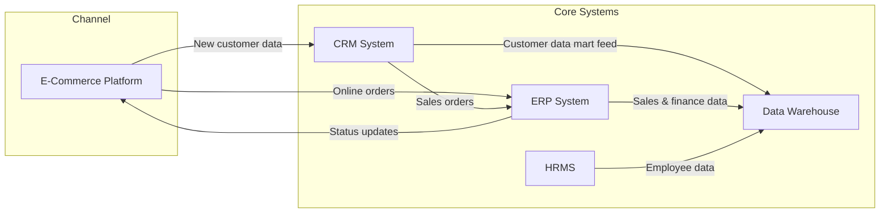
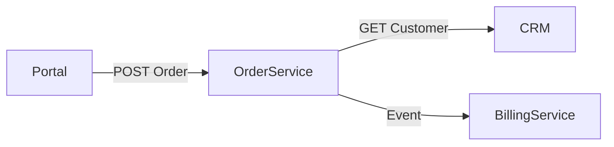

# Information Systems Architecture: Application

## Core Application Architecture

### Strategic Alignment & Principles

<Purpose>
This section defines how the Application Architecture supports business goals by identifying and structuring the major applications and their interactions. It establishes alignment with business capabilities, functional requirements, and guiding architectural principles such as modularity, reuse, scalability, and security. This ensures applications are developed or acquired to fit enterprise strategy, avoid redundancy, and support operational effectiveness.

<Instructions>
1. **Link to Business Architecture:** Explain how the application landscape supports key business functions and processes identified in Phase B.
2. **Reference Architecture Principles:** Highlight principles such as reuse, service-orientation, interoperability, cloud readiness, and lifecycle management.
3. **Define Scope and Boundaries:** Describe what’s in scope (new applications, modernizations, decommissions) and integration touchpoints.

<Example>
The application architecture is **business-driven**, meaning every major system and interface is justified by a business need and directly supports a key business capability. For example, a Customer Relationship Management (CRM) application supports the *Manage Customers* business function, while an Order Management system supports *Process Orders*. This ensures a clear line of sight from technology to business outcomes. The scope of this architecture covers the new customer-facing portal and its supporting backend applications (CRM, Order Processing, Billing, Product Catalog), the modernization of legacy components, and the decommissioning of redundant tools (e.g. old spreadsheets or duplicate databases). It defines integration touchpoints such as how the portal will interact with the Order and CRM systems.

**Architectural Principles:** To align with enterprise strategy, the solution follows key architecture principles:

* **Modularity & Reuse:** Applications are designed in a modular way so that components can be *reused* or upgraded independently without affecting the whole system. For instance, a single **customer authentication** service is built once and reused across the web portal, mobile app, and internal systems rather than duplicated in each. This reduces redundancy and speeds up development by leveraging pre-built modules.
* **Service-Oriented Integration:** We embrace service-orientation, exposing functionality via APIs and microservices. Each major capability (e.g. order processing, billing) is delivered as a service with well-defined interfaces. This *loose coupling* ensures changes in one service have minimal impact on others and supports scalability. For example, the Order Management service communicates with the Billing service through an API rather than direct database calls, isolating the two.
* **Interoperability & Standardization:** The architecture emphasizes use of open standards and consistent technologies so systems can easily interconnect. Standard protocols (RESTful HTTP for synchronous calls, messaging for async), data formats (JSON for web services), and common identity management (single sign-on) are enforced across applications. This prevents teams from “reinventing the wheel” and reduces integration issues by ensuring new applications can *talk to* existing ones without complex adapters.
* **Scalability & Cloud Readiness:** Applications are built to scale horizontally and leverage cloud infrastructure for elasticity. Following a **cloud-first** approach, new components (like the customer portal and order services) are cloud-deployable to take advantage of on-demand scaling and high availability. Design considerations include stateless services and distributed databases to handle increased load. This ensures the architecture can grow with business demand and remain resilient.
* **Security by Design:** Security and compliance requirements are baked into application design from the start. All applications adhere to enterprise security policies (e.g. role-based access control, encryption of data in transit and at rest, input validation) so that security is a built-in aspect, not an afterthought. For example, the APIs require authentication tokens and use HTTPS, and sensitive personal data in the CRM is encrypted. This also helps meet regulatory demands (such as privacy laws) early in the design.
* **Lifecycle Management:** We plan for the full lifecycle of applications. Each application has an owner and a roadmap for evolution. We avoid “technology for technology’s sake” – if a proposed application doesn’t clearly support a business capability or principle, it’s out of scope. Conversely, legacy applications that no longer align may be slated for phase-out to reduce complexity.

**Scope & Boundaries:** The Application Architecture scope includes all solution components needed for the target state. In scope are the **new Customer Portal** (for self-service access), a **modern Cloud CRM** system replacing the legacy CRM, a **new Order Management microservice** (replacing a legacy order-entry app), integration of an **existing Billing/Finance system**, and a **Product Catalog service**. It also covers the integration middleware and APIs that connect these components. Out of scope (for this iteration) are purely back-office systems that do not interface with the solution (e.g. HR system). The boundaries of the solution are clearly defined: for example, the architecture will interface with an external **Payment Gateway** and a **Shipping Carrier API**, but systems outside those integration points are considered external. By defining these boundaries, we ensure a clear focus on relevant applications and avoid scope creep into unrelated systems.

Finally, these principles and scope decisions align with the broader enterprise architecture principles (like *technology agnosticism* to avoid vendor lock-in and *data as an asset* to ensure single sources of truth). By adhering to them, the application landscape will remain aligned with business strategy and be positioned to accommodate future changes. In summary, the application architecture is structured to directly enable business functions, guided by enterprise principles of **reuse, interoperability, scalability, security, and agility**, and scoped to include all necessary components while avoiding extraneous complexity.

<Prerequisites>

* **Completed Business Architecture & Requirements:** Before finalizing application alignment, the Business Architecture (Phase B) must be completed, identifying the key processes, capabilities, and requirements that the applications need to support. This ensures we have a clear mapping of what business goals each application must serve.
* **Established Principles & Standards:** Enterprise architecture principles (e.g. published IT standards, security policies, cloud strategy) should already be defined. These act as constraints and guides for designing the application architecture. For instance, knowing there is a “cloud-first” policy or a mandate to prefer COTS solutions where possible will shape the application decisions.
* **Current Application Portfolio Assessment:** An inventory of existing applications and their pain points should be available as a baseline. Understanding what systems exist (and their shortcomings such as redundancy or technical debt) is necessary to plan alignment and avoid repeating past mistakes.
* **Technology Strategy Inputs:** Any relevant IT strategy or technology roadmaps (for example, plans to adopt microservices or retire mainframe technology) should be identified. These set the context for what kinds of application solutions are feasible or preferred.
* **Stakeholder Buy-In:** Key stakeholders (both business and IT) need to agree on the business goals and principles driving the application architecture. Executive sponsorship and user community input are prerequisites to ensure the architecture will be accepted and used.

<Standards>

* **Architecture Principles Catalog:** The solution adheres to the enterprise’s Architecture Principles (as defined in the Principles catalog). For example, if “Service Reusability” and “Buy over Build” are stated principles, they are applied here by reusing existing services where possible and choosing COTS/SaaS solutions unless a unique custom build is justified.
* **Reference Models:** Alignment is checked against any enterprise reference architecture or industry reference models (like TOGAF’s III-RM for integrated information infrastructure). If a **reference application architecture** exists for common capabilities (e.g. a standard way the company implements CRM or e-commerce systems), those models are used as a starting point.
* **Naming & Identification:** All applications are given unique identifiers and names in accordance with the enterprise portfolio catalog standards. (For example, prefix “CRM” for customer systems, consistent naming of environments, etc.). This ties into the Application Portfolio Catalog for traceability.
* **Scope Definition:** A formal **Statement of Architecture Work** or equivalent document outlines the scope of this architecture effort. It defines what’s included/excluded and is approved by governance, preventing scope creep.
* **Compliance Standards:** The architecture will comply with relevant standards such as ISO 25010 for software quality (ensuring maintainability, security), and any industry-specific standards (for example, HL7 in healthcare, or the Open Travel Alliance standards if in travel industry). These standards inform requirements for the applications (e.g. performance, interoperability) from the outset.

By meeting these prerequisites and adhering to standards, the Application Architecture is positioned to effectively align with business strategy and conform to enterprise-wide guidelines.

### Application Portfolio Catalog

<Purpose>
TODO

<Instructions>
TODO

Complete list of key enterprise applications with descriptions, ownership, platform, and lifecycle status:

<Example>
| ID   | Application                              | Description                                                           | Owner/Business Unit              | Platform             | Lifecycle Stage       |
| ---- | ---------------------------------------- | --------------------------------------------------------------------- | -------------------------------- | -------------------- | --------------------- |
| AP01 | Customer Relationship Management (CRM)   | Manages customer accounts, sales pipeline, and support interactions.  | Sales & Customer Service         | Cloud (SaaS)         | Live                  |
| AP02 | Online E-Commerce Platform               | Online platform for digital sales and customer self-service.          | Digital Marketing & Commerce     | Cloud (PaaS)         | Live                  |
| AP03 | Enterprise Resource Planning (ERP)       | Core system for finance, accounting, inventory, and order management. | Finance & Operations             | On-Premises          | Live                  |
| AP04 | Human Resources Management System (HRMS) | System for employee records, payroll, and HR processes.               | Human Resources                  | On-Premises (Legacy) | Planned (replacement) |
| AP05 | Enterprise Data Warehouse (EDW)          | Central repository for enterprise analytics and reporting.            | Enterprise Data & Analytics (IT) | On-Premises          | Live                  |

<Prerequisites>

TODO

<Standards>

TODO

### Application Components & Services

<Purpose>
Break down applications into functional modules or services, showing how they map to business capabilities and technical layers.

<Instructions>
1. **Use Logical Decomposition:** Identify key services (e.g., customer onboarding, billing, asset tracking) and where they reside.
2. **Application to Business Function Mapping:** Map every major applications to business functions using a table (✔ indicates primary support for the function)
3. **Differentiate Types:** Clarify distinctions between custom apps, COTS (commercial-off-the-shelf), SaaS, and shared services.
4. **Include Reuse and Rationalization:** Highlight opportunities for reuse, consolidation, or replacement.

<Example>
In the target architecture, each major application is **logically decomposed** into a set of **application components or services**, each responsible for specific business functions. This section describes those components and the types of applications in play (custom-built, COTS, SaaS), and how we are maximizing reuse and eliminating redundancy.

**Logical Decomposition by Application:**

* **Customer Management (CRM)** – *Type: SaaS.* The Cloud CRM (A1) is a commercial SaaS product, but we can describe its key modules: e.g., **Account Management**, **Contact Management**, **Case Management**, and **Marketing** modules. These are out-of-the-box components of the CRM platform that map to business needs (Account/Contact modules support customer data, Case module supports customer service, etc.). Being SaaS, these modules are configured, not custom-developed. They operate on a shared platform but provide distinct services. We leverage as many native CRM features as possible (for example, using its built-in workflow for customer onboarding), rather than custom building those functions. *Reuse:* If the enterprise has other departments needing a CRM, this same platform can be extended rather than having separate CRMs. This SaaS CRM thus becomes a shared service for multiple business units.
* **Order Management Service** – *Type: Custom Microservices.* We decompose A2 into sub-services for clarity and easier development: for example, an **Order Entry Service** (handles new orders, validations), **Inventory Service** (checks and updates inventory levels per order), **Fulfillment/Shipping Service** (coordinates shipping and updates order status), and **Payment Service** (handles payment transactions, possibly via a payment gateway). Each of these is a module that could be separately deployed and scaled. They collectively fulfill the *Process Orders* capability. The separation follows domain boundaries – e.g., the Payment Service might be separate since it interacts with external payment providers. *Reuse & Rationalization:* We ensure no duplicate functionality across services – e.g., only the Payment Service integrates with payment API, so other services call it rather than each implementing payment logic. Also, if any of these services could be used by other contexts (for instance, a Payment Service might be reusable by other applications that need to charge customers), we design it to be a generic shared component. Internally, each microservice has distinct layers (API controller, business logic, data access), following a consistent architecture pattern.
* **Billing/Finance Module** – *Type: COTS (ERP).* The billing system is a module of an existing ERP. Rather than breaking it down into sub-modules (since that’s internal to the ERP), we treat it as a black box offering specific **services**: e.g., **Invoice Generation Service**, **Accounts Receivable Service**. These services are exposed via an integration layer – for instance, an API endpoint “GenerateInvoice()” that internally triggers the ERP’s invoice function. We differentiate it as a COTS component meaning we configure and integrate it, but don’t alter its internal code. We *reuse* this existing capability instead of building a new billing system from scratch (rationalizing on cost and reliability). However, if the ERP had overlapping features with other systems, we’d consolidate; in this case, it’s uniquely providing finance functions, so there’s no duplication with others.
* **Product Catalog Service** – *Type: Custom (could be partially COTS).* We implement A4 as a custom service, possibly with a standard database or even a lightweight COTS product data management tool behind it. Key components here include a **Product Database** (central data store for all product info) and a **Catalog API Service** that queries/updates that database. Within this service, we could logically separate **Pricing Service** (to manage and provide pricing info, perhaps to handle different pricing rules) and **Product Info Service** (for descriptive info). If the enterprise had an existing product DB or a content management system, we would consider reusing it; assuming not, this is built new. *Rationalization:* This service replaces multiple spreadsheets and ensures one place for product truth. It removes redundant data sources. Additionally, it can serve multiple channels (website, internal systems) – a big reuse improvement over each channel managing product data separately.
* **Customer Self-Service Portal** – *Type: Custom Web App.* The portal itself can be thought of as composed of front-end components corresponding to features: **Profile Management UI**, **Product Catalog UI**, **Order Entry UI**, **Order Tracking UI**. These map to services on the back-end (Profile UI talks to CRM, Order UI talks to Order service, etc.). We maintain a separation of concerns: the portal focuses on presentation, while all business logic resides in aforementioned back-end services. If the organization has a design system or reusable UI components, the portal uses those (for consistency and faster development). *Reuse:* We plan to reuse any existing web components (e.g., maybe the company already has a payment widget or a maps address widget). Also, the portal itself could be extended to other user groups (for example, a dealer portal in the future) by reusing the same underlying architecture.

| Business Function         | CRM | E-Commerce | ERP | HRMS | EDW |
| ------------------------- | --- | ---------- | --- | ---- | --- |
| Sales & Marketing         | ✔   | ✔          |     |      |     |
| Customer Service          | ✔   |            |     |      |     |
| Order Fulfillment         |     |            | ✔   |      |     |
| Finance & Accounting      |     |            | ✔   |      |     |
| Human Resource Management |     |            |     | ✔    |     |
| Analytics & Reporting     |     |            |     |      | ✔   |

**Types of Applications Summary:** We clearly distinguish that **A1 and possibly A3 are COTS/SaaS** – meaning their core code is not in our control, we configure them. **A2, A4, A5 are custom-developed** – giving flexibility but requiring us to manage their full lifecycle. There are also **shared enterprise services** that are part of the architecture but not listed as separate applications: for example, an **Enterprise Identity Service** (for Single Sign-On) is leveraged by A5 and A1 – this is a shared service rather than part of one application. Similarly, an **Enterprise Integration Bus or API Gateway** is a shared component through which these apps communicate. We highlight these as part of the architecture (often under Technology Architecture, but relevant here for application interactions).

**Reuse and Rationalization Opportunities:** In designing the components, we intentionally looked for reuse:

* Wherever a capability existed in a stable product, we chose to reuse rather than reinvent (e.g., using the SaaS CRM’s case management for customer support instead of writing a new support module).
* We identified functional redundancies in the current state and addressed them. For instance, previously both the CRM and order system stored customer addresses separately; in the future, **only the CRM (A1) will master customer data**, and other components will reference it. This consolidation of customer data to a single application is a prime rationalization example (reducing data redundancy and ensuring one source of truth). Similarly, product info was scattered; now one service holds it.
* We also reduce overlapping tools: if the ERP’s billing covers invoicing, we won’t procure a separate invoicing tool – avoiding duplicate software for the same function. If the SaaS CRM offers a mobile app out-of-the-box, we use it for internal users instead of building a custom mobile interface.
* Some new components can be shared beyond this project: e.g., the **Product Catalog Service** could be used by the e-commerce website or by a retail POS system in the future, not just the portal – making it a reusable enterprise service. The architecture thus not only solves the immediate needs but contributes to a **rationalized application portfolio** where each application has a clear purpose and is leveraged broadly.

In conclusion, the Application Architecture is structured into distinct components aligned with business functions. We’ve chosen the right type of solution for each (build or buy) based on strategic fit and reuse potential. By breaking applications into services/modules, we improve maintainability and scalability – each component can evolve on its own. And by eliminating redundant systems and consolidating capabilities, we simplify the application landscape and reduce costs over time. Each component described will be designed and implemented in accordance with these principles, ensuring a clean, service-oriented architecture.

### Current State Architecture

<Purpose>
To document the as-is application environment, including existing systems, their purposes, capabilities, and known issues or constraints. This baseline allows informed gap analysis and future-state planning.  Please indicate if these are Architectural Building Blocks (ABB) or Solution Building Blocks (SBB) by tagging them.

<Instructions>
1. **Current State: Inventory of Applications:** List current applications supporting the solution and what business functions they are used for in the solution.  Please indicate if these are Architectural Building Blocks (ABB) or Solution Building Blocks (SBB) by tagging them.
2. **Categorize by Capability:** Group applications by business capability or functional domain.
3. **Highlight Technical Debt:** Note systems that have technical debt from problem management, any approaching end-of-life, legacy constraints, or integration bottlenecks.

<Example>
In the current state, the organization’s application landscape consists of several siloed systems that collectively support the business, but with overlaps and inefficiencies. Below is an **inventory of the key existing applications** relevant to the solution and the business capabilities they serve:

* **Customer Management (CRM Legacy System):** A legacy on-premises CRM (Customer Relationship Management) system is used to store customer contact information and interaction history. It supports the *Manage Customers* capability by allowing customer service reps to look up customer records. However, this CRM is over 10 years old and difficult to maintain. It has limited integration capabilities (no modern API, only nightly batch exports), leading to data being siloed. There is known **technical debt**: duplicate customer entries often exist because the CRM isn’t integrated with the order system, and the technology stack (built on an outdated platform) is nearing end-of-life support. Maintenance is costly and skilled support is hard to find. This reflects a common situation where legacy systems hinder efficiency – in fact, 88% of businesses report being hindered by legacy software, which also consumes a large portion of IT budgets.
* **Order Processing System:** A homegrown Order Management application is used by Order Clerks to enter and track customer orders (*Process Orders* capability). It is a monolithic client-server app running on an internal server. While it has basic functionality for order entry and status tracking, it lacks real-time inventory visibility or modern user interface features. **Integration constraints:** It does not automatically communicate with the CRM or billing systems – clerks manually re-enter customer information from the CRM into the order system, which is error-prone. The order system also produces flat files that are sent to the warehouse system every night (batch integration). This point-to-point, batch integration is a bottleneck and prevents real-time updates. Such data **silos** and nightly syncs are classic symptoms of legacy integration issues. The system also has scaling issues (it can handle current volume but would not perform well if order volume doubled, due to a tightly coupled design and an aging infrastructure).
* **Billing/Invoicing System:** A module within the legacy ERP is responsible for invoicing and financial record-keeping (*Generate Invoices* capability). It’s a COTS module (part of a decades-old ERP system) that the Billing Analysts use to issue invoices once they get order information. Currently, the integration between the Order system and this billing module is **manual** – billing staff receive an email or file of fulfilled orders and then input them into the ERP for invoicing. This introduces delays and opportunities for error. The ERP module itself is robust in accounting terms but is **approaching end-of-support** from the vendor in the next 2 years, raising risks if not updated or replaced. There’s technical debt in the form of outdated report generation tools and a lack of API – it was not built for easy integration. Custom scripts have been written to extract data for finance, which are hard to maintain.
* **Product Catalog Database:** The Product Management team currently maintains product information in a combination of spreadsheets and a simple database (*Maintain Product Catalog* capability). There is no dedicated product catalog application; instead, the **product data** (descriptions, pricing, stock levels) is stored in a Microsoft Access database and several Excel files. The **constraints here** include data inconsistency (multiple versions of product data), lack of accessibility (only the Product Manager can update the spreadsheets), and no direct integration with the order system or website. This means, for example, the Order Clerks manually refer to printed price lists for product details, and there have been incidents of orders being taken for obsolete products due to lag in updating these files. This setup represents significant technical debt and a **lack of a single source of truth** for product information.

**Categorization by Business Capability:** For clarity, the current applications can be grouped by the primary capability they support:

* *Sales & Customer Service:* **CRM System** – supports sales reps and customer service (customer info, contacts, leads).
* *Order Fulfillment:* **Order Management System** – supports order entry and status tracking.
* *Finance:* **Billing (ERP Module)** – supports invoicing and financial posting.
* *Product Management:* **Product Catalog (ad hoc DB/Spreadsheets)** – supports product data maintenance.

Each of these existing systems is relatively isolated, which leads to **pain points**: data duplication, inconsistent information between systems, and inefficient processes. For example, customer address changes are updated in the CRM but not automatically propagated to the order system or billing system, causing mismatched records. These gaps underscore the need for a more integrated future state.

**Technical Debt & Constraints:** Several of the current systems carry technical debt and constraints that limit the business:

* The **legacy CRM and Order systems** use outdated technology stacks that are costly to enhance. They lack modern API capabilities, making integration very challenging (any new integration requires building custom connectors or doing batch file transfers). This is a common scenario – indeed, **61% of businesses find integrating new applications with legacy systems to be one of their top challenges**. This means any improvement or new introduction (like a customer portal) faces obstacles in connecting with these old systems.
* **Performance and scalability issues** are present in the order system – as order volume grows or if more users need concurrent access (for example, if we opened it to customers directly, which currently we cannot), the system would likely not keep up. The infrastructure is not cloud-scalable and would require significant investment to upgrade.
* **Manual processes and workarounds:** The lack of integration has led to several manual workflows (re-entering data, emailing spreadsheets). These are error-prone and slow down operations. For instance, billing being a manual step delays revenue recognition and provides no real-time payment status back to the order system or CRM.
* **End-of-Life risk:** The ERP billing module’s vendor support window is closing, which is a risk. If the vendor stops releasing patches, the company could be exposed to security or reliability issues with no fixes. Planning for its replacement or upgrade is imperative.
* **Security and compliance gaps:** The current state also has potential compliance issues; for example, customer data in the CRM and spreadsheets may not meet modern security standards (the CRM database might not be encrypted, and spreadsheets with sensitive product cost info may not be access-controlled). Also, having customer data spread in multiple places (CRM, order system, possibly billing records) makes it hard to ensure consistent privacy controls (important for regulations like GDPR/CCPA).

In summary, the as-is application architecture is functional but fragmented. It shows **duplication of data**, **siloed functions**, and **aging technology** that collectively hinder business agility and efficiency. This baseline highlights the specific areas the future architecture needs to improve: unify customer and product data, automate integrations, eliminate redundant data entry, and replace or upgrade technologies that pose risk. The following sections will use this current state assessment as a foundation for defining the target application architecture and identifying the gaps to address.

<Prerequisites>

* **Current State Documentation:** A thorough inventory (list) of all existing applications, including their versions, technologies, and ownership, should be compiled. Prerequisite deliverables could include an *Application Portfolio Catalog* and *Application/Function Matrix* mapping existing systems to business functions. This provides the raw data for analysis.
* **Known Issues List:** A compilation of known pain points, incidents, or problem tickets related to current applications is needed. This might come from Problem Management records or interviews with users. For example, knowing that “System X goes down weekly” or “Integration between System Y and Z fails often” is essential to highlight in the current state.
* **Business Process Maps:** Having current business process flows (from the Business Architecture phase) helps pinpoint where each application fits and where manual handoffs occur. This contextual information is needed to fully describe current application usage and issues in business terms.
* **Technology Assessments:** Any recent assessments or health checks on the existing systems (e.g. a vendor saying the ERP is out of support, or a security audit on the CRM) should be gathered. These provide evidence and quantitative support for statements about technical debt, security gaps, or performance problems.
* **Stakeholder Input:** Input from users and IT support staff who work with these systems daily is a prerequisite to ensure the current state description is accurate. Workshops or interviews should be conducted to capture unwritten workarounds or issues. (For instance, the billing clerks might reveal how they actually use Excel to complement the ERP – such insights are critical to document.)

<Standards>

* **Documentation Standard:** The current state is documented following the standard format (e.g. using ArchiMate or UML diagrams to depict the interactions among current systems). All current-state diagrams and matrices follow the enterprise’s modeling standards. For example, a *System Landscape Diagram* (an ArchiMate Application Cooperation view) may be used to visualize all existing applications and interfaces.
* **Severity/Impact Notation:** The organization may have a standard way to indicate technical debt or risk (such as a heat map or rating). We will apply that standard – for instance, marking high-risk systems in red or noting the “Critical” technical debt items in a table. This aligns with IT risk management standards in the company.
* **Reference to Baseline Architecture Definition:** This section will conform to TOGAF guidelines for Baseline Description. According to TOGAF, the baseline Application Architecture should be described using relevant artifacts like the Application Portfolio Catalog and Application Communication diagrams. We ensure the current state write-up can be traced back to those artifact formats for consistency.
* **Terminology:** We use consistent terminology (as defined in the Architecture Glossary). For example, whether we call something a “system”, “application” or “service” is standardized to avoid confusion. If the enterprise defines “Application” as software that performs business functions (per TOGAF definitions), we use that consistently here.
* **Stakeholder Review:** Before finalizing, the current state description will be reviewed by key stakeholders (e.g. the Application Portfolio Manager or owners of each system) as per the governance process. This ensures accuracy and adherence to the truth on the ground. Their sign-off is part of the quality standard for baseline documentation.

### Application Gap Analysis Matrix

<Purpose>
TODO

<Instructions>
TODO

<Example>

| Capability             | Current State         | Gaps Identified                                | Future State (SBB)     |
|------------------------|------------------------|--------------------------------------------------|-------------------------|
| Manage Customers       | On-Prem CRM (SBB)      | No modern UI, no API, batch integrations         | A1 Cloud CRM (SBB)      |
| Process Orders         | Order App (SBB)        | No real-time inventory, high technical debt      | A2 Order Service (SBB)  |
| Product Management     | Excel/Access DB (SBB)  | Data inconsistency, no API access                | A4 Catalog Svc (SBB)    |

<Prerequisites>
TODO

<Standards>
TODO

### Future State Architecture

<Purpose>
Describes the target application landscape, aligning with strategic objectives such as digital transformation, automation, and improved integration. Emphasizes agility, composability, and business-aligned platforms.  Please indicate if these are Architectural Building Blocks (ABB) or Solution Building Blocks (SBB) by tagging them.

<Instructions>
1. **Describe Target Outcomes:** Define what the future application ecosystem should enable (e.g., real-time analytics, self-service portals, composable services).  Please indicate if these are Architectural Building Blocks (ABB) or Solution Building Blocks (SBB) by tagging them.
2. **Reference Architecture Patterns:** Align proposed applications with enterprise-wide reference models and target states (e.g., microservices, event-driven, cloud-native).
3. **Showcase Interoperability:** Highlight intended application-to-application integration and shared services.
4. **Future State: Inventory of Applications:** List the future state applications supporting the solution and what business functions they will be used for in the solution.
5. **Categorize by Capability:** Group applications by business capability or functional domain.

<Example>
The **target state application architecture** is designed to be **integrated, flexible, and customer-centric**. It will eliminate the silos of the current environment and provide a seamless platform for business operations and customer interactions. Key outcomes of the future state include:

* **Real-Time Data & Integration:** All core applications will be connected in real-time, allowing, for instance, a customer updating their address in the portal/CRM to immediately reflect in order and billing systems. Event-driven updates and APIs replace overnight batch jobs, enabling up-to-the-minute information flow (e.g., an order placed triggers instant inventory allocation and an invoice generation event).
* **Self-Service & Omnichannel Enablement:** A new **Customer Self-Service Portal** will empower customers to place orders, track status, manage their profile, and access invoices without needing to call support. This portal (and any future mobile app) will use the same underlying services, ensuring consistent experience across channels.
* **Composability & Agility:** The architecture uses a **microservices** pattern for new development, meaning each core function is delivered by a small, independent service (order service, product service, etc.). This composability allows the business to introduce new capabilities or updates (like adding a recommendation service or a new payment method) by adding or modifying individual services rather than monolithic system overhauls. The microservices communicate through standard APIs and event messages, which facilitates flexibility in deployment and scaling.
* **360° View of Customer and Operations:** By integrating the CRM, Order, Billing, and Product systems around a shared data model, the future state provides a unified, single source of truth. Analytics and reporting will draw from this integrated data, enabling real-time dashboards (e.g., up-to-date order status, customer purchase history) and better decision-making.
* **Improved Scalability & Reliability:** The target applications are largely cloud-native, which means they can automatically scale up or down based on demand. For example, if order volume spikes during a sale, the Order Management service can instantiate additional instances in the cloud to handle the load. High availability is built-in: if one instance fails, another takes over, minimizing downtime. This resiliency is a big improvement over the single-server legacy systems.
* **Enhanced Security & Compliance:** The future state also strengthens security – e.g., unified authentication via an Identity Provider for portal and internal systems, encryption of data in transit between services, and audit logging of all cross-application interactions. Compliance is easier since data is consolidated and controls can be uniformly applied (for instance, one place to execute a “right to be forgotten” request from a customer across all systems).

To achieve these outcomes, the future architecture aligns with modern **reference patterns**. We are leveraging a **cloud-native, service-oriented architecture**: microservices and APIs form the backbone, and an event-driven approach handles cross-service communication for decoupling. This approach is in line with enterprise target architecture guidelines favoring loosely coupled systems that are easier to maintain and evolve. In particular, event-driven architecture (EDA) will be used for certain processes – for example, an Order Placed event will asynchronously trigger inventory updates and billing. This pattern *promotes loose coupling*, making it easier to scale and update components independently. Also, the solution respects the **Enterprise Reference Architecture** by ensuring each new application fits into the defined layers (e.g., presentation vs. business logic vs. data) and interacts via the enterprise integration backbone.

The following table lists the **future-state applications** and key details, grouped by capability domain:

| Application ID | Application Name                 | Capability                         | Technical Debt (Future) | Reference Architecture Pattern Used        | Integrated With (Application IDs)             |
| -------------- | -------------------------------- | ---------------------------------- | ----------------------- | ------------------------------------------ | --------------------------------------------- |
| **A1**         | **Cloud CRM Platform**           | Customer Management                | Very Low (new SaaS)     | SaaS CRM (Cloud-based, modular)            | Integrates with A2, A5 (via API)              |
| **A2**         | **Order Management Service**     | Order Processing                   | Low (new build)         | Microservice (Cloud-native, containerized) | Integrates with A1, A3, A4, A5 (API & Events) |
| **A3**         | **Billing System Module**        | Billing/Finance                    | Moderate (some legacy)  | COTS ERP Module (exposed via API)          | Integrates with A2, A1 (via API)              |
| **A4**         | **Product Catalog Service**      | Product Management                 | Low (new build)         | Custom Microservice (Cloud-native)         | Integrates with A2, A5 (via API)              |
| **A5**         | **Customer Self-Service Portal** | Multi-capability (Sales & Support) | Low (new)               | Web Application (Cloud web app)            | Integrates with A1, A2, A4 (via APIs)         |

**Descriptions:**

* **A1 Cloud CRM Platform:** This is a modern Customer Relationship Management system (likely a SaaS product like Salesforce or a similar cloud CRM) that replaces the old CRM. It supports *Customer Management* capabilities – contact management, lead tracking, customer service case management, etc. Being SaaS, it has minimal technical debt going forward (the vendor maintains it). It adheres to a modular, upgrade-friendly pattern and comes with built-in APIs. **Integrations:** A1 will integrate with A2 (Order Management) to share customer info (e.g., when an order is created, it pulls customer details from A1). It also connects to A5 (Portal) to allow customers to view/update their profile, which actually updates in the CRM. A1, as SaaS, may also integrate with corporate identity services for SSO and can be extended via its API for any future needs.
* **A2 Order Management Service:** This is a custom-built order processing application, implemented as a set of microservices. It covers the *Process Orders* capability – from order entry and validation to status tracking and fulfillment coordination. Being cloud-native, it’s containerized and can scale horizontally. It has no legacy baggage (built fresh) so technical debt is initially low. We use domain-driven design: e.g., an **Order Service**, **Inventory Service** (if needed to check stock), etc., that together form the Order Management suite. **Integrations:** A2 is central, integrating with A1 (for customer data lookups and to attach orders to customer accounts), with A3 (to send billing requests or receive payment confirmations), with A4 (to fetch product details like price and availability during order entry), and with A5 (the portal calls A2’s APIs to create orders or query order status). Integration patterns include synchronous REST calls for immediate actions (e.g. portal to order service) and asynchronous events for background processes (e.g. A2 emits an “Order Placed” event that A3 listens to for invoicing).
* **A3 Billing System Module:** In the target state, the Billing function might still leverage a module of an ERP or a specialized finance system, but it will be **encapsulated with APIs** so it behaves like a service. For example, we might keep the existing ERP’s AR (Accounts Receivable) module but modernize access via an API layer or replace it with a newer SaaS finance system. Technical debt here is moderate – if we keep the ERP, we mitigate its legacy issues by only exposing needed functionality through services (reducing direct user interaction with the old interface). Over time, we plan to phase out any remaining legacy aspects. **Integrations:** A3 will receive order charge events from A2 to generate invoices (via an API call or message). It will fetch customer bill-to information from A1 as needed (or A2 might pass it along). If payments are processed through an external gateway, A3 also integrates with that (though that might be considered part of A2’s process). A1 (CRM) might also query A3 for billing status or outstanding invoices when customer service reps are viewing a customer – hence A3 provides an API for such queries.
* **A4 Product Catalog Service:** This is a new centralized Product Information Management component fulfilling the *Maintain Product Catalog* capability. It is a custom microservice (or set of services) that stores all product data (descriptions, pricing, stock levels, etc.) and provides that data via a service API. This eliminates the spreadsheets/Access DB. **Technical debt** is low as it’s built with modern tech (and possibly hosted on cloud DB and service). It might incorporate a small database optimized for read queries since many components need product info. **Integrations:** A4 provides APIs that A2 (Order) uses in real-time (e.g., to get price or check stock when an order is placed). It also feeds A5 (Portal) – for example, the portal’s product catalog page or product search will call A4 to get up-to-date product details. If needed, A1 (CRM) could even use A4’s data to, say, fetch product names when preparing a quote. Additionally, A4 could push updates (events) if product info changes (like price updates) so that other services cache or refresh their data.
* **A5 Customer Self-Service Portal:** This is a new web application (and potentially mobile app in the future) that provides an integrated user interface to customers. It’s essentially the presentation layer combining functions from A1, A2, and A4 to deliver capabilities like account management, product browsing, ordering, and checking order status (*multi-capability* across sales and support). Technical debt is low due to it being a new development using modern web frameworks. It will be hosted in the cloud for scalability and availability. **Integrations:** The portal does not have its own heavy logic; it relies on APIs from other apps. For instance, when a customer logs in, the portal authenticates via an identity service and then pulls their profile from A1 (CRM). When they browse products, it calls A4. When they place an order or view order history, it interacts with A2. This architecture ensures that the portal remains a thin layer and all business rules reside in the underlying services. The portal might also consume composite APIs (if we create any aggregator endpoints) to simplify its interactions.

This future state set of applications is **categorized by capability** similarly to current state, but with one key application per capability (eliminating duplication):

* *Customer Management:* Cloud CRM (A1) – authoritative system for customer data and interactions.
* *Order Fulfillment:* Order Management Microservice suite (A2) – handles order lifecycle end-to-end.
* *Finance:* Billing/Finance Module (A3) – manages invoicing and financial records, accessed via API.
* *Product Management:* Product Catalog Service (A4) – single source for product information.
* *Customer Experience:* Customer Portal (A5) – unified access point for customers, tying together outputs of other apps.

**Interoperability in the Future State:** All these applications are designed to be interoperable through a unified integration architecture (detailed in the next section). Each communicates via well-defined interfaces; for example, they share a common data model for key entities (Customer, Order, Product) so that when data flows from one app to another, minimal translation is needed. Shared services (like an enterprise **Integration Middleware** or API Gateway) will ensure messages and API calls flow smoothly between them. The result is a **cohesive application ecosystem** supporting digital business processes (e.g., an online order triggers automated workflows across multiple systems without human intervention).

In essence, the future state architecture provides the technological foundation for a transformed business operation: customers can self-serve, employees have up-to-date information, and the business can rapidly introduce new features. The design deliberately adheres to modern architecture patterns (microservices, cloud, events) which are aligned with the enterprise’s target architecture vision. This ensures that the solution not only meets today’s requirements but is built to accommodate tomorrow’s needs with minimal friction.

<Prerequisites>
* **Enterprise Target Architecture & Roadmap:** Before finalizing the future state, there should be an agreed-upon target architecture vision at the enterprise or program level. This includes target principles (like those we adhered to) and possibly a technology roadmap that indicates preferred platforms (e.g., which cloud provider, which CRM product). Our future state must be developed within that context.
* **Gap Analysis (Current vs Target):** A gap assessment should be done identifying what needs to change in moving from current to target. This includes mapping which current systems will be retired or replaced by which future systems (for example, mapping Legacy CRM -> Cloud CRM, etc.). This prerequisite analysis ensures the future state addresses all current state gaps and that nothing essential is lost in transition.
* **Investment Approval:** Implementation of the future state often requires significant investment (new software licenses, development effort). A business case and funding need to be in place. We assume the organization’s portfolio governance has approved the needed projects (e.g., acquiring a new CRM SaaS, developing the portal).
* **Data Migration Planning:** A plan for migrating data from current systems (customers, orders, products data) to the new systems is needed. Before finalizing the future state design, it’s prerequisite to consider how legacy data will populate the new applications (for instance, migrating all customer records from legacy CRM to the Cloud CRM, migrating product data from spreadsheets to the new catalog service).
* **Organizational Readiness:** The target architecture introduces new technologies and processes (like managing microservices, using a portal for customer interactions, etc.). It’s important that the organization (IT and end-users) is prepared. This may involve having trained developers for the new tech stack, change management for users (training customer service reps on the new CRM, etc.), and possibly new roles (like a product manager for the portal or a DevOps engineer for cloud deployments). Ensuring this readiness is a prerequisite to make the future state successful.
* **Security & Compliance Input:** Before locking in the target architecture, security and compliance teams should review the plans. They must specify requirements like data encryption standards, identity management integration, compliance checkpoints (for GDPR, PCI, etc.). Those inputs are prerequisites so that the architecture can be designed to meet them from the start rather than retrofitted.

<Standards>
* **Reference Architecture Patterns:** The future design follows standard architecture patterns endorsed by the enterprise. For example, if the company has a reference for “Event-Driven Microservices Architecture”, we apply those patterns (using pub/sub for events, designing services around bounded contexts). We explicitly aligned with these patterns in our design narrative.
* **Technology Standards:** Specific technology choices comply with enterprise standards. If the standard tech stack is, say, Java/Spring Boot for microservices and Angular for front-ends, then A2 and A5 will be built using those (unless exceptions are approved). For SaaS like A1, we choose a vendor from the approved list. All cloud deployments adhere to the cloud governance standards (e.g., using the company’s AWS tenancy with standardized networking, monitoring, etc.).
* **Data Standards:** The data that flows through the future systems follows canonical data models (for instance, a standard Customer data schema used across apps). If the enterprise has a master data management standard or common data definitions (like what constitutes a “customer” or “product”), the future state implements those. We ensure that messages or APIs use these standard definitions, which improves integration.
* **Interface Standards:** All APIs and integration points in the future state will conform to defined standards – for example, RESTful API design guidelines (naming conventions, versioning, error handling) set by the enterprise architecture board. Also, any events published follow a standard schema (maybe defined in an enterprise Event Catalog). By following these, all services can understand each other’s communications more easily.
* **TOGAF Artifacts for Target State:** In documenting the future state, we use TOGAF-recommended artifacts such as an *Application Communication Diagram* (to illustrate all interactions among A1–A5 and external systems) and an *Application and User Location Diagram* if needed (to show where these apps are hosted and used). We also prepare matrices like a *System/Function matrix* to ensure coverage of business functions by future applications. Adhering to these standard artifacts ensures completeness and traceability of the architecture description.
* **Compliance Standards:** The design and documentation of the target architecture account for relevant regulatory standards (PCI-DSS for payment handling in orders, GDPR for personal data in CRM, etc.). For instance, as a standard, any system dealing with credit card info (if the portal or order service does) must comply with PCI-DSS – so we include tokenization and never store raw card numbers, etc., in our design. We also follow OWASP standards for web security on the portal. All such compliance considerations are part of our “definition of done” for the architecture design according to enterprise policy.

By adhering to these standards, the future state architecture will not only meet its immediate goals but also fit smoothly into the broader enterprise IT environment and governance framework.

## Integration Architecture

### Application Communication Diagram

<Purpose>
Illustration of communication flows between the applications (labeled arrows indicate key data/process exchanges):

<Instructions>
TODO

<Example>

**As Is Application Communications Diagram**


**To Be Application Communications Diagram**



<Prerequisites>
TODO

<Standards>
TODO

### Interface Catalog

<Purpose>
TODO

<Instructions>
TODO

<Example>
TODO

<Prerequisites>
TODO

<Standards>
TODO

### Application Interaction Requirements & APIs

<Purpose>  
This section defines how applications within the enterprise interact with each other and with external systems. It outlines the integration principles, interface designs (inbound, internal, outbound), interoperability standards, middleware usage, and security measures. The goal is to establish a robust, loosely coupled, and standards-based architecture that supports agility, scalability, and operational resilience.

<Instructions>  
1. **Describe Integration Patterns & API Types:** Explain synchronous (REST/gRPC) and asynchronous (event-driven) flows across internal, inbound, and outbound APIs.  
2. **Define Standards & Tooling:** Reference canonical models, API security standards, API gateways, and message brokers.  
3. **Document Interface Contracts & Middleware:** Clarify the role of ESBs, service meshes, and integration adapters.  
4. **Show Governance & Monitoring:** Include practices for versioning, error handling, testing, and observability.

<Example>

#### Integration Principles

We adopt a hybrid integration model that combines **API-led connectivity**, **event-driven architecture**, and **middleware-mediated orchestration**. The architecture separates concerns across three interface types:

* **Inbound APIs**: Interfaces exposed to external systems, customers, or partners.
* **Internal APIs**: Service-to-service interactions within the enterprise.
* **Outbound APIs**: Calls from our systems to third-party or external services.

Each interface is designed using API-first principles, emphasizing clear contracts, consistent standards, and secure, scalable interaction patterns.

---

#### Integration Patterns

| Type         | Pattern                | Use Case Example                                                |
| ------------ | ---------------------- | --------------------------------------------------------------- |
| Synchronous  | RESTful APIs (JSON)    | Portal calls CRM to retrieve customer data.                     |
| Synchronous  | gRPC/Internal REST     | Order service queries Inventory service for stock validation.   |
| Asynchronous | Event-Driven Messaging | `OrderPlaced` event triggers Billing and Notification services. |
| Mediated     | ESB (e.g., Mulesoft)   | Protocol mediation between new services and legacy ERP system.  |
| Batch        | ETL / File Transfer    | Nightly load from CRM to data warehouse for reporting.          |

These patterns are selected based on latency, decoupling needs, system boundaries, and data ownership.

---

#### API Architectures

##### Inbound API Architecture

APIs exposed to users, customers, or partner systems are secured, rate-limited, and monitored via an **API Gateway**. These APIs include:

* **Customer API** – profile data management
* **Product Catalog API** – query product listings
* **Order Management API** – create, track, retrieve orders
* **Billing API** – retrieve invoices or make payments

**Security**: OAuth2, OpenID Connect, API keys
**Documentation**: OpenAPI/Swagger, developer portal
**Governance**: API versioning, SLA-backed interfaces, compliance with RFC 7807 for error responses

##### Internal API Architecture

Microservices communicate using internal REST or gRPC APIs and asynchronous events. Principles include:

* **Encapsulation** – each service owns its domain and data
* **Service Mesh (if used)** – Istio/Linkerd handle discovery, MTLS, retry policies
* **Shared Services** – Email, Notification, Audit services offered via internal APIs

Events (e.g., `PaymentCompleted`, `OrderShipped`) are published to a **Message Broker** (e.g., Kafka) and subscribed to by relevant services. Internal APIs are documented, versioned, and governed with contract testing (e.g., Pact), traceability (OpenTelemetry), and standard logging.

##### Outbound API Architecture

Our applications consume APIs from external vendors like:

* **Payment Gateway** – process transactions via Stripe/PayPal/etc.
* **Shipping/Logistics API** – generate tracking numbers and shipping labels
* **Tax Calculation API** – compute taxes in real-time
* **ERP/CRM Integration** – sync with enterprise systems (via ESB or direct API)

All external calls are abstracted through **adapter services**, isolating the rest of the application from provider-specific logic. Outbound calls incorporate:

* **Timeouts and retries** (with exponential backoff)
* **Circuit breakers** (to avoid cascading failures)
* **Vault-based secrets management** (for credentials and API keys)
* **Compliance handling** (PCI-DSS, GDPR)

---

#### Middleware and Tools

| Component               | Purpose                                                                 |
| ----------------------- | ----------------------------------------------------------------------- |
| API Gateway             | Ingress control, rate limiting, security enforcement                    |
| Message Broker          | Kafka/SNS/SQS for async, decoupled messaging                            |
| Enterprise Service Bus  | Integration with legacy apps, complex routing, transformation           |
| Integration Adapters    | Isolate external system APIs (e.g., shipping, payments, ERP connectors) |
| Service Mesh (Optional) | Secure, observable service-to-service communication                     |

---

#### Interoperability & Standards

* **Data Models**: Canonical formats (e.g., `Customer`, `Order`) with versioned JSON schemas
* **Protocols**: REST/JSON (default), gRPC (internal performance), SOAP/XML (legacy support)
* **Auth Standards**: OAuth2, mutual TLS, API keys
* **Documentation**: OpenAPI specs, internal event catalog
* **Error Handling**: RFC 7807 (Problem Details) for REST; dead-letter queues for events
* **Versioning**: Semantic versioning, backward compatibility guarantees
* **Testing**: Contract testing, integration testing, performance/load testing

---

#### Governance & Monitoring

* **Logging**: Structured logs with correlation/tracing IDs (e.g., via OpenTelemetry)
* **Monitoring**: API usage, latency, failure trends across gateway and middleware
* **Audit**: Centralized logs for compliance traceability (SOX, PCI, etc.)
* **Change Control**: Interface change reviews, backward compatibility coordination
* **Fallback Handling**: Defined strategies per interface (e.g., default tax on failure)

---

#### Interface Flows

> A customer places an order via the portal:
>
> 1. Inbound: Portal → Order API → Order Service
> 2. Internal: Order → Inventory, Payment (REST/gRPC)
> 3. Internal Async: `OrderPlaced` → Billing, Notification services
> 4. Outbound: Payment Adapter → Stripe, Shipping Adapter → FedEx
> 5. Inbound: FedEx Webhook → Update Order Status
> 6. Logging & Tracing: Each step emits trace data and logs for observability

---

<Prerequisites>

* API Gateway and Message Broker deployed
* IAM provider and service identities in place
* Enterprise Integration Reference Architecture defined
* Legacy system access points identified
* Integration patterns catalog established

<Standards>

* REST API & Event Schema Guidelines
* Canonical Data Model Library
* API Lifecycle Policies (versioning, deprecation, review)
* Internal API Naming Conventions and Auth Model
* Contract Testing and Continuous Integration Compliance
* Middleware Configuration Playbooks (for API Gateway, ESB, Brokers)

## Lifecycle Governance & Risk / Compliance

### Application Lifecycle & Governance

<Purpose>
Outlines how applications will be governed throughout their lifecycle — from selection and implementation to maintenance and decommissioning — to ensure compliance, cost-efficiency, and business alignment.

<Instructions>
1. **Reference Governance Processes:** Include intake, reviews, sunset planning, and funding models.
2. **Lifecycle Stages:** Align each application to phases (e.g., pilot, production, deprecated).
3. **Map to Portfolios:** Identify product owners or portfolio managers for each app.
4. **Environments Required:** List all of the environments needed for this application.
5. **Development Methodology:** Identify the solution methodology to be used (e.g. SCRUM, Agile, XP, etc.)

<Example>
Effective management of our application architecture requires well-defined **lifecycle governance** – ensuring each application is tracked from inception to retirement with appropriate oversight at each stage. This section describes how we will govern the applications (A1–A5) in terms of decision-making, maintenance, and eventual decommissioning, as well as the development approach and environments used.

**Governance Processes & Intake:** All new or changed applications go through the enterprise Architecture Review Board (ARB) process. At the outset, any proposal for a new application or major enhancement must go through an **intake process**. For example, if a new module or integration is needed, a Request for Architecture Work is submitted, outlining the business need, expected value, and alignment with strategy. The ARB (comprising enterprise architects, security, infrastructure reps, etc.) will review it. Key governance gates in our project include:

* *Initiation/Intake:* We already underwent this for the major components in this solution (CRM selection, Portal development approval, etc.). The ARB ensured alignment with enterprise principles (like avoiding duplicate systems, leveraging preferred tech stacks) at the start. Going forward, any significant changes (say choosing a new third-party product or major refactor) would similarly require ARB review.
* *Architecture Design Review:* Before build, the detailed design of each application’s architecture is reviewed (likely what we are doing here). This ensures things like integration patterns and compliance requirements are met. This document will be part of that review evidence.
* *Security and Compliance Review:* A separate governance process ensures each application meets security standards. For example, the Portal would go through a threat model review and penetration test sign-off by the security team before going live (a governance checkpoint).
* *Pre-Deployment Review:* Prior to moving to production, a Change Advisory Board (CAB) or similar will review the readiness: Did it pass testing? Are support plans in place? Is monitoring configured? Only upon approval can an application or major release go live, adhering to ITIL change management processes.
* *Post-Implementation Review:* After go-live, a review (say after \~30 days) might be held to capture lessons, ensure benefits are realized, and any issues are addressed. This is part of continuous improvement governance.

Funding for these applications typically comes from a mix of project budget (for initial build) and then operational budget (for ongoing SaaS subscriptions, maintenance, cloud hosting costs). Governance ties in here by requiring cost estimates at intake and tracking ROI. For example, the Cloud CRM (A1) has a subscription cost, which is approved under a vendor management governance and reviewed annually for value.

**Lifecycle Stages:** We classify each application in a lifecycle stage and manage accordingly:

* *Plan/Ideation:* (Pre-project phase) – e.g., if a new capability is needed, it’s in planning. The CRM and Portal were in this phase when doing vendor selection or initial prototyping.
* *Development/Implementation:* Active build and configuration. Currently, the Portal (A5) and Order service (A2) are in development. In this stage, we have agile sprints delivering functionality, and governance focuses on design adherence and quality (via architecture and code reviews).
* *Pilot/Testing:* Before full production, some apps may run as a pilot (for instance, releasing the Portal to a small user group first). This stage gathers feedback and ensures stability. Governance requires exit criteria (performance met, no Sev1 bugs outstanding, user acceptance) to move to production.
* *Production (Live/Operational):* When fully rolled out to users and handling real transactions. At this stage, the application is under operational governance: monitored by IT operations, incident management applies for outages, and enhancements are managed via change control. Each production app has an assigned **Application Owner** (and technical owner) who is accountable for it in this phase.
* *Maintenance/Continuous Improvement:* Over time, an app in production will have minor enhancements, patches, etc. We adopt a *DevOps* approach where the development team remains involved even in operations (especially for custom apps). We schedule regular upgrades for COTS (like CRM updates) under governance oversight to ensure nothing breaks.
* *Deprecation/End-of-Life:* Eventually, applications might become obsolete (e.g., if we later consolidate CRM into a global system or replace the ERP module with a new one). We maintain a **sunset plan**: once an application is slated for decommission, it enters a deprecated status (no new features, only critical fixes). We communicate to stakeholders and plan data migration if needed. Governance ensures no app is simply turned off without a proper plan. For instance, if in 5 years we plan to move billing entirely to a new ERP, we will mark A3 as “to be retired” and start migration steps as per a **Transition Architecture**.
* *Retirement:*\* This is removing the app from service. Governance requires approvals (especially to ensure compliance – e.g., data archived appropriately, users notified). Once retired, we update the portfolio inventory to mark it as such and maybe archive its documentation. For example, once the legacy CRM was replaced by Cloud CRM, we formally retired it, archived its database for compliance read-only access, and removed the system from active support.

Each application in our solution is tracked in the **Application Portfolio Management (APM)** system, which records its current stage, criticality, business owner, etc. The **product owner or business sponsor** for each (for example, Sales VP for the CRM, Operations manager for Order system, etc.) is listed there, as well as the IT owner (like an Application Owner from IT who coordinates technical maintenance). This ensures accountability – each app has someone responsible for its fitness and alignment to business.

**Portfolio Mapping:** In the context of enterprise portfolios, our applications fall under certain portfolios:

* A1 (CRM) might be under the “Sales & Marketing Portfolio” overseen by the Sales IT manager.
* A2/A4/A5 (Order, Product, Portal) likely fall under an “Digital Commerce” or “Operations IT” portfolio.
* A3 (Billing) is under “Finance Systems” portfolio.
  Mapping this helps in governance because portfolio managers periodically review all apps in their domain for redundancy, investment needs, etc. For instance, the portfolio review might question: do we have two CRMs in different divisions that we should consolidate? If so, that triggers future lifecycle decisions.

We have designated product owners for each app in the solution implementation team now, who will transition to operational owners post-launch. For example, during development, the project manager oversees, but once live, the CRM might be managed day-to-day by the Customer Service lead (business owner) and an IT CRM application manager (technical owner).

**Environments Required:** To support development, testing, and deployment, we establish multiple environments:

* **Development (DEV):** Where developers integrate and test code initially. Each developer might also have a local environment or a shared DEV. Continuous integration pipelines deploy to DEV for initial validation. This environment often has stub integrations or sanitized data.
* **Test/QA:** A separate environment used by QA engineers for system testing, and by business analysts for functional testing. It should mirror production configurations reasonably. We will deploy release candidates here for thorough testing (including integration with external test systems). Possibly we maintain both a “System Integration Testing (SIT)” environment and a “User Acceptance Testing (UAT)” environment, or combine them if scope is manageable. UAT environment might have more production-like data for realistic validation by end-users.
* **Performance/Load Testing:** If needed, a dedicated environment to conduct performance tests. Sometimes this can be done in QA if large enough, but often a separate **Staging** environment is used that is a close replica of prod for final performance and volume tests (ensuring scale and configurations match prod). We will simulate high loads here to ensure the system meets performance NFRs.
* **Staging/Pre-Production:** We may have a staging environment that is essentially a dress rehearsal for production deployments. It uses the same production configuration, perhaps even connected to prod external endpoints in test mode. This is used for final verification of releases (smoke tests) just before production. Sometimes UAT and Staging are combined in smaller orgs.
* **Production (PROD):** The live environment serving end-users and processing real data.
* **Disaster Recovery (DR):** If applicable, we maintain a secondary environment (in another region or data center) for DR. This isn’t used day-to-day but is configured to take over if PROD fails. We might periodically test failover to this environment as part of governance (ensuring our RTO/RPO commitments are met).

In summary, at minimum: DEV, QA (including UAT), STAGING, PROD, and possibly PERF and DR. We list these in our deployment plan and have separate configuration for each (like separate database instances, etc.). Data flows between them are controlled (for example, prod personal data won’t be copied to lower env without masking to comply with privacy rules).

**Development Methodology:** We are adopting an **Agile methodology**, specifically Scrum, for development. The project is broken into iterations (sprints of 2 weeks). Each sprint, we deliver increments of functionality for one or more applications. For example, Sprint 1 might deliver basic order entry in A2 and corresponding UI in A5; Sprint 2 adds payment integration, etc. We have cross-functional teams (developers, QA, product owner) working continuously and adapting requirements as needed. This Agile approach ensures close alignment with stakeholder needs and allows mid-course corrections (important given evolving digital requirements).

To complement Agile, we embrace **DevOps** practices: automated builds, continuous integration (with Jenkins/GitLab CI etc.), and automated deployment to environments. We aim for potentially shippable product at each sprint end, even if not all features are ready, which allows frequent UAT feedback. We also plan to perform continuous testing (unit tests as part of CI, and automated regression tests).

For configuration management and releases, we might use feature toggles to deploy code to production that can be turned on when ready (supporting continuous delivery). However, given the major release nature of this project, we likely do a big bang go-live once everything is tested, then move to continuous enhancement post go-live.

**Governance of Development Process:** We follow the organization's SDLC guidelines. That means code reviews are mandated (peer review of all code via pull requests), static code analysis and security scanning are done (using tools like SonarQube, Checkmarx in CI pipeline) – these ensure code quality and security issues are caught early. These are **quality gates** that must pass before code merges or deploys (governance at dev stage). The Agile process itself is monitored – we hold sprint demos with stakeholders and our architecture governance body can request to see that the architectural intent is being followed in those demos.

**Release management:** We plan a phased rollout (perhaps internal beta then external). Each release is documented and approved through CAB as mentioned. Post-launch, any further changes will go through an Agile maintenance process with regular sprint releases or patches, but still under change management governance for production deployment.

**Application Monitoring & KPIs:** Governance also involves ensuring each application meets certain KPIs and SLAs. For instance, Portal uptime, average response time, number of incidents, etc., are tracked. The Application owners will report these in monthly operations reviews. If SLAs are missed, a problem management process is triggered to address root causes. Also, capacity reviews might be scheduled (e.g., every year, check if the infrastructure needs to scale given growth trends – part of lifecycle governance to avoid performance degradation over time).

In conclusion, the lifecycle and governance approach ensures our applications not only are delivered successfully but continue to align with business needs and technical standards throughout their existence. By having structured governance gates, clear stage definitions, environment segregation, and an Agile/DevOps operating model, we balance agility with control, thereby reducing risk and maximizing value from our application portfolio.

<Prerequisites>
* **Defined Roles & Owners:** Before launch, assign and document the business owner and IT owner for each application. For example, ensure someone in the business is identified to take ownership of the CRM usage and prioritization after project (e.g., Head of Sales), and someone in IT is assigned as Application Manager. This is needed for accountability in governance.
* **Operational Support Plan:** Develop the support model (who monitors, who responds to incidents, what the escalation path is). If leveraging an existing support team or NOC, engage them early. They might require certain monitoring setup as prerequisite (like specific logs or health check pings).
* **Training & Documentation:** Ensure training materials and system documentation are prepared for each application. Users of the CRM need training manuals; support teams need run-books (e.g., what to do if Order service goes down). A prerequisite for production readiness is completing this documentation and training sessions.
* **Service Level Agreements (SLAs):** Define target SLAs for each app (uptime, performance). These might be informal internal targets or formal if you have internal OLAs. Knowing these upfront helps tailor monitoring and support processes.
* **Tooling for Agile/DevOps:** Have the necessary tools configured: e.g., Jira for backlog tracking, CI/CD pipeline tools ready, Git repositories set up with branching strategy defined. These need to be in place to effectively follow the chosen methodology.
* **Data Migration Completion:** If any data from legacy systems must be migrated (e.g., migrating legacy CRM data into new CRM), that needs to be completed in a controlled manner before cut-over. Planning and executing data migration (and data quality checks) is a prerequisite to decommission the old and fully use the new. This ties into lifecycle (sunset of old system only after data in new).
* **Test Sign-offs:** Before moving from test to prod, ensure UAT is signed off by business, and performance tests are signed off by IT to confirm readiness per requirements. This formal sign-off is required by governance to proceed.

<Standards>
* **Enterprise SDLC Policy:** We adhere to the company’s standard SDLC phases and deliverables. For instance, the policy might dictate that for each project, certain documents are produced (architecture doc – which is this, test plan, deployment plan, etc.). We’ve ensured all those exist. Also the SDLC might mandate security testing – we’ll follow that (e.g., a penetration test standard for web apps before go-live).
* **Change Management:** All changes in production follow ITIL change management. We will register changes in the Change Management system, get necessary approvals, schedule during approved deployment windows, and perform post-implementation review. Our deployment plan aligns with change management standards (including having a rollback plan for each release).
* **IT Governance & Audit:** If the company is subject to SOX or internal audits, we ensure separation of duties in deployment (e.g., developers not promoting code to prod themselves – operations team does it or it’s automated with approvals). We maintain required evidence (like test results, approval records) for audit. In architecture governance terms, we also maintain traceability from requirements to implementation to test cases (maybe using a requirements management tool), fulfilling any audit or quality management standards.
* **DevOps & Environment Standards:** Use consistent naming conventions and configuration management for environments. For example, infrastructure as code (Terraform, etc.) is used to set up environments consistently. The standard might be: no manual changes in production; all configuration goes through code and is tracked. We apply that to avoid drift.
* **Lifecycle in Portfolio Tool:** The enterprise APM tool (like LeanIX or ServiceNow APM module) should reflect the state of each application. The standard process is to update that repository when an app goes live or is retired. We will ensure, as part of governance, to mark legacy CRM as retired, new CRM as active with the date, etc. Also any risk ratings (some companies rate apps on a scale for risk or business fit) – we’ll provide input for those metrics in the tool.
* **Methodology Standards:** Agile is our chosen method. We align with enterprise agile standards – e.g., use of Scrum ceremonies (daily stand-up, sprint review, retrospective). Possibly follow Scaled Agile Framework (if multiple teams, coordinate via a Scrum of Scrums or PI planning). We also integrate QA and security early (standard shift-left testing). Code style guidelines are followed so that maintenance is easier.
* **Retirement Policy:** Adhere to policy for data retention on retired systems. For instance, company policy might require keeping data for 7 years for compliance. Thus, when we retire the legacy CRM, we archived its data in read-only form in compliance with that policy before decommissioning the server. Similarly, any time we plan to retire an app, we’ll follow the official checklist (take backup, verify archive readability, notify users X months ahead, etc.).

By following these standards and processes, we ensure that the management of our application architecture is not ad-hoc but systematically handled, with proper oversight and alignment to corporate governance frameworks. This reduces operational risk and ensures the application portfolio remains lean, up-to-date, and business-aligned over the long term. Good governance ultimately helps the IT organization deliver value continuously and predictably, avoiding the “wild west” of unmanaged apps.

### Standards Information Base

<Purpose>
TODO

<Instructions>
TODO

<Example>
TODO

<Prerequisites>
TODO

<Standards>
TODO

### Risks, Constraints, and Compliance

<Purpose>
Identifies known risks (technical, operational, vendor), architecture constraints (e.g., hosting location, licensing), and compliance requirements (e.g., SOX, GDPR, NERC-CIP).

<Instructions>
1. **Describe Risks:** Vendor lock-in, end-of-support, API fragility, scalability issues.
2. **List Constraints:** Cloud-first mandates, budget caps, security architecture standards.
3. **Note Regulatory Requirements:** Tie application data flows or storage to compliance frameworks.

<Example>
Implementing this application architecture involves several **risks and constraints** that we must acknowledge and manage. Additionally, we operate under important **compliance requirements** that shape certain design decisions.

**Key Risks:**

* **Vendor Lock-In Risk:** By using certain SaaS and cloud services, we face potential vendor lock-in. For example, our Cloud CRM (A1) is provided by a specific vendor. If their pricing changes drastically or service quality drops, it could be difficult and costly to switch to another CRM due to data migration and re-integration efforts. Similarly, building on a particular cloud platform’s services could create dependency. Vendor lock-in means we are essentially “stuck” with that vendor unless we invest significant effort to move. **Mitigation:** We mitigate this by ensuring data portability (regular data exports/backups from SaaS, use of standard APIs) and by abstracting vendor-specific implementations where feasible (for example, using an abstraction layer for cloud services, and avoiding proprietary features if not necessary). We also maintain good relationships with vendors and include clauses in contracts for data export assistance.
* **Technology Obsolescence:** Some components have lifecycle risks – e.g., the ERP billing module (A3) is known to be nearing end-of-support by its vendor. If it goes out of support, we risk lack of patches or compatibility issues with new OS/DB versions. **Mitigation:** We have flagged this and plan to upgrade or replace the module within 2 years (there is a project in roadmap). In interim, we isolate it behind APIs and monitor vendor announcements.
* **Integration Fragility:** The heavy reliance on integrations means there’s risk that changes in one service or external API can break others. E.g., if the shipping provider changes their API spec, our ShippingAdapter could fail. **Mitigation:** We manage this via strict versioning and backward compatibility in our own APIs, automated testing of integration endpoints, and by monitoring external deprecation notices. We have unit and integration tests that run against sandbox externals to catch incompatibilities early. Also, by loosely coupling via events, if one part fails, it doesn’t crash the whole system (e.g., billing can be temporarily down without stopping order placement; it will catch up once restored).
* **Performance and Scalability Risks:** While we designed for scalability, there is a risk that real-world usage patterns or volumes exceed our assumptions. For instance, if an unexpected surge of users hits the portal, or if certain queries (like a customer with thousands of orders viewing their history) strain the system. **Mitigation:** We will conduct thorough load testing and tune the system. We’ve designed stateless scalable services behind a load balancer which can scale out. We also included caching for frequently requested data. In production, we will use auto-scaling rules to add capacity if certain thresholds are exceeded. We have also identified database scaling (read replicas, etc.) as a strategy if needed.
* **Security Risks:** As with any web-based architecture, there are risks of cyber attacks (SQL injection, XSS, DDoS, data breach). Specifically, storing customer personal data (names, addresses) in CRM means we’re a target for data theft. Also, integration points could be targeted (e.g., someone might try to hit our APIs maliciously). **Mitigation:** We implement robust security measures: input validation, WAF (web application firewall) in front of the portal and APIs, continuous security testing (including third-party penetration tests). We also ensure encryption of data at rest and in transit. Role-based access control is in place to limit data access. Security monitoring (SIEM) will alert on suspicious activities. Compliance with standards like OWASP Top 10 is verified. We treat security as a top priority, not an afterthought.
* **Project Delivery Risk:** Implementing multiple new systems concurrently (CRM, Portal, Order service) is complex. There’s a risk of delays or quality issues if integration testing reveals problems. **Mitigation:** We use an agile approach with incremental integration to catch issues early. We have buffer time in the schedule for fixing integration bugs. We also have strong executive support to cut scope if needed to ensure core functionality works properly rather than overreaching.

**Constraints:**

* **Cloud-First Constraint:** The enterprise has mandated a cloud-first approach for new applications. This means we are expected to deploy on cloud infrastructure (and avoid on-prem servers) unless there’s a compelling reason. Our design indeed leverages cloud services for scalability. A constraint here is to use the approved cloud provider (e.g., AWS) and within that, approved services (for instance, maybe the company has standardized on Azure DevOps pipelines but AWS for runtime). We follow these standards. Also, data residency constraints mean if using cloud, data should reside in certain regions (e.g., all customer data must be in US-based data centers or EU-based depending on user location). We design with region selection accordingly.
* **Budget Constraints:** There is a fixed budget for this project and ongoing OPEX limits. For example, we have to be mindful of the number of cloud resources (each microservice, each environment costs money), and the SaaS licensing costs (CRM is per-user licensed). This constrains us to be efficient in design – e.g., perhaps we limit non-critical redundancy or delay a nice-to-have feature that would require a lot of extra infrastructure. We also chose SaaS CRM partly to avoid large up-front costs of building one. We will monitor cloud usage closely to stay in budget (using auto-scaling but with caps, etc.). If budget cuts occur, we might have to reduce scope (that risk is noted).
* **Skill Constraints:** The organization’s team has lots of experience in .NET/SQL, but we are introducing, say, Node.js for the portal or new integration tech. There’s a learning curve. We must account for training time, and it constrains how quickly we can develop some components. To mitigate skill constraints, we brought in an experienced vendor for initial setup and are cross-training staff (governance ensures training is budgeted as part of project). We may also constrain choice of new tech to what we can realistically support (e.g., use a familiar DB like PostgreSQL vs a trendy but unfamiliar one).
* **Dependency Constraints:** We have to integrate with existing enterprise systems (ERP, etc.) that have their own schedules and constraints. For example, the ERP (for billing) can only be modified in a certain maintenance window or maybe cannot handle high frequency API calls. This constrains how we design our integration (we might batch updates to ERP to a certain time or frequency). Also, the legacy data quality (e.g., customer records might be messy) constrains how smoothly we can migrate to CRM; we might need a data cleanup phase.
* **Compliance and Policy Constraints:** We have internal policies that act as constraints. For instance, a security policy may require multi-factor authentication for any admin access to systems – so our admin portals for these apps must integrate with SSO/MFA. A data policy might require that production data not be used in test without masking – thus we must build a data masking tool for testing or generate synthetic data. Also, backup policy: must back up critical data daily and retain for X days – our architecture must include backup setups for databases to comply.
* **User Experience Constraints:** The business has mandated that the user experience (especially for the portal) conform to the company’s digital style guide. That is a constraint on the UI design – we must use certain branding, navigation style, etc. It’s not technical, but it shapes how A5 is implemented (we might be constrained to use a particular UI framework already in use by the company’s website to ensure consistency).

**Compliance Requirements:**

Our solution touches on several regulatory areas, and compliance is non-negotiable:

* **Privacy (GDPR/CCPA):** We will store and process personal data of customers (names, addresses, possibly purchase history – which can infer personal preferences). Therefore, GDPR (if we have EU customers) and CCPA (for California residents) apply. We must ensure compliance by design: obtaining consent for data usage where required (e.g., marketing opt-in in CRM), allowing customers to request data deletion or export (our architecture should enable extracting all their data from CRM, orders, etc. easily). We have a mechanism to delete or anonymize personal data upon request. Data minimization is practiced – we only collect what we need and retain as long as needed for purpose. All personal data in transit and at rest is encrypted as per policy. We also maintain records of processing as required. Our design choices like using a single CRM help here (one source to update or scrub data when needed, rather than chasing multiple silos). Logging and monitoring are set to ensure no unauthorized access to PII. In summary, our architecture is aligned with privacy by design principles to meet regulations such as GDPR.
* **Financial Controls (SOX):** Because this system will handle financial transactions (orders, payments, revenue records in billing), Sarbanes-Oxley (for public companies) requires controls on financial data accuracy and process integrity. We ensure that any financial relevant transactions (order value, invoice amounts) are logged and cannot be altered without trace (immutability). For instance, once an order is completed, any adjustments (refunds, etc.) are recorded separately rather than changing the original record. We implement role-based permissions so that only authorized personnel can perform actions that affect finance (like only finance team can do an invoice override in billing). The system also produces audit trails – e.g., an audit log records who did what in the CRM or billing system. These logs are kept read-only and archived yearly for auditors. We coordinate with the internal audit team to validate that the order-to-cash process implemented by these apps has proper approvals and reconciliations. For example, ensuring the totals in the order system can be reconciled with totals in the ERP financials. Any integration to the general ledger is checked. By embedding these controls, we comply with SOX requirements on IT systems supporting financial reporting.
* **PCI-DSS:** If we process credit card payments directly (depending on whether the payment gateway handles it entirely or our system touches card data), we fall under PCI-DSS (Payment Card Industry Data Security Standard). Our strategy is to minimize scope by using tokenization (the card info is captured by the gateway’s hosted field, so our system never sees the full card number or CVV). Thus, the portal and backend are mostly out of PCI scope, since we transmit only a token. However, if there is any card data passing through (even briefly), we treat our environment as PCI zone: this means strict network segmentation, quarterly scans, and compliance checks. We ensure no card data is stored in our databases or logs. PCI also requires annual security training for developers and regular code reviews for security, which we incorporate. The API calls to gateway are over secure channels and the gateway itself is PCI certified (we have that assurance in contract). Essentially, by design we try to offload PCI-sensitive functions to the specialized provider, thereby simplifying our compliance.
* **Industry-Specific Compliance:** If our business was in a specific domain like energy (NERC-CIP) or healthcare (HIPAA), we’d have additional requirements. In our case (retail/e-commerce assumption), main ones are privacy and payment. If there’s any chance we keep medical data or such (likely not), we would comply with HIPAA by ensuring PHI is encrypted and only accessible with need, etc. Noting: NERC-CIP (power grid security) probably doesn’t apply here.
* **Accessibility Compliance:** Though not a law in all cases, many places have accessibility requirements (like ADA in the US or EN 301 549 in EU for digital services). We ensure the Portal (A5) is accessible (keyboard navigation, screen reader compatibility, color contrast) as it might be required for public-facing sites. It’s often a policy to meet WCAG 2.1 AA standards.
* **Data Sovereignty:** If we operate in certain countries, data cannot leave the country (Russia, China, etc.). We might have to host certain components in specific regions due to that. For now, we consider that personal data of EU citizens will be stored in EU data center of the SaaS or cloud (complying with GDPR data residency if required). We would mention in design if, say, our CRM vendor stores data in US, ensuring they have Privacy Shield or standard contractual clauses in place for EU personal data transfer.
* **Audit and Logging Compliance:** Regulations often require keeping logs of user activities, especially in finance (SOX) or if any personal data breaches (GDPR requires breach notifications, so logs help detect breaches). Our logging strategy ensures we can detect anomalies and produce forensic data if needed. We align with IT compliance in logging (like not logging passwords or sensitive fields which would itself break compliance).

In summary, our architecture proactively addresses these risks and constraints. We have designed mitigation strategies for each significant risk and acknowledged where constraints shape our design decisions. Additionally, compliance requirements are tightly woven into our architecture choices – from data encryption to audit trails – ensuring that the solution not only meets functional needs but also operates within the legal and policy framework necessary for the business. This risk-aware, compliant design will support a smoother implementation and operation, as we won’t be caught off guard by requirements later (they’ve been built in upfront).

<Prerequisites>
* **Risk Register:** A formal risk register should be maintained, listing all these identified risks, their impact, likelihood, owners, and mitigation plans. We assume project governance has this in place, and it will be updated continuously. This ensures visibility and active management (e.g., a risk like “performance issue” will have a mitigation task “conduct load test by date X”).
* **Sign-off on Constraints:** Stakeholders need to acknowledge constraints (especially business owners understanding budget/time constraints might limit some features). For example, confirming that phase 1 will only support one language or currency if budget doesn’t allow more – such constraint sign-offs prevent later scope creep.
* **Compliance Team Engagement:** Before go-live, compliance officers or data protection officers should review the system (especially for GDPR/PCI). Getting their checklist early is a prerequisite so we can address any gaps. For instance, verifying that our privacy policy covers the new data collection on the portal, and that we have cookie consent for any tracking, etc., should be cleared with them.
* **Legal Agreements:** For compliance, ensure any needed legal documents are in place: e.g., Data Processing Agreements with the SaaS vendor (for GDPR), PCI attestation from payment provider, etc. Without these, we might be out of compliance. This is more organizational, but crucial.
* **Security Testing:** Conduct security risk assessment (threat modeling) and penetration testing as prerequisites to final deployment (especially for PCI compliance and general best practice). Any high findings must be resolved or risk-accepted by appropriate authority.
* **Performance Testing Results:** As mitigating performance risk, have a prerequisite that the system must pass defined performance tests (e.g., support X concurrent users with response time < Y). This is effectively a gating criterion to ensure we mitigated scalability risk. If tests fail, we address issues before going live.
* **Contingency Plans:** Develop contingency plans for major risks, essentially “Plan B” scenarios. For example, if the payment gateway integration fails close to go-live, do we have an alternate method (maybe manual processing as backup)? Or if Cloud CRM has outage, what’s our manual fallback to continue operations? Documenting and perhaps rehearsing these contingency procedures is a prerequisite to ensure operational resilience.

<Standards>
* **Risk Management Standard:** The organization likely follows a standard risk management framework (maybe ISO 31000 or internal methodology). We align by classifying risks, assigning ratings (High/Med/Low), and treating them accordingly. Regular risk review meetings will be held. We ensure each risk has an owner and a mitigation strategy in line with this standard process.
* **Security Standards Compliance:** We adhere to relevant security frameworks like OWASP ASVS (Application Security Verification Standard) for web apps, ensuring we meet those controls (e.g., authentication, session management standards). For infrastructure, we follow CIS hardening benchmarks for servers/containers. If ISO 27001 or similar is in place, our controls feed into those compliance requirements.
* **Privacy by Design:** As per GDPR, privacy by design is a standard we follow. This means data protection principles (minimize, isolate, secure) are integrated into the system design from the start, not bolted on. We have documented how each personal data element flows and how it’s protected, fulfilling Article 25 of GDPR.
* **Regulatory Monitoring:** A standard practice is to monitor relevant laws for changes. For instance, if a new privacy regulation or industry standard emerges, the architecture team and compliance team will assess impact. We set up a process to periodically revisit compliance in architecture (e.g., annual review to see if any new rules require changes).
* **Constraints Documentation:** All major constraints are documented in project scope and architecture decision records. If something is out of scope due to a constraint, that is captured to manage expectations. Also, any constraint that might be revisited later (like “phase 2 will address multi-currency once budget allows”) is noted so that it’s part of the roadmap.
* **Quality Assurance Standards:** We incorporate risk-based testing per standards – meaning higher risk areas get more rigorous testing. For compliance, we include test cases verifying compliance features (e.g., create a dummy user and ensure we can export/delete their data via an admin function to satisfy GDPR rights). This aligns with QA standards that everything in requirements including regulatory ones is tested.
* **Audit Trail Standard:** We follow the company’s standard for audit logs (which fields to capture, how to secure them). For example, the standard might be that audit logs cannot be edited or deleted by any application user, and they must record user ID, timestamp, action, and success/failure. We implemented that for critical operations. Also, logs might need to be time-synchronized (NTP across servers) for accuracy – we do that.

By rigorously following these standards and prerequisites, we aim to minimize surprises in compliance and risk management. This disciplined approach ensures our architecture remains robust not just technically, but also in satisfying the oversight and regulatory environment in which the business operates. In the event of an audit or assessment, we can demonstrate that we have identified and addressed risks methodically and built compliance into the fabric of our applications.

## Visual Models

### Application Architecture Models & Views

<Purpose>
Provides visual models to communicate how applications relate to business processes, data, and technology. Useful for stakeholders to grasp complexity and plan changes. The Application Model (i.e., the application architecture) describes the application structure and the interactions among the applications.

<Instructions>
1. **Use ArchiMate or UML:** Include Application Communication Views, Layered Views, Deployment Views.
2. **Model Key Interactions:** Show integration points, external/internal interfaces, and data flow.
3. **Reference Logical or Physical Models:** Add supporting diagrams from modeling tools.
4. **Describe the application composition and relationships among components:** The model should contain the top-level applications, system-level components and data stores used in the solution. It should also show all the architecturally significant external and internal interfaces between those solution components and between external actors/agents. A typical methodology employed to describe the application model would be a level 1 Data Flow Diagram (DFD).

<Example>
To **visualize the application architecture**, we provide a set of diagrams and models. These help illustrate how the system is structured and how data flows between elements, complementing the textual description above. We use a layered approach (Business layer, Application layer, Data layer) to show alignment with business capabilities, and application communication diagrams to show integrations.

Below is an example **Application Architecture model** depicted in a diagram form (using a Mermaid.js flowchart for illustration). This diagram maps business roles and capabilities to application functions and components, and shows key data entities and their relationships:

```Mermaid
flowchart TD
  %% Business Capabilities
  B1[Manage Customers]
  B2[Process Orders]
  B3[Generate Invoices]
  B4[Maintain Product Catalog]
  %% Business Roles (Actors)
  R1[Customer Service Rep]
  R2[Order Clerk]
  R3[Billing Analyst]
  R4[Product Manager]
  %% Application Components
  A1[CRM System]
  A2[Order System]
  A3[Billing System]
  A4[Product Catalog Service]
  %% Application Functions
  F1[Customer Profile Management]
  F2[Order Processing]
  F3[Invoice Generation]
  F4[Product Maintenance]
  %% Logical Data Entities
  D1["(Customer)"]
  D2["(Address)"]
  D3["(Order)"]
  D4["(Order Item)"]
  D5["(Product)"]
  %% Business Role -> Business Capability
  R1 --> B1
  R2 --> B2
  R3 --> B3
  R4 --> B4
  %% Capability -> Application Function
  B1 --> F1
  B2 --> F2
  B3 --> F3
  B4 --> F4
  %% Application Function -> Application Component
  F1 --> A1
  F2 --> A2
  F3 --> A3
  F4 --> A4
  %% Application Component -> Logical Data Entity
  A1 --> D1
  A1 --> D2
  A2 --> D3
  A2 --> D4
  A3 --> D3
  A3 --> D4
  A4 --> D5
  %% Data relationships
  D1 -->|has| D2
  D3 -->|contains| D4
  D4 -->|references| D5
  %% Groupings for clarity
  subgraph Business Layer
    R1
    R2
    R3
    R4
    B1
    B2
    B3
    B4
  end
  subgraph Application Layer
    F1
    F2
    F3
    F4
    A1
    A2
    A3
    A4
  end
  subgraph Data Layer
    D1
    D2
    D3
    D4
    D5
  end
```

The above **Layered View** shows how, for example, the *Order Clerk* role is linked to the *Process Orders* capability, which is realized by the Order Processing function in the application layer, implemented by the Order System (A2). The Order System in turn deals with Order and Order Item data entities. Similar traceability is shown for other domains. This helps validate that every business need is supported by an application component, and conversely that every application component is justified by a business need.

We also develop an **Application Communication Diagram** (not fully shown here in text) that depicts **interfaces and data flows** between our applications and with external actors. In summary, the communication diagram includes:

* A1 (CRM System) – has an interface to A2 (Order System) for customer data lookup (likely via an API call from Order to CRM). Also an interface to A3 (Billing) perhaps to sync customer info or credit data. External interface from CRM: used by Customer Service Reps through a UI.
* A2 (Order System) – interfaces with A4 (Product Catalog) to fetch product details, with A3 (Billing) to send billing events, and with external Payment Gateway (actor) to process payments. It also interfaces with A1 (CRM) to retrieve customer data as mentioned. External interface: used by the Order Clerks (internal user) and by the Customer Portal (which we consider part of the order system front-end).
* A3 (Billing System) – receives input from A2 (order details to generate invoice), and might interface with an external Finance system (for general ledger posting, if any). It also sends data to a reporting database perhaps. External interface: used by Billing Analysts via an interface or by finance report tools.
* A4 (Product Catalog Service) – interfaces with A2 (providing product info) and possibly with external e-commerce site or supplier systems if needed. External interface: used by Product Manager through an admin UI to update products.
* Additionally, we include external actors like *Payment Gateway* connecting to Order System, and *Shipping Carrier* API connecting to the Order System (for fulfilling orders).

All these interactions are labeled with the data or service they carry (e.g., "CustomerID query", "Order event", "Payment request", etc.) on the communication diagram.

We also create a **Deployment Diagram** (in UML) in the Technology Architecture detailing how these application components are deployed across nodes (e.g., CRM SaaS is cloud-hosted, Order System runs on AWS EKS cluster, etc.), but for the scope of Application Architecture, we focus on logical interactions.

Another useful view is the **Context Diagram** (Level-1 DFD style) of the Order Management System as a centerpiece:

* It shows Order System (A2) in the middle, with arrows going to CRM (to get customer info), Product Service (get product and stock), Billing (send invoice data), Payment Gateway (send payment and receive status), Shipping Service (send shipment order), and Portal (receiving order submissions from customers). This single diagram conveys all inputs/outputs of the Order system in one view, which is great for understanding the integration scope.

Similarly, a context diagram for CRM might show it connecting to Order, to an email marketing system, etc., giving a complete picture of its touchpoints.

All these models are created in ArchiMate in our EA tool repository for formality. They correspond to standard TOGAF artifacts: we have **Application Communication diagrams**, **Application Usage (interaction with business processes)**, and **Data Entity–Application matrices** that show which applications handle which data. We also used a **System/Function matrix** to ensure each required function (like "Manage customer account") is covered by an application.

**Illustrative Summary of Component Relationships:**

* The **CRM (A1)** contains sub-components such as Account Management and Contact Management modules. It stores Customer and Address data. It provides customer info to Order System via API call (this is one internal interface).
* The **Order System (A2)** comprises modules like Order Entry, Inventory Check, Payment Processing, etc. It uses Product data from Product Service and sends events or API calls to Billing. It also updates Order and Inventory data stores.
* The **Billing System (A3)** includes Invoicing module and AR module. It consumes order info and produces Invoice records. It shares Order and Order Item as inputs (from A2) and outputs financial records (which maybe flow to ERP).
* The **Product Catalog (A4)** has a Product DB and provides product query and update services. It interacts mainly with A2 (and maybe directly with Portal for product browsing).
* **Portal (as part of user interface)** interacts with A2 and indirectly with others through A2. It's considered at the edge of application layer interfacing with users (Customers, who are external actors).

By visualizing the above in diagrams, we ensure clarity on how information moves through our system and how responsibilities are assigned. These views help validate that the architecture is complete (all required interactions are accounted for) and compliant with separation of concerns (e.g., no inappropriate direct DB access across components, everything flows via designed interfaces).

Finally, all diagrams and models are stored in the architecture repository and will be updated as the architecture evolves. They serve as a reference for future solution designers and for onboarding new team members – a picture is often worth a thousand words in conveying the structure of our application landscape.

<Prerequisites>
For producing these models, we needed:

* **Accurate inputs from Business & Data Architecture:** e.g., list of business capabilities, roles, and key data entities (so that we could include B1–B4 and D1–D5 in the diagram above). These came from previous phases (Phase B and data architecture work).
* **Modeling Tools:** Access to an EA modeling tool (such as Archi or Sparx EA) that supports ArchiMate or UML. We have that in place, and architects familiar with using it.
* **Conventions Set:** A decision on diagram notation (we chose ArchiMate for consistency, plus some custom visuals via Mermaid for documentation). We aligned on a legend and style (e.g., applications in blue boxes, externals in gray, data stores in cylinders) to keep diagrams understandable.
* **Review with Stakeholders:** We conducted a walkthrough of these diagrams with key stakeholders (e.g., dev leads, business analysts) to verify correctness. This was done to ensure the models reflect reality and to catch any missing interaction not described elsewhere.
* **Include External Interfaces:** We confirmed all necessary external actors (like Payment Gateway, etc.) to depict them. This required knowledge of all integration requirements (from requirements or use case analysis) as a prerequisite to complete the communication diagram.

<Standards>
We adhered to **TOGAF’s recommended artifacts** for Application Architecture. Specifically, we produced:

* The **Application Communication Diagram** that shows all internode communication between applications (as partially described above).
* An **Application and User Location Diagram** which maps where users (by role or geography) access each application – useful if, say, we needed to show that Order Clerks in one location use the Order system hosted elsewhere.
* A **System Use-Case Diagram** for key scenarios, showing how users interact with applications to accomplish tasks. This helps validate that the applications collectively support all required user scenarios.
* We also have the **Data Entity to Application matrix** (showing CRUD of each data entity by which application) to align with data architecture.

The diagrams follow the **ArchiMate 3.1 standard** for notation. For example, business roles and actors are modeled in the Business layer, application components in Application layer, and data objects in the Technology/Data layer. We use junctions, flows, and services in ArchiMate as appropriate. This ensures consistency and that any architect can read them with standard meaning.

We also ensure that **level-1 DFD** guidelines are met: the context diagram clearly shows all sources and sinks of data for each major process, satisfying common practice for communicating integration at a high level.

All modeling standards, including naming (we name elements clearly, e.g., "Order System" not just "Order"), and layout conventions, are followed as per our architecture team’s guidelines. For example, external systems are represented with the "Business Actor/Role" or an interface with a sterotype <<External>> to make it clear in diagrams.

In conclusion, the models and views presented provide a complete and standardized visual representation of the Application Architecture. They serve as a bridge between conceptual understanding and implementation details, ensuring everyone from business stakeholders to developers shares a common picture of how the solution is structured and operates. This visual documentation will be maintained alongside textual documentation, as part of our architecture knowledge base, and updated if the architecture changes in the future.

<Standards>
(All modeling standards and reference diagrams adhered to were discussed above, combining with prerequisites for brevity.)

### Application Interaction Matrix (CRUD)

<Purpose>
Matrix of applications versus key data entities, showing which systems create, read, update, or delete each entity
Summary view of applications versus business capabilities, including current lifecycle stage and risk level (🔴 high risk, 🟡 medium, 🟢 low):

<Instructions>
TODO 

<Example>

**Application Interaction Matrix (CRUD)**

| Data Entity | CRM     | E-Commerce | ERP        | HRMS       | EDW |
| ----------- | ------- | ---------- | ---------- | ---------- | --- |
| Customer    | C, R, U | C, R, U    | R          |            | R   |
| Order       | C, R, U | C, R, U    | C, R, U    |            | R   |
| Product     | R       | R          | C, R, U, D |            | R   |
| Inventory   | R       | R          | C, R, U    |            | R   |
| Employee    |         |            |            | C, R, U, D | R   |

**Application Capability Summary Matrix**

| Application | Customer Mgmt | Sales & Marketing | Digital Commerce | Order Fulfillment | Financial Mgmt | HR Mgmt | Analytics & Reporting | Stage      | Risk      |
| ----------- | ------------- | ----------------- | ---------------- | ----------------- | -------------- | ------- | --------------------- | ---------- | --------- |
| CRM         | ✓             | ✓                 |                  |                   |                |         |                       | Live 🟢    | Low 🟢    |
| E-Commerce  |               | ✓                 | ✓                |                   |                |         |                       | Live 🟢    | Medium 🟡 |
| ERP         |               |                   |                  | ✓                 | ✓              |         |                       | Live 🟢    | High 🔴   |
| HRMS        |               |                   |                  |                   |                | ✓       |                       | Planned 🟡 | Medium 🟡 |
| EDW         |               |                   |                  |                   |                |         | ✓                     | Live 🟢    | Low 🟢    |

<Prerequisites>

<Standards>

### Capability Realization Mapping and Gap - TODO

<Purpose>
TODO

<Instructions>
TODO

<Example>

| Business Capability     | Realized By (App) | ABB/SBB | Gap Notes                          |
|-------------------------|-------------------|---------|------------------------------------|
| Manage Customers        | CRM (A1)          | SBB     | None – mapped 1:1                  |
| Process Orders          | Order Svc (A2)    | SBB     | Inventory logic not modularized    |
| Product Management      | Catalog Svc (A4)  | SBB     | UI Admin tooling TBD               |
| Financial Reporting     | Billing (A3)      | SBB     | ERP module aging – replacement in roadmap |

<Prerequisites>
TODO

<Standards>
TODO

### Stakeholder Concerns & Viewpoints

<Purpose>

Captures the key concerns of different stakeholders and shows how the Application Architecture addresses them. Organizing viewpoints around stakeholders ensures the architecture remains relevant, actionable, and aligned with enterprise needs.

<Instructions>

1. **Identify Stakeholders:** Include business, IT, security, compliance, operations, etc.
2. **Capture Concerns:** What keeps them up at night? (e.g., integration reliability, customer experience, compliance)
3. **Viewpoint Mapping to the Architecture:** Show how the architecture addresses these concerns. Reference models, patterns, or diagrams as needed.

<Example>

#### Security Architect

**Concerns**

* API authentication, authorization, and secure token handling
* Protection against common web attacks (OWASP Top 10)
* Encryption at rest and in transit
* Logging and audit traceability

**Architecture Response**

* OAuth2 + OpenID Connect implemented across all public-facing APIs
* API Gateway enforces rate limits, scopes, and key lifecycle
* HTTPS enforced on all traffic, MTLS optional for internal APIs
* Web apps and APIs undergo static analysis, pen testing, and follow OWASP ASVS
* Centralized audit logging through OpenTelemetry & SIEM integration
* Follows "Security by Design" (see `Strategic Principles` and `Integration Architecture`)

#### Business Owner (Customer Service VP)

**Concerns**

* Minimal disruption to operations during CRM migration
* Improved visibility into customer data and interactions
* Fast time-to-value and reduced training curve

**Architecture Response**

* SaaS CRM platform selected for ease of deployment and reduced IT overhead
* CRM UI tailored to support sales workflows with minimal customization
* Historical customer data migrated and deduplicated into single source of truth
* Portal enables 24/7 self-service and data-driven sales enablement
* Refer to `Future State Architecture` and `Application Components & Services`

#### CIO / CTO

**Concerns**

* Alignment with enterprise strategy (cloud-first, modularity)
* Vendor lock-in and technical debt mitigation
* Extensibility and long-term maintainability

**Architecture Response**

* All applications follow modular, service-oriented design patterns
* Microservices, event-driven, and API-led integration enable flexibility
* SaaS/COTS only used with data exportability and abstraction layers
* Lifecycle governance ensures decommissioning of legacy tech
* Refer to `Strategic Alignment & Principles` and `Lifecycle Governance`

#### Compliance Officer (SOX, PCI, GDPR)

**Concerns**

* Audit trails, access control, and financial system segregation
* Data protection laws (GDPR, CCPA)
* PCI-DSS and PII handling

**Architecture Response**

* All financial transactions logged immutably with role-based controls
* Customer data encrypted, accessible only to authorized roles
* CRM and Portal designed for GDPR compliance (RTBF, data export)
* Tokenization ensures no credit card data is stored locally
* Refer to `Risks, Constraints & Compliance` and `Integration Architecture`

#### Integration Architect

**Concerns**

* Reliable service-to-service communication
* Protocol mediation for legacy systems
* Data consistency across services

**Architecture Response**

* API-first design: all internal/external interactions via documented APIs
* Kafka used for event-driven messaging between services
* ESB handles SOAP-to-REST and legacy mediation for ERP/HRMS
* Canonical models used for core entities (Customer, Order)
* Refer to `Integration & API Architecture` and `Application Communication Diagram`

#### DevOps / Platform Engineer

**Concerns**

* CI/CD pipeline standardization
* Observability and alerting for production systems
* Secure, scalable deployment environments

**Architecture Response**

* Git-based pipelines with SonarQube, Checkmarx, and automated deployments
* Logging via OpenTelemetry, metrics via Prometheus/Grafana or similar
* Environments include DEV, QA, UAT, STAGING, PROD, and DR
* Feature flags, rollback plans, and configuration-as-code applied
* Refer to `Lifecycle Governance & Risk` and `Environment Requirements`

#### Product Owner / Application Owner

**Concerns**

* Business capability alignment and traceability
* Easy backlog grooming and agile delivery alignment
* Clear ownership of systems and roadmaps

**Architecture Response**

* Each application maps directly to one or more business capabilities
* Product backlog organized by sprint deliverables and capability support
* Application Portfolio catalog includes ownership, lifecycle stage, and KPIs
* KPIs and SLAs are monitored post go-live for continuous improvement
* Refer to `Application Capability Summary`, `Lifecycle Governance`, and `Application/Function Matrix`

#### Data Architect / DPO

**Concerns**

* Single source of truth for key entities
* Canonical data model enforcement
* Data residency and sovereignty

**Architecture Response**

* CRM is authoritative for customer data, Product Catalog is authoritative for SKUs
* Canonical JSON schemas defined and enforced across services
* Data encryption and regional hosting configured for GDPR compliance
* Application CRUD matrix documents full data lifecycle across apps
* Refer to `Application Interaction Matrix`, `Data Standards`, and `Risks & Constraints`

<Prerequisites>
TODO

<Standards>
TODO
