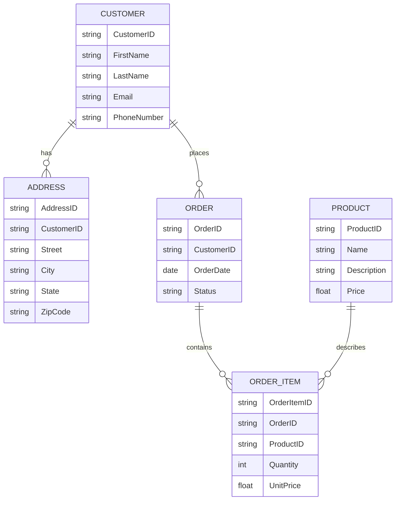
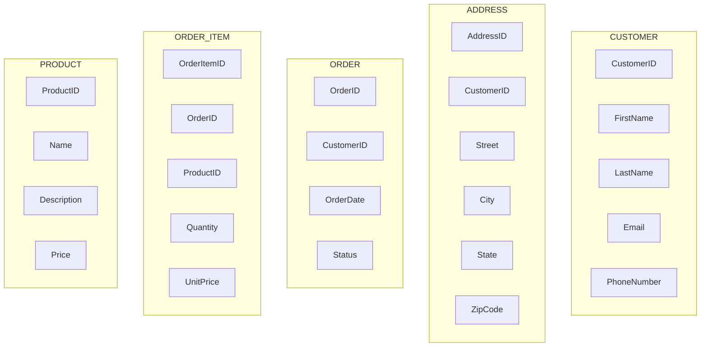

# 1.    Information Systems Architecture: Data

TOGAF Phase C: Data Architecture Deliverable Mapping

| TOGAF Output Element                 | Section(s) Covered         |
|--------------------------------------|----------------------------|
| Baseline & Target Data Architecture  | 1.4 (Logical Architecture) |
| Data Principles                      | 1.1.2                      |
| Logical Data Model                   | 1.4.1                      |
| Data Entity Lifecycle                | 1.1.4                      |
| Security & Governance Considerations | 1.5.1 – 1.5.3              |
| Data Management Frameworks           | 1.1.3, 1.3.1.1             |
| Data Quality Policies                | 1.3.1.2 – 1.3.1.5          |

## 1.1 Strategic Alignment & Principles

Establish the Why

### 1.1.1 Architecture Vision Alignment

<Describe how the data architecture supports the business drivers, goals, and constraints from Phase A. Include key data-centric principles and high-level objectives (e.g., compliance, trust, data democratization).>

### 1.1.2. Applicable Data Principles

- Data is an Asset
- Data is Shared
- Data is Accessible
- Data has a Single Owner
<Include references to your organization's Enterprise Architecture Principles or Information Management Principles.>

### 1.1.3. Metadata and Master Data Strategy

- Describe your approach to metadata management (cataloging, lineage, business glossary).
- Outline MDM scope and federated vs centralized model.
- Reference tools (e.g., Informatica, Collibra) and governance.

### 1.1.4. Data Lifecycle and Retention

<Insert diagram or table showing lifecycle phases (Create, Read, Update, Archive, Delete) across data entities. Align with policies such as GDPR, CCPA, or internal retention standards.>

## 1.2 Foundational Data Inputs

Establish the What

### 1.2.1. Data Sourcing Details

The following information is documented when data is selected for use.  Key considerations of data collection are recorded, including the labeling of unstructured data, reasoning behind the uses of synthetic and purchased data, and assumptions of data. Geopolitical limitations of the data source are documented, and SCE evaluates how they may affect the model results for the intended population.

  * Data Source: Source of the data, including internal and external origins, with details about providers or origins.
  * Data Description: Nature, format, structure, and relevant metadata of the data, detailing data types, variables, and fields in a data dictionary.
  * Data Collection Process: Methods, instruments, protocols, and standards used in data collection. In data collection, consult with legal, information governance, privacy and other relevant stakeholders to assess consent for data usage and the history of the data source(s). Data used to train and test the model must be representative of the intended population and any subgroups.
  * Data Modification: Decisions regarding transformations of the data, including joins, encoding, or scaling of the data. Derived features are also defined.
  * Data Quality and Completeness: Information on known issues, biases, or concerns regarding data quality.
  * Data Privacy and Security: Measures applied to ensure the privacy and security of the data.
  * Data Usage Permissions and Licensing: Permissions, licenses, and legal restrictions associated with data use.>>

#### 1.2.1.x [Data Source Name ] - Details

<< Replicate this section for EACH data source and fill out this section for each source>>

  **Data Source:**

  **Data Description:**

  **Data Collection Process:**

  **Data Modification:**

  **Data Quality and Completeness:**

  **Data Privacy and Security:** Measures applied to ensure the privacy and security of the data.

  **Data Usage Permissions and Licensing:** Permissions, licenses, and legal restrictions associated with data use

### 1.2.2. Data Selection

<< SCE decides on the data to use for modeling based on criteria such as relevance to the business problem, data quality, legal / regulatory, and technical constraints. Justifications for the selected data are noted, and alternative data sources are evaluated if the criteria are not met.

Describe the criteria used to select the data chosen for this effort please cover each area of constraint.>>

1. Business Process Constraints - Respond with Text, Link, Diagram and/or other response here…
2. Data Quality Constraints - Respond with Text, Link, Diagram and/or other response here…
3. Legal / Regulatory Constraints - Respond with Text, Link, Diagram and/or other response here…
4. Technical Constraints - Respond with Text, Link, Diagram and/or other response here…

### 1.2.3. Stakeholder and Data Steward Approval

<< Document the agreements you received from business process stakeholders, the SCE data stewards, and any other relevant stakeholders before proceeding to the next steps such as modelling or use case development.>>

## 1.3 Data Quality & Bias Evaluations

Establish Trust

### 1.3.1 Data Quality

#### 1.3.1.1 Bias Evaluation Plan

<< Document the appropriate bias evaluation plan and involves subject matter experts (SMEs) relevant to the business use case to review bias testing and mitigate, where possible, bias in inputs and outputs. The bias evaluations are commensurate with the level of risk involved and are documented, with records maintained while the AI/ML system remains in use. Training data must be complete, accurate, and free of any bias that would mislead the model to produce biased or false information.  Add a reference to our AI/ML Model Risk Governance Framework.>>

#### 1.3.1.2 Data Quality & Bias

<< Identify any problematic data and address each of them by transforming, removing, or imputing data. If actions are not taken, document why actions are not needed. Problematic data can be defined as data that contains missing, duplicate, or incorrectly typed values.  Methods such as Mean Imputation, Zero Imputation, Regression Imputation, KNN Imputation, or Multivariate Imputation by Chained Equation are potentially used to populate missing values. Data owners of each identified data quality issue are notified and investigate the root cause if it is not a normal use or expectation of the data. The cause and resolution for each issue are documented.>>

#### 1.3.1.3 Data Cleaning Approach

<< Describes the initial quality of the data and the steps taken to improve it. The rationale behind the chosen cleaning approaches is explained, including transformation, removal, or imputation of data.

This section should also describe how the application is should plan to maintain data quality for the transactions involved in the solution. If the proposed solution is introducing any new data quality issues, the risk and solution mitigation (short-term, long-term) should be explained.

For each applicable dimension, explain the approach application is planning to implement.>>

##### 1.3.1.4. Data Quality Impact: Completeness

_Please follow the example YAML file for all Quality Issues related to Completeness:_

```YAML
- DataElement: CustomerBirthdate
   Description: Date of birth for customer verification and segmentation 
   SourceSystem: CRM-System-A 
   ExpectedCompleteness: 100% for KYC-compliant customers 
   ObservedCompleteness: 63% 
   RiskLevel: High 
   BusinessImpact: Impacts age-based risk scoring and product eligibility 
   UseCaseImpacted: Credit Scoring, Compliance Reporting 
   RootCause: Legacy records migrated from paper forms lacked DOB 
   Mitigations: 
     - Flag incomplete records in reports 
     - Initiate outreach for missing data 
   Notes: Coverage improving ~1%/month due to digital onboarding_
```

##### 1.3.1.5. Data Quality Impact: Consistency

_Please follow the example YAML file for all Quality Issues related to Completeness:_

```YAML
- DataElement: CustomerState
  Description: State or province of residence for regional reporting
  SourceSystems: [CRM, ERP]
  ExpectedConsistency: 2-letter ISO state codes across all systems
  ObservedInconsistencies: Mismatched formats ("California" vs "CA")
  RiskLevel: Medium
  BusinessImpact: Skews regional sales reporting and tax calculations
  UseCaseImpacted: Financial Reporting, Regional Campaign Targeting
  RootCause: Different input validation rules across systems
  Examples:
    - FieldValueDifferences:
        - SourceSystem: CRM
          Value: "California"
        - SourceSystem: ERP
          Value: "CA"
  Mitigations:
    - Standardize values during ETL
    - Harmonize front-end validation in CRM
  Notes: CRM migration roadmap includes field normalization Q3
```

## 1.4 Logical Architecture

The How

### 1.4.1. Logical Data Model

Please insert the Level 2 Logical Data model as a mermaid script.  In Mermaid diagrams, you may want to annotate ABB vs SBB explicitly


### 1.4.2 Logical Entity List and CRUD

<<The Logical Entity List documents and describes all the data object (entity) definitions, systems of record, entity relationships, and type of entity (master data or transactional data) shown in the logical data model above. Information shall include the entities which will be modified (based on the business process application being implemented).

Details of Operation shall include the kind of operation (read/insert/update/delete) the proposed solution is planning to implement.

Note: For all entities included in the table below, a CRUD matrix shall be created.

Note: The CRUD matrix below shall refer to/use/update the enterprise-level CRUD matrix document.>>

Please insert the Logical Entity Diagram as a Mermaid Script. In Mermaid diagrams, you may want to annotate ABB vs SBB explicitly



Please insert a link to Informatica for all the data objects In the Logical Entity List
Please Insert a CRUD Matrix in the form of a YAML Document for the CRUD Matrix Document

```YAML
entities:
  - name: Customer
    accessed _by:
      - role: Customer Service
        operations:  [Create, Read, Update ]
      - role: Order System
        operations:  [Read ]
      - role: Billing System
        operations:  [Read ]
  - name: Address
    accessed _by:
      - role: Customer Service
        operations:  [Create, Read, Update, Delete ]
  - name: Order
    accessed _by:
      - role: Order System
        operations:  [Create, Read, Update, Delete ]
      - role: Billing System
        operations:  [Read ]
  - name: Order Item
    accessed _by:
      - role: Order System
        operations:  [Create, Read, Update, Delete ]
      - role: Billing System
        operations:  [Read ]
  - name: Product
    accessed _by:
      - role: Product Catalog
        operations:  [Create, Read, Update, Delete ]
      - role: Customer Service
        operations:  [Read ]
      - role: Order System
        operations:  [Read ]
```

### 1.4.3. Data Model-to-Application Mapping

Please tag Abstract Building Blocks (ABB) that are enterprise standards as defined by the Technology Architect for Data and those that are Solution Level Building Blocks (SBB), which are only specific to this solution.

<<  This section should illustrate the logical data entities (in section 3.1) mapping to application components (in application architecture) and business capability/function mapping and finally the database the data is stored in. Do this in the format of a Mermaid Script>>.

```Mermaid
graph TD

  %% Business Processes
  BP1[Customer Onboarding]
  BP2[Profile Management]
  BP3[Service Request Tracking]
  BP4[Account Authentication]

  %% Data Models
  DM1[Customer Master Data Model]
  DM2[User Identity Model]
  DM3[Service Request Data Model]

  %% Application Components
  APP1[SAP CRM System]
  APP2[Corporate Customer Portal]
  APP3[Okta IAM]

  %% Databases
  DB1[SAP HANA DB]
  DB2[Portal DB]
  DB3[Okta Identity Store]

  %% Business Processes → Data Models
  BP1 --> DM1
  BP1 --> DM2
  BP2 --> DM1
  BP2 --> DM2
  BP3 --> DM1
  BP3 --> DM3
  BP4 --> DM2

  %% Data Models → Applications
  DM1 --> APP1
  DM1 --> APP2
  DM2 --> APP3
  DM2 --> APP2
  DM3 --> APP1
  DM3 --> APP2

  %% Applications → Databases
  APP1 --> DB1
  APP2 --> DB2
  APP3 --> DB3

  %% Styling
  subgraph "Business Processes"
    BP1
    BP2
    BP3
    BP4
  end

  subgraph "Data Models"
    DM1
    DM2
    DM3
  end

  subgraph "Application Model"
    APP1
    APP2
    APP3
  end

  subgraph "Databases"
    DB1
    DB2
    DB3
  end
```

### 1.4.4 Data Movement and Processing Flow

This section illustrates both:
- **Data Movement**: How data flows between systems, applications, and databases.
- **Data Processing**: How data is transformed, enriched, filtered, or validated through internal workflows.
- **Data Dissemination**: How final or intermediate data products are exposed to consumers (e.g., reports, APIs, external feeds, analytic platforms).

Include the following:

#### 1.4.4.1 End-to-End Data Flow Diagram

<Insert Mermaid.js flowchart showing major flow paths between producers, processors, and consumers.>

#### 1.4.4.2 Data Processing Stages

| Stage      | Description                            | Tools/Components         | Example Transformation |
|------------|----------------------------------------|--------------------------|------------------------|
| Ingestion  | Raw data collected from source systems | Kafka, APIs              | Raw JSON payload       |
| Cleansing  | Standardizing, deduplicating           | DataBricks               | Normalize date formats |
| Enrichment | Add context or external lookups        | Informatica              | Map ZIP to region      |
| Output     | Dissemination to consumers             | Tableau, S3, API Gateway | Publish daily report   |

### 1.4.5 Data Dissemination Channels

<Diagram or list of where the data ultimately goes, grouped by internal/external and real-time/batch.>

- Internal APIs (real-time)
- Regulatory Reporting System (batch, daily)
- Customer Insights Dashboard (interactive)

## 1.5 Data Security, Privacy & Governance

### 1.5.1 Data Security and Protection

* Scope
* DLP Policy Overview
* Control Points
* Technology Stack and Integration
* Monitoring and Response
* Governance
* Limitations and Roadmap

### 1.5.2 Impacted business process

<<  This section shall illustrate the list of impacted business processes along with the business capabilities and enterprise applications.

| Master Data Entity | Business capability | Business process  | Impacted enterprise applications |
|--------------------|---------------------|-------------------|----------------------------------|
| Transformer        | Asset Management    | E1 and E2 process | SAP EAM,MAP 3D                   |
|                    |                     |                   |                                  |
|                    |                     |                   |                                  |
|                    |                     |                   |                                  |
|                    |                     |                   |                                  |

### 1.5.3. Data Minimization

<< Describe how a thorough review will be conducted to identify potential opportunities for data minimization in relation to confidential data elements. See the "Classifying and Handling Company Information Standard" for more details.

Describe the data minimization efforts >>

Respond with Text, Link, Diagram and/or other response here…
