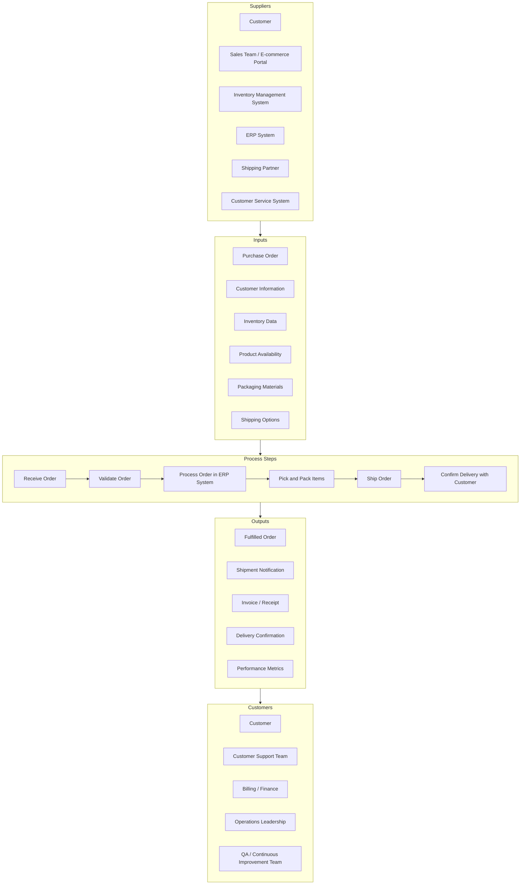
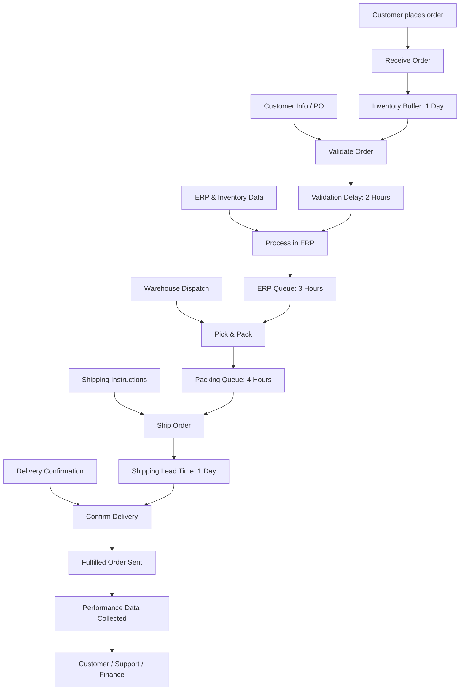
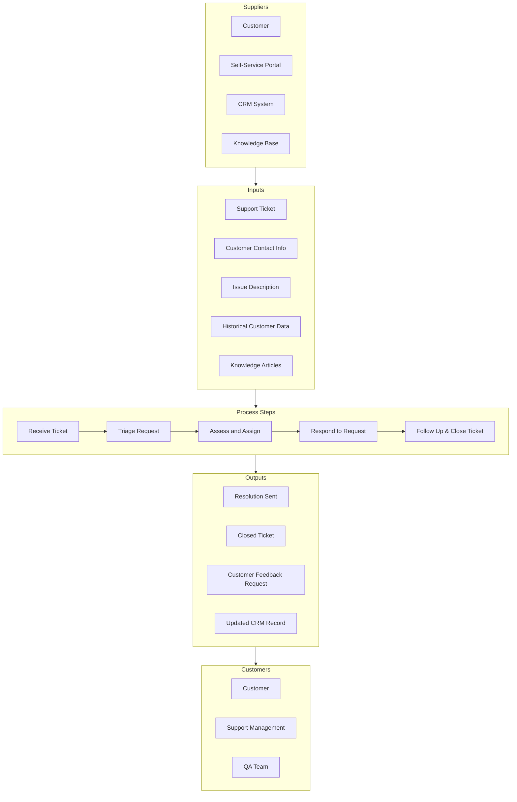
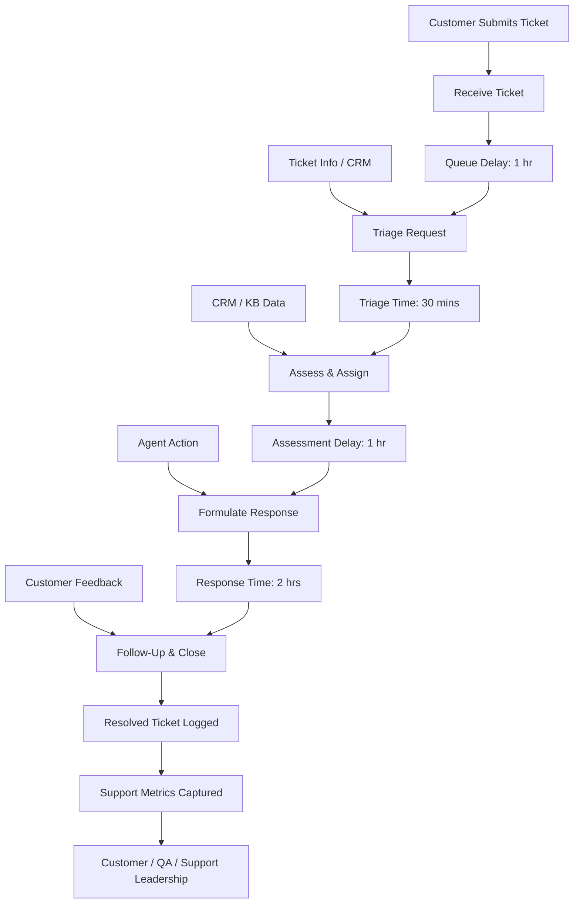

## Business Architecture

### Goals, Objectives, and Key Results

<Purpose>
This section clearly defines the business goals, objectives, and key results (OKRs) that the IT solution is intended to achieve. Documenting these elements ensures alignment between the proposed technology solution and the organization's strategic intentions. It serves as the foundational context for evaluating the solution's success, prioritizing project scope, and guiding stakeholders through decision-making processes.
</Purpose>
<Instructions>
1. Clearly articulate the high-level business goals this solution aims to fulfill. Goals should reflect strategic aspirations of the business area or organization.
2. List specific, measurable, achievable, relevant, and time-bound (SMART) objectives aligned with each business goal.
3. Define key results for each objective, specifying measurable outcomes and milestones that will indicate successful progress and achievement.
4. Ensure each objective explicitly addresses how the proposed solution will support or enable achievement.
5. Collaborate with business stakeholders to validate and refine documented goals, objectives, and key results to ensure clarity, relevance, and completeness.
</Instructions>
<Example>
**Goal:** Improve customer satisfaction and retention.

* **Objective 1:** Enhance customer support responsiveness.

  * **Key Result 1:** Reduce average customer support response time from 24 hours to less than 4 hours by Q3 2026.
  * **Key Result 2:** Achieve an 85% customer satisfaction rating within 6 months after deploying the new solution.
* **Objective 2:** Increase self-service capabilities.

  * **Key Result:** Implement a self-service customer portal to reduce support call volume by 30% within 12 months post-launch.

**Goal:** Enhance operational efficiency.

* **Objective 1:** Streamline account onboarding.

  * **Key Result:** Automate the account onboarding process to reduce processing time from 7 days to 2 days by end of Q4 2026.
* **Objective 2:** Improve data accuracy and integrity.

  * **Key Result:** Integrate system data flows to reduce manual data entry errors by 50% within one year post-implementation.
</Example>
<Standards>
* Goals, objectives, and key results must align with strategic business directives and documented enterprise strategies.
* All objectives and key results should adhere to the SMART framework for clarity and effectiveness.
* Documentation must be validated and approved by relevant business owners and stakeholders.
* Clearly link each key result to measurable performance indicators.
* Refer to external industry standards, such as TOGAF (The Open Group Architecture Framework), specifically sections pertaining to Business Architecture documentation (TOGAF 10 – Business Architecture, Section 7) and ISO/IEC/IEEE 42010 standards for architectural descriptions, ensuring completeness, relevance, and adherence to recognized best practices.
</Standards>

## Impacted Business Capabilities

<Purpose>
This section identifies and describes the specific business capabilities impacted by the implementation of the IT solution. Clearly documenting impacted capabilities helps to clarify the scope of change, facilitates alignment between business and IT stakeholders, and ensures effective management of dependencies and interactions within the organization.
</Purpose>
<Instructions>
1. Identify and list each business capability directly or indirectly impacted by the proposed solution.
2. Describe the current state of each capability, including existing strengths, weaknesses, or known gaps.
3. Clearly articulate the expected changes or enhancements to each capability resulting from the solution implementation.
4. Highlight dependencies or integration points between impacted capabilities.
5. Validate this information with relevant business and IT stakeholders.
</Instructions>
<Example>
**Capability:** Customer Relationship Management (CRM)

* **Current State:** Disjointed customer data across multiple legacy systems causing inefficient customer interactions and lack of a unified customer view.
* **Expected Changes:** Consolidation of customer data into a unified CRM system, providing a comprehensive, real-time customer view, improved interaction efficiency, and enhanced customer analytics capabilities.

**Capability:** Order Management

* **Current State:** Manual processes with significant delay and error rates.
* **Expected Changes:** Automation of key processes reducing processing time by 60%, minimizing errors, and improving scalability for future growth.
</Example>
<Standards>
* Business capabilities must align with the organization's business architecture and capability model.
* Changes described must clearly demonstrate the intended value and benefit to each capability.
* Documentation should reflect integration with existing enterprise frameworks and standards such as TOGAF’s Business Architecture Capability Framework.
* Align capability documentation with external industry standards such as the Business Architecture Guild’s Business Architecture Body of Knowledge (BIZBOK® Guide).
</Standards>

## Impacted Business Processes

<Purpose>
This section documents the business processes associated with each impacted business capability. Clear documentation of business processes ensures a shared understanding of workflow, roles, responsibilities, and metrics, facilitating effective alignment, analysis, and optimization.
</Purpose>
<Instructions>
1. List and categorize business processes under their associated impacted business capabilities.
2. Provide clear and descriptive names for each business process.
3. Identify and document the owner of each process.
4. Include detailed descriptions of each process, highlighting key steps and interactions.
5. Document basic process metrics such as process duration, throughput, quality indicators, and associated costs.
6. Provide standardized process visualizations using Business Process Model and Notation (BPMN), Supplier-Input-Process-Output-Customer (SIPOC), and Value Stream Mapping (VSM).
7. Note clearly that Flowcharts and Customer Journey Maps are non-standardized and require additional dialogue to reduce ambiguity and avoid misunderstandings.
</Instructions>
<Example>
**Capability: Order Management**
* Process Name: Order Fulfillment
* Owner: Jane Doe, Operations Manager
* Description: Manages end-to-end order processing from receipt to delivery, including validation, processing, packing, shipment, and customer confirmation.
* Metrics: Average Processing Time: 3 days, Error Rate: 2%, Orders Processed per Day: 150, Cost per Order: $5
* Visualizations:
  * BPMN:

```XML
<?xml version="1.0" encoding="UTF-8"?>
<bpmn:definitions xmlns:xsi="http://www.w3.org/2001/XMLSchema-instance"
                  xmlns:bpmn="http://www.omg.org/spec/BPMN/20100524/MODEL"
                  xmlns:bpmndi="http://www.omg.org/spec/BPMN/20100524/DI"
                  xmlns:dc="http://www.omg.org/spec/DD/20100524/DC"
                  xmlns:di="http://www.omg.org/spec/DD/20100524/DI"
                  id="Definitions_1"
                  targetNamespace="http://example.com/order-fulfillment">

  <bpmn:process id="OrderFulfillmentProcess" name="Order Fulfillment" isExecutable="true">
    <!-- Metadata -->
    <bpmn:documentation>
      Capability: Order Management
      Process Owner: Jane Doe (Operations Manager)
      Description: Manages end-to-end order processing from receipt to delivery, including validation, processing, packing, shipment, and customer confirmation.
      Metrics: Average Processing Time: 3 days, Error Rate: 2%, Orders Processed per Day: 150, Cost per Order: $5
    </bpmn:documentation>

    <!-- Start Event -->
    <bpmn:startEvent id="StartEvent_OrderReceived" name="Order Received">
      <bpmn:outgoing>Flow_ValidateOrder</bpmn:outgoing>
    </bpmn:startEvent>

    <!-- Task: Validate Order -->
    <bpmn:task id="Task_ValidateOrder" name="Validate Order">
      <bpmn:incoming>Flow_ValidateOrder</bpmn:incoming>
      <bpmn:outgoing>Flow_OrderValid?</bpmn:outgoing>
    </bpmn:task>

    <!-- Exclusive Gateway: Is Order Valid? -->
    <bpmn:exclusiveGateway id="Gateway_OrderValid" name="Is Order Valid?">
      <bpmn:incoming>Flow_OrderValid?</bpmn:incoming>
      <bpmn:outgoing>Flow_Reject</bpmn:outgoing>
      <bpmn:outgoing>Flow_ProcessOrder</bpmn:outgoing>
    </bpmn:exclusiveGateway>

    <!-- Task: Reject Order -->
    <bpmn:task id="Task_RejectOrder" name="Reject Order & Notify Customer">
      <bpmn:incoming>Flow_Reject</bpmn:incoming>
      <bpmn:outgoing>Flow_EndRejected</bpmn:outgoing>
    </bpmn:task>

    <!-- Task: Process Order -->
    <bpmn:task id="Task_ProcessOrder" name="Process Order in ERP System">
      <bpmn:incoming>Flow_ProcessOrder</bpmn:incoming>
      <bpmn:outgoing>Flow_PickPack</bpmn:outgoing>
    </bpmn:task>

    <!-- Task: Pick & Pack -->
    <bpmn:task id="Task_PickPack" name="Pick & Pack Items">
      <bpmn:incoming>Flow_PickPack</bpmn:incoming>
      <bpmn:outgoing>Flow_Ship</bpmn:outgoing>
    </bpmn:task>

    <!-- Task: Ship Order -->
    <bpmn:task id="Task_ShipOrder" name="Ship Order">
      <bpmn:incoming>Flow_Ship</bpmn:incoming>
      <bpmn:outgoing>Flow_Confirm</bpmn:outgoing>
    </bpmn:task>

    <!-- Task: Confirm Delivery -->
    <bpmn:task id="Task_ConfirmDelivery" name="Confirm Delivery with Customer">
      <bpmn:incoming>Flow_Confirm</bpmn:incoming>
      <bpmn:outgoing>Flow_EndFulfilled</bpmn:outgoing>
    </bpmn:task>

    <!-- End Events -->
    <bpmn:endEvent id="EndEvent_OrderFulfilled" name="Order Fulfilled">
      <bpmn:incoming>Flow_EndFulfilled</bpmn:incoming>
    </bpmn:endEvent>

    <bpmn:endEvent id="EndEvent_OrderRejected" name="Order Rejected">
      <bpmn:incoming>Flow_EndRejected</bpmn:incoming>
    </bpmn:endEvent>

    <!-- Sequence Flows -->
    <bpmn:sequenceFlow id="Flow_ValidateOrder" sourceRef="StartEvent_OrderReceived" targetRef="Task_ValidateOrder"/>
    <bpmn:sequenceFlow id="Flow_OrderValid?" sourceRef="Task_ValidateOrder" targetRef="Gateway_OrderValid"/>
    <bpmn:sequenceFlow id="Flow_Reject" sourceRef="Gateway_OrderValid" targetRef="Task_RejectOrder" name="No"/>
    <bpmn:sequenceFlow id="Flow_ProcessOrder" sourceRef="Gateway_OrderValid" targetRef="Task_ProcessOrder" name="Yes"/>
    <bpmn:sequenceFlow id="Flow_PickPack" sourceRef="Task_ProcessOrder" targetRef="Task_PickPack"/>
    <bpmn:sequenceFlow id="Flow_Ship" sourceRef="Task_PickPack" targetRef="Task_ShipOrder"/>
    <bpmn:sequenceFlow id="Flow_Confirm" sourceRef="Task_ShipOrder" targetRef="Task_ConfirmDelivery"/>
    <bpmn:sequenceFlow id="Flow_EndFulfilled" sourceRef="Task_ConfirmDelivery" targetRef="EndEvent_OrderFulfilled"/>
    <bpmn:sequenceFlow id="Flow_EndRejected" sourceRef="Task_RejectOrder" targetRef="EndEvent_OrderRejected"/>

  </bpmn:process>
</bpmn:definitions>
```
  * SIPOC: [Link to SIPOC diagram]



  * Value Stream Map:



Annotations:
* Process Boxes (PSx): Core value-added steps.
* Inventory Buffers / Waits (INVx): Represent non-value-added time.
* Information Flow (IFx): Dashed conceptual arrows from upstream systems or customers.
* Metrics Collection (METRICS): Point at which time, cost, and error data are measured.
 
Metrics

|              Step | Cycle Time | Lead Time | % Complete & Accurate |
|------------------:|:----------:|:---------:|:---------------------:|
|     Receive Order |  10 mins   |   1 day   |          98%          |
|    Validate Order |  30 mins   |   2 hrs   |          95%          |
|    Process in ERP |  20 mins   |   3 hrs   |          97%          |
| Pick & Pack Items |  45 mins   |   4 hrs   |          92%          |
|        Ship Order |    1 hr    |   1 day   |          99%          |
|  Confirm Delivery |  15 mins   | Same Day  |         100%          |

**Capability: Customer Relationship Management**
* Process Name: Customer Support Request Handling
* Owner: John Smith, Customer Support Lead
* Description: Handles customer support tickets from initiation through resolution, including issue triage, response formulation, and follow-up.
* Metrics: Average Response Time: 4 hours, Customer Satisfaction Rating: 85%, Resolution Rate on First Interaction: 70%
* Visualizations:
  * BPMN:

```XML
<?xml version="1.0" encoding="UTF-8"?>
<bpmn:definitions xmlns:xsi="http://www.w3.org/2001/XMLSchema-instance"
                  xmlns:bpmn="http://www.omg.org/spec/BPMN/20100524/MODEL"
                  xmlns:bpmndi="http://www.omg.org/spec/BPMN/20100524/DI"
                  xmlns:dc="http://www.omg.org/spec/DD/20100524/DC"
                  xmlns:di="http://www.omg.org/spec/DD/20100524/DI"
                  id="Definitions_2"
                  targetNamespace="http://example.com/customer-support">

  <bpmn:process id="CustomerSupportProcess" name="Customer Support Request Handling" isExecutable="true">
    <bpmn:documentation>
      Capability: Customer Relationship Management
      Process Owner: John Smith (Customer Support Lead)
      Description: Handles customer support tickets from initiation through resolution, including issue triage, response formulation, and follow-up.
      Metrics: Average Response Time: 4 hours, Customer Satisfaction Rating: 85%, Resolution Rate on First Interaction: 70%
    </bpmn:documentation>

    <bpmn:startEvent id="StartEvent_TicketReceived" name="Support Request Received">
      <bpmn:outgoing>Flow_Triage</bpmn:outgoing>
    </bpmn:startEvent>

    <bpmn:task id="Task_TriageRequest" name="Triage Request">
      <bpmn:incoming>Flow_Triage</bpmn:incoming>
      <bpmn:outgoing>Flow_Assess</bpmn:outgoing>
    </bpmn:task>

    <bpmn:task id="Task_AssessRequest" name="Assess and Assign">
      <bpmn:incoming>Flow_Assess</bpmn:incoming>
      <bpmn:outgoing>Flow_Respond</bpmn:outgoing>
    </bpmn:task>

    <bpmn:task id="Task_RespondToRequest" name="Formulate and Send Response">
      <bpmn:incoming>Flow_Respond</bpmn:incoming>
      <bpmn:outgoing>Flow_Followup</bpmn:outgoing>
    </bpmn:task>

    <bpmn:task id="Task_FollowUp" name="Follow-Up & Close Ticket">
      <bpmn:incoming>Flow_Followup</bpmn:incoming>
      <bpmn:outgoing>Flow_End</bpmn:outgoing>
    </bpmn:task>

    <bpmn:endEvent id="EndEvent_TicketClosed" name="Support Request Resolved">
      <bpmn:incoming>Flow_End</bpmn:incoming>
    </bpmn:endEvent>

    <bpmn:sequenceFlow id="Flow_Triage" sourceRef="StartEvent_TicketReceived" targetRef="Task_TriageRequest"/>
    <bpmn:sequenceFlow id="Flow_Assess" sourceRef="Task_TriageRequest" targetRef="Task_AssessRequest"/>
    <bpmn:sequenceFlow id="Flow_Respond" sourceRef="Task_AssessRequest" targetRef="Task_RespondToRequest"/>
    <bpmn:sequenceFlow id="Flow_Followup" sourceRef="Task_RespondToRequest" targetRef="Task_FollowUp"/>
    <bpmn:sequenceFlow id="Flow_End" sourceRef="Task_FollowUp" targetRef="EndEvent_TicketClosed"/>

  </bpmn:process>
</bpmn:definitions>
```

* SIPOC:



* Value Stream Map:



Metrics

|               Step | Cycle Time | Lead Time | % Resolved on First Contact |
|-------------------:|:----------:|:---------:|:---------------------------:|
|     Receive Ticket |  10 mins   |   1 hr    |             90%             |
|     Triage Request |  20 mins   |  30 mins  |             85%             |
|    Assess & Assign |  15 mins   |   1 hr    |             80%             |
| Formulate Response |  45 mins   |   2 hrs   |             70%             |
|  Follow-Up & Close |  20 mins   | Same Day  |            100%             |
</Example>
<Standards>
* Process documentation should clearly align with the associated business capabilities documented previously.
* Adhere to BPMN 2.0 standards for business process modeling.
* Utilize SIPOC and Value Stream Mapping for clear and concise visual representations.
* Explicitly note when additional stakeholder discussions are necessary, especially if utilizing Flowcharts and Customer Journey Maps, as these require consensus to eliminate ambiguity.
* Reference external standards, such as ISO 9001 for quality management and ISO/IEC 19510 for BPMN notation, ensuring compliance and recognized best practice adherence.
</Standards>

## Business Process Information Attributes

<Purpose>
This section identifies and documents information attributes associated with each business process that require specific data controls. Properly identifying these attributes helps ensure compliance with regulatory, legal, and security requirements, reducing risk and safeguarding sensitive data.
</Purpose>
<Instructions>
1. Clearly identify and list each business process that handles or interacts with sensitive or controlled information.
2. Specify the type of data control applicable to the process from the common control list provided below or indicate any additional specific controls.
3. Provide a brief rationale for each data control selected.
4. Ensure validation with compliance, legal, or security stakeholders as needed.
5. Output must reference external and internal standards clearly, including relevant regulatory frameworks (FERC, NERC, PCI, SOX, CPRA, etc.).
</Instructions>
<Example>
**Process:** Customer Billing

* **Control:** PCI Compliance
* **Rationale:** Handles customer credit card payment data requiring secure handling, encryption, and storage per PCI DSS.

**Process:** Infrastructure Management

* **Control:** Critical Energy Infrastructure Information (CEII)
* **Rationale:** Manages sensitive infrastructure data critical to energy supply and national security.

**Process:** Employee Onboarding

* **Control:** Personally Identifiable Information (PII)
* **Rationale:** Handles personal data for employment records, requiring compliance with CPRA privacy regulations.
</Example>
<Standards>
* Clearly align documented information controls with applicable regulatory standards and internal policies.
* Engage relevant compliance and security stakeholders to verify control applicability and correctness.
* **Critical Energy Infrastructure Information (CEII)** - [FERC CEII](https://www.ferc.gov/ceii)
* **FERC Standards of Conduct (SOC)** – [FERC SOC](https://www.ferc.gov/enforcement-legal/legal/major-orders-regulations/standards-conduct-transmission-providers)
* **NERC CIP Confidential** – Reference appropriate internal NERC CIP documentation.
* **Personally Identifiable Information (PII)** – [California Privacy Rights Act](https://iapp.org/resources/article/the-california-privacy-rights-act-of-2020/)
* **Sensitive Personal Information (High Risk)** – Strict access controls and encryption required. Misuse may lead to legal implications or identity theft. Governed under CCPA/CPRA requirements. - [Sensitive Personal Information](https://edisonintl.sharepoint.com.mcas.ms/ssc/EthicsCompliance/Forms/AllItems.aspx?id=%2Fssc%2FEthics%20%20Compliance%2FSensitive%20Personal%20Information%20Cybersecurity%20Checklist%2Epdf&parent=%2Fssc%2FEthics%20%20Compliance)
* **Sarbanes-Oxley (SOX) Financial Reporting Data** – [Sarbanes–Oxley Act](https://en.wikipedia.org/wiki/Sarbanes–Oxley_Act)
* **CPUC Utility Data** – Regulated by CPUC guidelines for data sharing with affiliate companies.
* **PCI Compliance** – [Payment Card Industry Data Security Standard](https://en.wikipedia.org/wiki/Payment_Card_Industry_Data_Security_Standard)
* **IT General Computing Controls (ITGC)** – [ITGC Standards](https://en.wikipedia.org/wiki/ITGC)
* **CISR (ADD/REMOVE)** – Controlled access to utility data.
* **Other** – Please specify any additional data control mechanisms explicitly.
</Standards>

## Business Process Complexity

<Purpose>
This section assesses and documents the Complexity of business processes associated with the solution. Complexity assessments help determine the robustness required in solution design, based on risks associated with process.
</Purpose>
<Instructions>
1. For each business process identified, evaluate and document the Complexity based on the provided scale where complexity is the number of phases, stakeholders, and interactions across internal and external business areas.

| Qualitative Values | Quantitative Values (%) | Quantitative Values (1 - 10) | Description                                                                                                                      |
|-------------------:|:-----------------------:|:----------------------------:|:---------------------------------------------------------------------------------------------------------------------------------|
|          Very High |       (96 – 100)        |              10              | The business process involves multiple phases and multiple stakeholders from multiple business areas inside and outside company. |
|               High |         (80-95)         |              8               | The business process involves multiple phases and multiple stakeholders within multiple business areas inside company.           |
|           Moderate |         (21-79)         |              5               | The business process involves multiple phases and multiple stakeholders within a single business area in company.                |
|                Low |         (5-20)          |              2               | The business process involves multiple phases and a single stakeholder within a single business area in company.                 |
|           Very Low |          (0-4)          |              0               | The business process involves a single phase and a single stakeholder within a single business area in company.                  |

2. Clearly define levels for each process to guide solution requirements.

3. Collaborate with relevant stakeholders, including business process owners, risk management, security, and compliance teams, to validate assessments.
</Instructions>
<Example>
**Process:** Customer Billing

* **Complexity:** High Complex (Score: 8)

* **Process:** Employee Onboarding

* **Complexity:** Moderate Complexity (Score: 5)

</Example>
<Standards>
* Clearly document the reason to select the score that you picked.
* Ensure each assessment is validated by relevant business and technical stakeholders.
* Maintain documentation transparency for audit and compliance purposes, aligning with industry best practices and regulatory requirements.
</Standards>

## Business Process Resiliency

<Purpose>
This section evaluates and documents the resiliency required for maintaining system operations under adverse conditions or disruptions. It specifically addresses acceptable downtime for underlying IT systems and ensures alignment between Business Process Deferment and Time to Restore metrics. The Business Process Owner must coordinate with upstream and downstream stakeholders to validate alignment on resiliency tiers and recovery expectations.
</Purpose>
<Instructions>
1. For each business process identified, evaluate and document the resiliency needed based on the provided scale:

| Category                 | Tier | RTO          | Definition                                                                                                                                                                          | Business Process                                              | Architecture Requirements                                                                                                                              | NERC CIP Requirements                                                 | Network Requirements                                              | Interface Requirements                                               | Backup Requirements                                                                  | Roll-Back Recovery Requirements                                               | Testing Requirements                                                                                                                                                 | Disaster Recovery Documentation Requirements                                                                                                                                                                     |
| ------------------------ | ---- | ------------ | ----------------------------------------------------------------------------------------------------------------------------------------------------------------------------------- | ------------------------------------------------------------- | ------------------------------------------------------------------------------------------------------------------------------------------------------ | --------------------------------------------------------------------- | ----------------------------------------------------------------- | -------------------------------------------------------------------- | ------------------------------------------------------------------------------------ | ----------------------------------------------------------------------------- | -------------------------------------------------------------------------------------------------------------------------------------------------------------------- | ---------------------------------------------------------------------------------------------------------------------------------------------------------------------------------------------------------------- |
| Infrastructure/Platforms | 0    | 0-4 hours    | Infrastructure must support essential shared services, including networks, storage, servers, mainframe, Unix, firewalls, DNS, Active Directory, internet, and partner connectivity. | Supports Essential, Critical, Important, Deferrable processes | Requires active replication (active/active) across data centers or cloud environments to meet defined RTO and RPO                                      | Comply with CIP-008-6 and CIP-009-6 if categorized under CIP-002-5.1a | Network performance/accessibility must align with defined RTO/RPO | N/A                                                                  | Backups must be offsite, offline, immutable, or air-gapped, meeting RPO requirements | Real-time synchronization capability required for shared services             | Annual DR plan and runbook reviews by Managed Service Provider Tower lead and SMOO; annual infrastructure testing scheduled by IT DR Team and SMOO                   | Fully documented DR Plan/Runbooks per SCE Templates, updated annually or upon infrastructure/platform modifications                                                                                              |
| Essential/Critical       | 1-2  | <8 to 24 hrs | Must remain available; downtime >24 hrs risks significant operational or financial loss                                                                                             | Supports Essential/Critical processes                         | Application/system and infrastructure redundancy across geographically dispersed alternate data centers/cloud regions required to meet defined RTO/RPO | Comply with CIP-008-6 and CIP-009-6 if categorized under CIP-002-5.1a | Network performance/accessibility must align with defined RTO/RPO | Interdependencies matching RTO require alternate location redundancy | Backups must be offsite, offline, immutable, or air-gapped, meeting RPO requirements | Real-time synchronization capability required                                 | Annual failover tests approved by Plan Owner and SMOO; pre-production rebuild/recovery testing; Cloud/external services must annually validate DR capabilities       | Fully documented DR Plan/Runbooks per SCE Templates, updated annually or upon system changes; Cloud/external providers must document and annually test Business Continuity and DR, verified by third-party audit |
| Important                | 3    | 24-72 hrs    | Recovery within 24-72 hrs; loss beyond 72 hrs risks significant operational or financial impact                                                                                     | Supports Important processes                                  | Manual rebuild/restore with procurement of necessary equipment; redundancy within same geographic region required                                      | Comply with CIP-008-6 and CIP-009-6 if categorized under CIP-002-5.1a | Network performance/accessibility must align with defined RTO/RPO | Interdependencies matching RTO require alternate location redundancy | Backups meeting RPO requirements, including cloud/external providers                 | Real-time synchronization capability required                                 | Annual DR plan/runbook review approved by Plan Owner and SMOO; pre-production rebuild/recovery testing; annual third-party DR validation for cloud/external services | Fully documented DR Plan/Runbooks per SCE Templates, updated annually or upon system changes; Cloud/external providers must annually document and validate DR plans through third-party audits                   |
| Deferrable               | 4    | >72 hrs      | Recovery beyond 72 hrs acceptable; minimal operational or financial impact                                                                                                          | Supports Deferrable processes                                 | Manual rebuild/restore with equipment procurement; redundancy within same geographic region required                                                   | Comply with CIP-008-6 and CIP-009-6 if categorized under CIP-002-5.1a | Network performance/accessibility must align with defined RTO/RPO | Interdependencies matching RTO require alternate location redundancy | Backups meeting RPO requirements, including cloud/external providers                 | Database restoration capability (rebuild or backup-based) required within RTO | Annual DR plan/runbook review approved by Plan Owner; pre-production rebuild/recovery testing; annual third-party DR validation for cloud/external services          | Fully documented DR Plan/Runbooks per SCE Templates, updated annually or upon system changes; Cloud/external providers must annually document and validate DR plans through third-party audits                   |

2. Clearly define levels for each process to guide solution requirements.

3. Collaborate with relevant stakeholders, including business process owners, risk management, security, and compliance teams, to validate assessments.
</Instructions>
<Example>
**Process:** Customer Billing

* Tier: Essential/Critical (Tier 1)
* RTO: <8 hours
* Reason: Customer Billing directly affects revenue streams and customer trust. Downtime beyond 8 hours would significantly impact financial transactions and compliance obligations. Validated by Finance, IT, and Compliance teams.

**Process:** Employee Onboarding

* Tier: Important (Tier 3)
* RTO: 24-72 hours
* Reason: Employee Onboarding supports business continuity but does not directly impact immediate operational capability. Recovery within 72 hours minimizes operational disruption. Validated by HR, IT, and Operations teams.
</Example>
<Standards>
* Clearly document the reason to select the score that you picked.
* Ensure each assessment is validated by relevant business and technical stakeholders.
* Maintain documentation transparency for audit and compliance purposes, aligning with industry best practices and regulatory requirements.
</Standards>

## Business Process Resiliency

<Purpose>
This section evaluates and documents the resiliency required for maintaining system operations under adverse conditions or disruptions. It specifically addresses acceptable downtime for underlying IT systems and ensures alignment between Business Process Deferment and Time to Restore metrics. The Business Process Owner must coordinate with upstream and downstream stakeholders to validate alignment on resiliency tiers and recovery expectations.
</Purpose>
<Instructions>
1. For each business process identified, evaluate and document the resiliency needed based on the provided scale:

| Category                 | Tier | RTO          | Definition                                                                                                                                                                          | Business Process                                              | Architecture Requirements                                                                                                                              | NERC CIP Requirements                                                 | Network Requirements                                              | Interface Requirements                                               | Backup Requirements                                                                  | Roll-Back Recovery Requirements                                               | Testing Requirements                                                                                                                                                 | Disaster Recovery Documentation Requirements                                                                                                                                                                     |
| ------------------------ | ---- | ------------ | ----------------------------------------------------------------------------------------------------------------------------------------------------------------------------------- | ------------------------------------------------------------- | ------------------------------------------------------------------------------------------------------------------------------------------------------ | --------------------------------------------------------------------- | ----------------------------------------------------------------- | -------------------------------------------------------------------- | ------------------------------------------------------------------------------------ | ----------------------------------------------------------------------------- | -------------------------------------------------------------------------------------------------------------------------------------------------------------------- | ---------------------------------------------------------------------------------------------------------------------------------------------------------------------------------------------------------------- |
| Infrastructure/Platforms | 0    | 0-4 hours    | Infrastructure must support essential shared services, including networks, storage, servers, mainframe, Unix, firewalls, DNS, Active Directory, internet, and partner connectivity. | Supports Essential, Critical, Important, Deferrable processes | Requires active replication (active/active) across data centers or cloud environments to meet defined RTO and RPO                                      | Comply with CIP-008-6 and CIP-009-6 if categorized under CIP-002-5.1a | Network performance/accessibility must align with defined RTO/RPO | N/A                                                                  | Backups must be offsite, offline, immutable, or air-gapped, meeting RPO requirements | Real-time synchronization capability required for shared services             | Annual DR plan and runbook reviews by Managed Service Provider Tower lead and SMOO; annual infrastructure testing scheduled by IT DR Team and SMOO                   | Fully documented DR Plan/Runbooks per SCE Templates, updated annually or upon infrastructure/platform modifications                                                                                              |
| Essential/Critical       | 1-2  | <8 to 24 hrs | Must remain available; downtime >24 hrs risks significant operational or financial loss                                                                                             | Supports Essential/Critical processes                         | Application/system and infrastructure redundancy across geographically dispersed alternate data centers/cloud regions required to meet defined RTO/RPO | Comply with CIP-008-6 and CIP-009-6 if categorized under CIP-002-5.1a | Network performance/accessibility must align with defined RTO/RPO | Interdependencies matching RTO require alternate location redundancy | Backups must be offsite, offline, immutable, or air-gapped, meeting RPO requirements | Real-time synchronization capability required                                 | Annual failover tests approved by Plan Owner and SMOO; pre-production rebuild/recovery testing; Cloud/external services must annually validate DR capabilities       | Fully documented DR Plan/Runbooks per SCE Templates, updated annually or upon system changes; Cloud/external providers must document and annually test Business Continuity and DR, verified by third-party audit |
| Important                | 3    | 24-72 hrs    | Recovery within 24-72 hrs; loss beyond 72 hrs risks significant operational or financial impact                                                                                     | Supports Important processes                                  | Manual rebuild/restore with procurement of necessary equipment; redundancy within same geographic region required                                      | Comply with CIP-008-6 and CIP-009-6 if categorized under CIP-002-5.1a | Network performance/accessibility must align with defined RTO/RPO | Interdependencies matching RTO require alternate location redundancy | Backups meeting RPO requirements, including cloud/external providers                 | Real-time synchronization capability required                                 | Annual DR plan/runbook review approved by Plan Owner and SMOO; pre-production rebuild/recovery testing; annual third-party DR validation for cloud/external services | Fully documented DR Plan/Runbooks per SCE Templates, updated annually or upon system changes; Cloud/external providers must annually document and validate DR plans through third-party audits                   |
| Deferrable               | 4    | >72 hrs      | Recovery beyond 72 hrs acceptable; minimal operational or financial impact                                                                                                          | Supports Deferrable processes                                 | Manual rebuild/restore with equipment procurement; redundancy within same geographic region required                                                   | Comply with CIP-008-6 and CIP-009-6 if categorized under CIP-002-5.1a | Network performance/accessibility must align with defined RTO/RPO | Interdependencies matching RTO require alternate location redundancy | Backups meeting RPO requirements, including cloud/external providers                 | Database restoration capability (rebuild or backup-based) required within RTO | Annual DR plan/runbook review approved by Plan Owner; pre-production rebuild/recovery testing; annual third-party DR validation for cloud/external services          | Fully documented DR Plan/Runbooks per SCE Templates, updated annually or upon system changes; Cloud/external providers must annually document and validate DR plans through third-party audits                   |

2. Clearly define levels for each process to guide solution requirements.

3. Collaborate with relevant stakeholders, including business process owners, risk management, security, and compliance teams, to validate assessments.
</Instructions>
<Example>
**Process:** Customer Billing

* Tier: Essential/Critical (Tier 1)
* RTO: <8 hours
* Reason: Customer Billing directly affects revenue streams and customer trust. Downtime beyond 8 hours would significantly impact financial transactions and compliance obligations. Validated by Finance, IT, and Compliance teams.

**Process:** Employee Onboarding

* Tier: Important (Tier 3)
* RTO: 24-72 hours
* Reason: Employee Onboarding supports business continuity but does not directly impact immediate operational capability. Recovery within 72 hours minimizes operational disruption. Validated by HR, IT, and Operations teams.
</Example>
<Standards>
* Clearly document the reason to select the score that you picked.
* Ensure each assessment is validated by relevant business and technical stakeholders.
* Maintain documentation transparency for audit and compliance purposes, aligning with industry best practices and regulatory requirements.
</Standards>

## Business Process Risk

<Purpose>
This section defines the purpose of conducting a Business Process Risk Assessment from an ISO 27001 perspective. It specifically addresses the evaluation of risks concerning Confidentiality, Integrity, and Availability (CIA) to ensure robust information security management within business processes.

**Confidentiality**

The purpose of assessing confidentiality is to ensure sensitive information is protected against unauthorized access or disclosure. Risks to confidentiality are evaluated to prevent data breaches, protect privacy, and ensure compliance with relevant laws and standards.

**Integrity**

The assessment of integrity aims to safeguard information from unauthorized modification or alteration. This evaluation ensures that business processes maintain accurate, reliable data and prevent errors or fraudulent activities that could compromise business operations.

**Availability**

Assessing availability ensures that business processes remain accessible and operational when needed. This evaluation identifies risks to the continuous functionality and timely recovery of systems, thereby minimizing disruptions and maintaining business continuity.
</Purpose>
<Instructions>
1. Document each risk event or condition following the guidelines provided below. Technical Debt, being a known issue, is not considered a risk. The methodology aligns with the PMI PMBOK and ISO 27001 standards.

2. **Risk Event**: Clearly describe each potential event or condition and the Source of that risk.

3. **Stakeholders:** Clearly describe the stakeholders impacted (both internal and external) for this risk.

4. **Risk Probability:** Evaluate each risk using the following scale:

| Qualitative Values | Quantitative Values (%) | Quantitative Values (1-10) | Description                                                           |
| ------------------ | ----------------------- | -------------------------- | --------------------------------------------------------------------- |
| Very High          | 96–100%                 | 10                         | Almost certain occurrence; occurs >100 times/year                     |
| High               | 80–95%                  | 8                          | Highly likely; occurs 10–100 times/year                               |
| Moderate           | 21–79%                  | 5                          | Somewhat likely; occurs 1–10 times/year                               |
| Low                | 5–20%                   | 2                          | Unlikely; occurs less than once/year to more than once every 10 years |
| Very Low           | 0–4%                    | 0                          | Highly unlikely; occurs less than once every 10 years                 |

4. **Risk Impact:** Evaluate the potential impact of each risk using the following scale:

| Qualitative Values | Quantitative Values (%) | Quantitative Values (1-10) | Description                                                                                                                                                                                                      |
| ------------------ | ----------------------- | -------------------------- | ---------------------------------------------------------------------------------------------------------------------------------------------------------------------------------------------------------------- |
| Very High          | 96–100                  | 10                         | Multiple severe adverse effects; critical operational, safety, regulatory, reputational, financial, and legal impacts; catastrophic operational interruptions (>50% customers, >24 hours)                        |
| High               | 80–95                   | 8                          | Severe adverse effects; major operational disruptions, significant regulatory failures, widespread reputational harm, severe financial and legal consequences                                                    |
| Moderate           | 21–79                   | 5                          | Serious adverse effects; noticeable operational degradation, significant but non-catastrophic safety incidents, notable regulatory and reputational impacts, moderate financial losses, considerable legal risks |
| Low                | 5–20                    | 2                          | Limited adverse effects; minor operational degradation, minimal safety incidents, limited regulatory and reputational impacts, minor financial consequences, few legal implications                              |
| Very Low           | 0–4                     | 0                          | Negligible adverse effects; minimal operational interruptions, negligible safety, regulatory, reputational, financial, and legal impacts                                                                         |

5. **Risk Exposure:** Assess the risk level combining likelihood and impact using this matrix:

|                      | Very Low Impact | Low Impact    | Moderate Impact | High Impact   | Very High Impact |
| -------------------- | --------------- | ------------- | --------------- | ------------- | ---------------- |
| Very High Likelihood | Very Low Risk   | Low Risk      | Moderate Risk   | High Risk     | Very High Risk   |
| High Likelihood      | Very Low Risk   | Low Risk      | Moderate Risk   | High Risk     | Very High Risk   |
| Moderate Likelihood  | Very Low Risk   | Low Risk      | Moderate Risk   | Moderate Risk | High Risk        |
| Low Likelihood       | Very Low Risk   | Low Risk      | Low Risk        | Low Risk      | Moderate Risk    |
| Very Low Likelihood  | Very Low Risk   | Very Low Risk | Very Low Risk   | Low Risk      | Low Risk         |

6. **Risk Mitigation:** Describe steps or approaches the solution will adopt to mitigate the risk in the form of formal requirements language.

7. **Risk Trigger / Monitoring Threshold:** Specify mechanisms or indicators within the solution for triggering risk alerts and monitoring in the form of formal requirements language.

8. **Risk Ownership / Source:** Identify the team or individual accountable for managing each risk.

9. **Risk Review / Audit:** Document who identified the risk, audit/review frequency, and details involved in conducting risk reviews in the form of formal requirements language.
</Instructions>
<Example>
**1. Data Breach Risk**

**Risk Event:** Unauthorized access to sensitive customer data due to inadequate data encryption practices.

**Stakeholders:** Internal IT Security Team, Customer Service, External Customers, Regulatory Authorities.

**Risk Probability:** Moderate (21–79%, Rating: 5)

**Risk Impact:** High (80–95%, Rating: 8)

**Risk Exposure:** Moderate Risk

**Risk Mitigation:** The solution must implement end-to-end data encryption compliant with AES-256 standards. Regular security audits and penetration testing shall be mandated quarterly. Access control must adhere strictly to role-based access control (RBAC) principles.

**Risk Trigger / Monitoring Threshold:** The system must trigger an immediate security alert if encryption compliance audits identify any non-encrypted sensitive data or unauthorized access attempts exceed a threshold of five per hour.

**Risk Ownership / Source:** IT Security Team

**Risk Review / Audit:** Identified by the IT Compliance Officer. Risk reviews shall be performed quarterly, including comprehensive penetration testing and compliance audits.

**2: Supplier System Outage**

**Risk Event:** Critical supplier's ERP system outage causing delays in procurement and order fulfillment processes.

**Stakeholders:** Procurement Team, Inventory Management, Suppliers, End Customers

**Risk Probability:** Low (5–20%, Rating: 2)

**Risk Impact:** Moderate (21–79%, Rating: 5)

**Risk Exposure:** Low Risk

**Risk Mitigation:** The solution shall implement a secondary procurement process using backup suppliers or manual ordering systems, activated automatically when primary ERP systems are unavailable beyond 2 hours.

**Risk Trigger / Monitoring Threshold:** Solution monitoring must continuously check supplier ERP availability. Notifications must trigger if supplier systems experience downtime exceeding 30 minutes.

**Risk Ownership / Source:** Procurement Operations Manager

**Risk Review / Audit:** Identified by Procurement Systems Analyst. Risk reviews conducted semi-annually, including system availability audits and alternative supplier verification.

**3: Regulatory Non-Compliance Risk**

**Risk Event:** Non-compliance with CCPA due to inadequate personal data handling procedures.

**Stakeholders:** Legal Department, Data Protection Officer, Regulatory Authorities, Customers

**Risk Probability:** High (80–95%, Rating: 8)

**Risk Impact:** Very High (96–100%, Rating: 10)

**Risk Exposure:** Very High Risk

**Risk Mitigation:** The solution must include comprehensive data anonymization and pseudonymization mechanisms for handling personal data. Compliance training must be conducted annually for all personnel handling personal data. Solution must maintain comprehensive logs of data processing activities.

**Risk Trigger / Monitoring Threshold:** Automated alerts must be triggered immediately if data handling activities bypass approved anonymization procedures or when regulatory updates occur that impact compliance standards.

**Risk Ownership / Source:** HR and CS Data Stewards

**Risk Review / Audit:** Identified by Compliance and Risk Management Team. Risk reviews shall be performed quarterly, including assessments of data handling practices, compliance audits, and employee training effectiveness.
</Example>
<Standards>
* PMI PMBOK Guide for Project Management
* ISO 27001 Information Security Management
</Standards>

### Actors with Applicable Roles & Responsibilities

<Purpose>
This section identifies all system actors in scope for the target architecture—both human and non-human. System actors are individuals, organizations, or systems that interact with or are impacted by the solution. Capturing this information is essential to understanding who will use, support, or depend upon the system. Including organizational context such as department or business unit helps clarify ownership, stakeholder alignment, access needs, and change impacts across the enterprise.
</Purpose>
<Instructions>
1. **List Human Actors:** Begin by identifying all human users or participants in the architecture. Include both internal and external roles, using examples and categories provided below. Be specific about job titles, responsibilities, and whether the actor belongs to SCE, an affiliate, or an external party.
2. **Provide Organizational Context:** For each human actor, indicate their organizational affiliation—department, business unit, affiliate, or vendor. This helps map ownership and determine which teams will be affected or responsible for solution support.
3. **List Non-Human Actors:** Capture any system, computer, or non-human actors relevant to the architecture. Reference or describe these in Section 3, as applicable.
4. **Ensure Role Clarity:** Clarify whether each actor is expected to use the system directly, provide data, receive outputs, support the platform, or govern outcomes.
5. **Use Structured Formats:** Use bullet points, tables, or a role matrix for clarity. Group actors by type or function.
6. **Validate with Stakeholders:** Confirm this list with business and technical leads to ensure completeness and accuracy. Include emerging roles where relevant.
</Instructions>
<Example>
Actors in Scope:

* Human Actors and Roles:**
  * **Public (External to SCE):**
    * _Public Figures:_ Individuals influencing opinion about SCE and its services
    * _Media:_ Reporters covering SCE-related stories
    * _Government Officials:_ Elected or appointed representatives serving constituents in SCE’s territory
    * _Investors:_ Individuals or institutions that hold equity or debt in SCE
    * _Energy Users:_
      * _Customers:_ Residential, commercial, or industrial users of SCE services
      * _Customer’s Family:_ Household members affected by service delivery
      * _Customer’s Employees:_ Staff at businesses who depend on energy services
  * **Workers (Internal and Partnered):**
    * _Potential Employees:_ Candidates interested in SCE job opportunities
    * _Employees:_
      * _SCE Employees:_
        * Include employee titles and clarify their function
        * Note if they hold roles with **FERC Marketing** responsibilities
      * _SCE Affiliate Company Employees:_ Identify the specific affiliate company and roles
    * _Contingent Workers:_ Individuals hired through external firms delivering outcomes in support of SCE personnel. Typically, not onboarded to internal systems
    * _Service Providers:_ External vendors or firms onboarded into the SCE environment, accountable for outcome delivery at agreed service levels
  * **Regulatory Agencies:**
    * Federal, state, or local agencies that oversee, audit, or guide SCE operations
* Computer (System) Actors:**  Include software agents, APIs, integration endpoints, and automated system roles that interact with or are part of the target architecture. Document these in detail in Section 3.
* Other System Actors:** List any additional relevant actors not covered above (e.g., AI components, decision engines, third-party platforms). Describe these in Section 3, where technical systems are detailed.
</Example>
<Standards>
* Use Case Definitions
* RACI Diagrams
* Org Charts with Role Descriptions
* Process Documentation (e.g., swimlane diagrams)
* **TOGAF Content Framework – Business Architecture Metamodel**
  🔗 [TOGAF 10: Business Layer Concepts](https://pubs.opengroup.org/togaf-standard/enterprise-agile/architecture-content/content-metamodel.html)
</Standards>